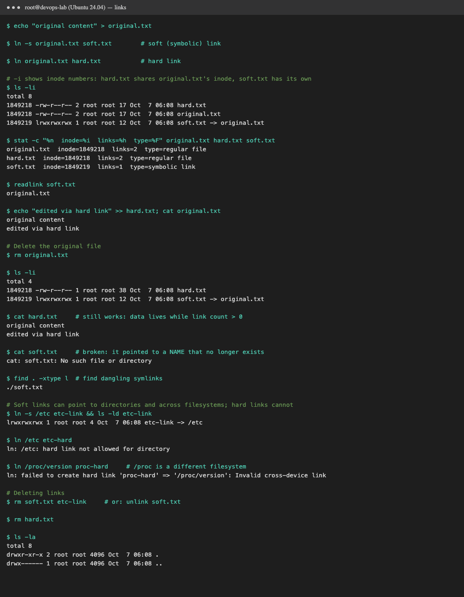
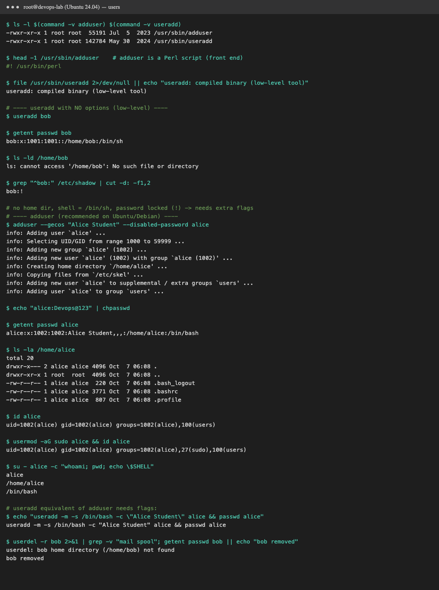
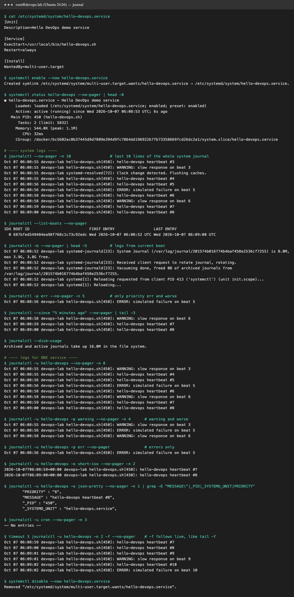
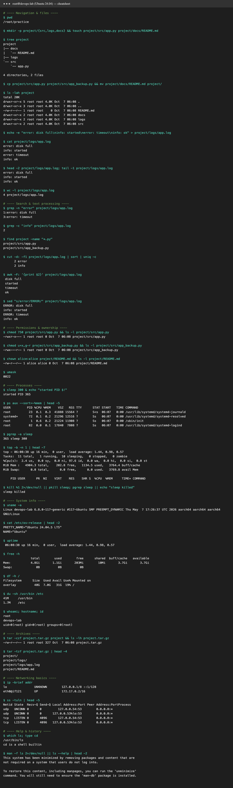

# Session 1 & 2: Linux Fundamentals

All commands were run on **Ubuntu 24.04** as a real systemd machine (container `linux-lab`, built from
[`Dockerfile.lab`](Dockerfile.lab)), using [`lab.sh`](lab.sh). Each task's full output is linked below.

<details><summary>How to reproduce</summary>

```bash
docker build -t linux-lab -f Dockerfile.lab .
docker run -d --name linux-lab --hostname devops-lab --privileged --cgroupns=host \
  -v /sys/fs/cgroup:/sys/fs/cgroup:rw --tmpfs /run --tmpfs /run/lock linux-lab
docker cp lab.sh linux-lab:/usr/local/bin/lab.sh
docker exec linux-lab bash /usr/local/bin/lab.sh links      # or: users | journal | cheatsheet
```
</details>

---

## Task 1: Soft link vs hard link

| | Soft (symbolic) link | Hard link |
|---|---|---|
| Command | `ln -s target linkname` | `ln target linkname` |
| What it is | A small file that stores a **path** to the target | Another **name** for the same inode (same data on disk) |
| Inode | Its own inode (`1849219`) | **Same** inode as the original (`1849218`) |
| `ls -l` | `lrwxrwxrwx ... soft.txt -> original.txt` | looks like a normal file; link count goes up (`2`) |
| Original deleted | **Breaks** (dangling link): `No such file or directory` | **Still works**; data lives until link count hits 0 |
| Directories | ✅ allowed | ❌ `hard link not allowed for directory` |
| Across filesystems | ✅ allowed | ❌ `Invalid cross-device link` |
| Delete | `rm link` or `unlink link` (target untouched) | `rm link` (data freed only when the last link goes) |



**Interview answer (30 seconds):**
> A hard link is a second directory entry pointing to the **same inode**, so it's indistinguishable from the original.
> Deleting one name leaves the data reachable through the other. It can't span filesystems or point to directories.
> A soft link is a separate file containing a **path**. It can point anywhere, including directories and other
> filesystems, but it breaks if the target is moved or deleted. `ls -li` shows the difference: same inode number
> means hard link, `->` means soft link. Real uses: soft links for `/usr/bin/python3 -> python3.12`, versioned releases
> (`current -> releases/v2`) and nginx `sites-enabled`. Hard links for space-saving backups (rsnapshot).

Full output: [`output-links.txt`](output-links.txt)

## Task 2: `adduser` vs `useradd`

| | `useradd` | `adduser` |
|---|---|---|
| Type | Low-level compiled binary (part of `shadow-utils`), on every distro | Friendly **Perl front end** (`#! /usr/bin/perl`) for Debian/Ubuntu that calls `useradd` |
| Home directory | ❌ not created unless `-m` | ✅ created and populated from `/etc/skel` (`.bashrc`, `.profile`) |
| Shell | `/bin/sh` unless `-s /bin/bash` | `/bin/bash` (from `/etc/adduser.conf`) |
| Password | none, account locked (`bob:!`) until `passwd` | prompts for one (or `--disabled-password`) |
| Full name (GECOS) | `-c "..."` | prompts (or `--gecos`) |
| Group | needs flags on some distros | creates a matching private group |
| Interactive | no, good for scripts | yes, good for humans |

**Which is preferred on Ubuntu?** **`adduser`.** The Debian/Ubuntu `useradd` man page itself says administrators "should usually use adduser(8) instead"
instead. It applies sensible defaults (home dir, skel files, bash, password) in one command. `useradd` is
preferred in **scripts, Dockerfiles and non-Debian distros** (RHEL, Alpine), where you want exact, portable flags.

What I saw: plain `useradd bob` produced `/home/bob:/bin/sh` with **no home directory** and a locked password.
`adduser alice` created the home directory, copied `/etc/skel`, set `/bin/bash`, and created group `alice`.

**Test user created with the recommended command:**
```bash
sudo adduser alice              # interactive: password + full name
sudo usermod -aG sudo alice     # optional: give sudo rights
su - alice                      # log in as alice
```



Full output: [`output-users.txt`](output-users.txt)

## Task 3: `journalctl`

`journalctl` reads the **systemd journal**, the central, binary, indexed log store that `systemd-journald`
fills from the kernel, every systemd service (stdout/stderr), and syslog. One tool, rich filters, no hunting
through `/var/log/*.log`.

| Goal | Command |
|---|---|
| Whole system log, newest last | `journalctl` (`--no-pager` for scripts) |
| Last N lines | `journalctl -n 20` |
| Follow live (like `tail -f`) | `journalctl -f` |
| Current boot / list boots | `journalctl -b` / `journalctl --list-boots` |
| Kernel messages (like `dmesg`) | `journalctl -k` |
| Time window | `journalctl --since "1 hour ago"` / `--since "2026-10-07 10:00" --until "11:00"` |
| By priority | `journalctl -p err` (0 emerg … 3 err, 4 warning … 7 debug) |
| **One service** | `journalctl -u nginx` / `journalctl -u ssh -f` |
| Service + priority | `journalctl -u hello-devops -p warning` |
| Output formats | `-o short-iso`, `-o json-pretty`, `-o cat` |
| Disk usage / cleanup | `journalctl --disk-usage` / `sudo journalctl --vacuum-time=7d` |

**Practice:** I created a small service, [`hello-devops.service`](lab.sh), that prints a heartbeat every
second, a `<4>` warning every 3rd beat and a `<3>` error every 5th beat. Then I ran
`journalctl -u hello-devops`, filtered it with `-p warning` and `-p err`, viewed it as JSON (`_PID`, `_SYSTEMD_UNIT`,
`PRIORITY`), followed it with `-f`, and checked the built-in `cron` service's logs too.



Full output: [`output-journal.txt`](output-journal.txt)

## Task 4: Linux command cheat sheet practice

| Area | Commands practiced | Purpose |
|---|---|---|
| Navigation & files | `pwd` `ls -lah` `mkdir -p` `touch` `cp` `mv` `rm` `tree` | Move around and manage files/dirs |
| Viewing | `cat` `head` `tail` `wc -l` `less` | Read file contents |
| Search & text | `grep -n/-c` `find -name` `cut` `sort` `uniq -c` `awk` `sed` | Find files, filter and transform text |
| Permissions | `chmod 750` `chmod u+x,g-r` `chown user:group` `umask` | Control who can read/write/execute |
| Processes | `ps aux --sort` `pgrep` `top -b` `kill` `pkill` `&` | See and control running programs |
| System info | `uname -a` `/etc/os-release` `uptime` `free -h` `df -h` `du -sh` `whoami` `id` | Machine, memory, disk, user |
| Archives | `tar -czf` `tar -tzf` | Compress and list archives |
| Networking | `ip -brief addr` `ss -tuln` | Interfaces and listening ports |
| Help | `which` `type` `man -f` `--help` | Find where commands live and how to use them |

**Permission numbers:** `r=4 w=2 x=1`, so `750` = owner `rwx`, group `r-x`, others `---`.



Full output: [`output-cheatsheet.txt`](output-cheatsheet.txt)
