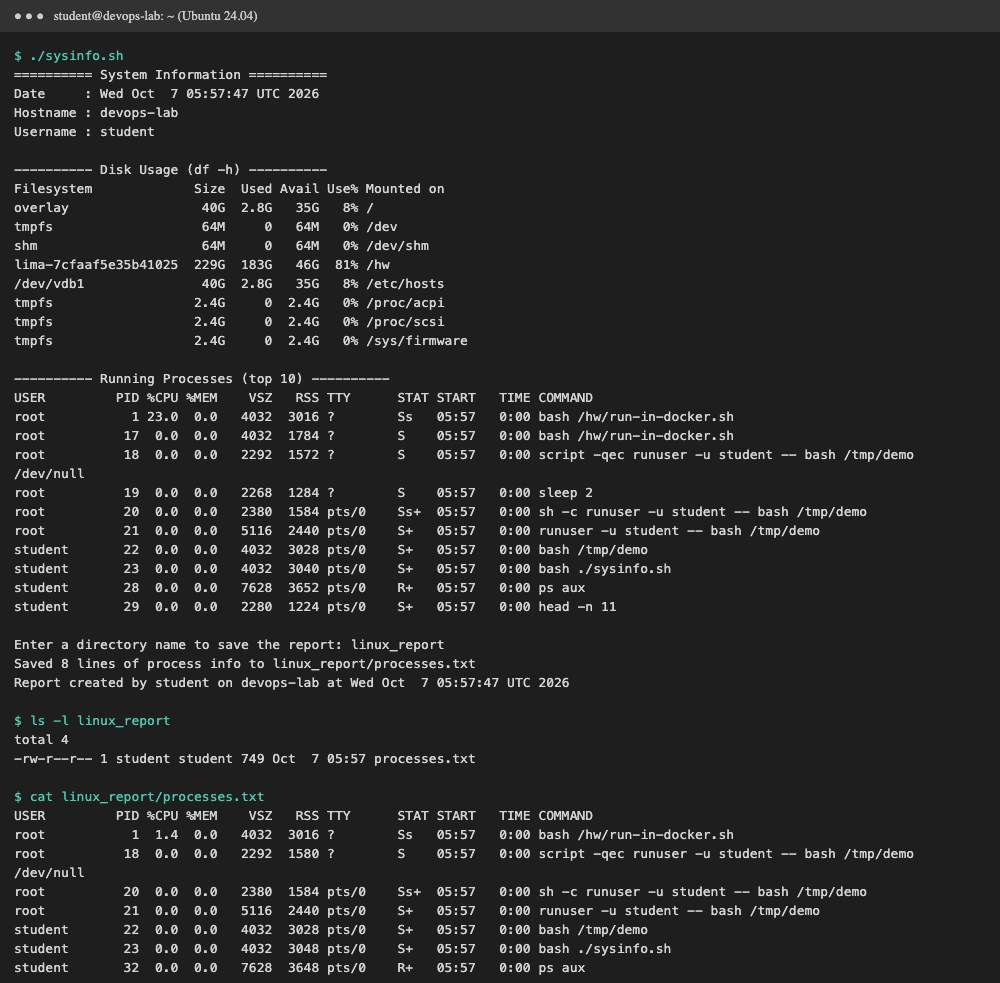

# Session 3: Shell Scripting — System Information Script

The script is [`sysinfo.sh`](sysinfo.sh).

## What the script does

| Requirement | How it is done in `sysinfo.sh` |
|---|---|
| Print current date | `CURRENT_DATE=$(date)` then `echo` |
| Print hostname | `HOST_NAME=$(hostname)` |
| Print username | `USER_NAME=$(whoami)` |
| Print disk usage | `df -h` |
| Print running processes | `ps aux \| head -n 11` |
| Use variables | `CURRENT_DATE`, `HOST_NAME`, `USER_NAME`, `DIR_NAME`, `REPORT_FILE` |
| Take user input | `read -p "Enter a directory name to save the report: " DIR_NAME` |
| Create a directory | `mkdir -p "$DIR_NAME"` |
| Create a file | `touch "$REPORT_FILE"` |
| Save processes with `>` | `ps aux > "$REPORT_FILE"` |

`DIR_NAME=${DIR_NAME:-sysinfo_report}` gives a default name if the user just presses Enter.
`>` **overwrites** the file each run. `>>` would append instead.

## How to run

```bash
chmod +x sysinfo.sh
./sysinfo.sh
```

The output below was captured on a clean **Ubuntu 24.04** machine, as user `student`, with
[`run-in-docker.sh`](run-in-docker.sh). The input typed at the prompt was `linux_report`.



## Commands output

```text
$ ./sysinfo.sh
========== System Information ==========
Date     : Wed Oct  7 05:57:47 UTC 2026
Hostname : devops-lab
Username : student

---------- Disk Usage (df -h) ----------
Filesystem             Size  Used Avail Use% Mounted on
overlay                 40G  2.8G   35G   8% /
tmpfs                   64M     0   64M   0% /dev
shm                     64M     0   64M   0% /dev/shm
lima-7cfaaf5e35b41025  229G  183G   46G  81% /hw
/dev/vdb1               40G  2.8G   35G   8% /etc/hosts
tmpfs                  2.4G     0  2.4G   0% /proc/acpi
tmpfs                  2.4G     0  2.4G   0% /proc/scsi
tmpfs                  2.4G     0  2.4G   0% /sys/firmware

---------- Running Processes (top 10) ----------
USER         PID %CPU %MEM    VSZ   RSS TTY      STAT START   TIME COMMAND
root           1 23.0  0.0   4032  3016 ?        Ss   05:57   0:00 bash /hw/run-in-docker.sh
root          17  0.0  0.0   4032  1784 ?        S    05:57   0:00 bash /hw/run-in-docker.sh
root          18  0.0  0.0   2292  1572 ?        S    05:57   0:00 script -qec runuser -u student -- bash /tmp/demo /dev/null
root          19  0.0  0.0   2268  1284 ?        S    05:57   0:00 sleep 2
root          20  0.0  0.0   2380  1584 pts/0    Ss+  05:57   0:00 sh -c runuser -u student -- bash /tmp/demo
root          21  0.0  0.0   5116  2440 pts/0    S+   05:57   0:00 runuser -u student -- bash /tmp/demo
student       22  0.0  0.0   4032  3028 pts/0    S+   05:57   0:00 bash /tmp/demo
student       23  0.0  0.0   4032  3040 pts/0    S+   05:57   0:00 bash ./sysinfo.sh
student       28  0.0  0.0   7628  3652 pts/0    R+   05:57   0:00 ps aux
student       29  0.0  0.0   2280  1224 pts/0    S+   05:57   0:00 head -n 11

Enter a directory name to save the report: linux_report
Saved 8 lines of process info to linux_report/processes.txt
Report created by student on devops-lab at Wed Oct  7 05:57:47 UTC 2026

$ ls -l linux_report
total 4
-rw-r--r-- 1 student student 749 Oct  7 05:57 processes.txt

$ cat linux_report/processes.txt
USER         PID %CPU %MEM    VSZ   RSS TTY      STAT START   TIME COMMAND
root           1  1.4  0.0   4032  3016 ?        Ss   05:57   0:00 bash /hw/run-in-docker.sh
root          18  0.0  0.0   2292  1580 ?        S    05:57   0:00 script -qec runuser -u student -- bash /tmp/demo /dev/null
root          20  0.0  0.0   2380  1584 pts/0    Ss+  05:57   0:00 sh -c runuser -u student -- bash /tmp/demo
root          21  0.0  0.0   5116  2440 pts/0    S+   05:57   0:00 runuser -u student -- bash /tmp/demo
student       22  0.0  0.0   4032  3028 pts/0    S+   05:57   0:00 bash /tmp/demo
student       23  0.0  0.0   4032  3048 pts/0    S+   05:57   0:00 bash ./sysinfo.sh
student       32  0.0  0.0   7628  3648 pts/0    R+   05:57   0:00 ps aux
```
