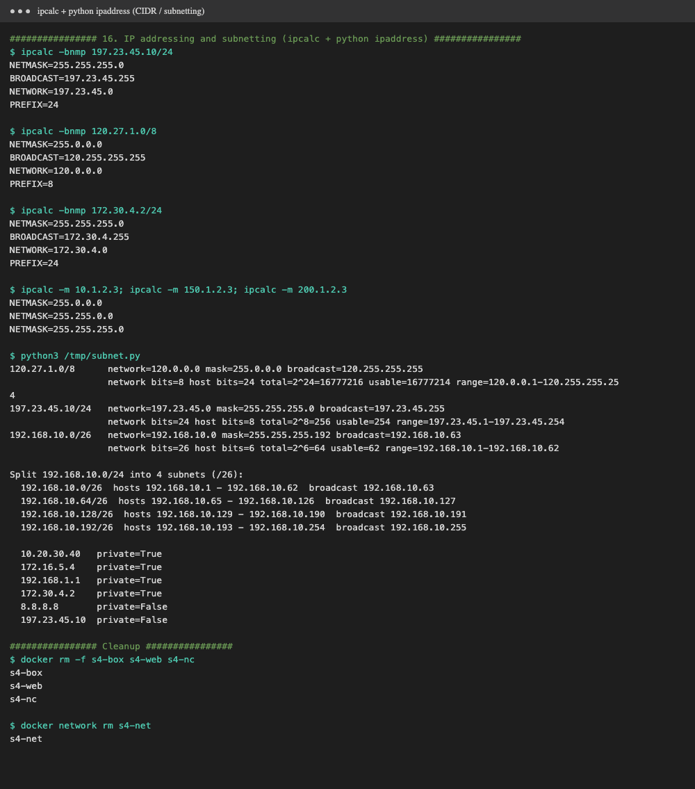
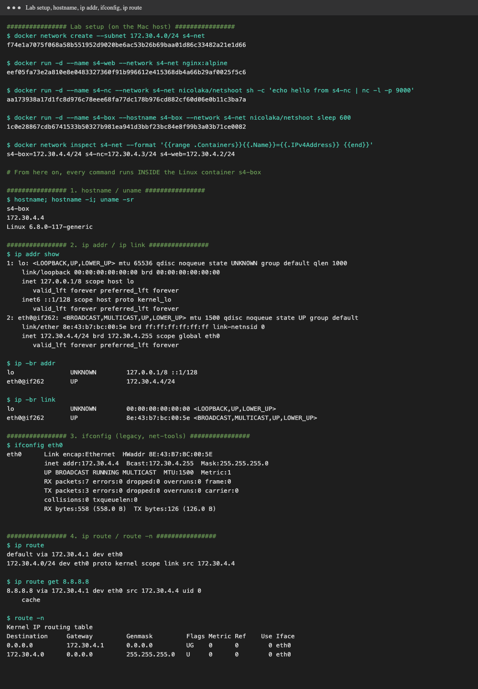
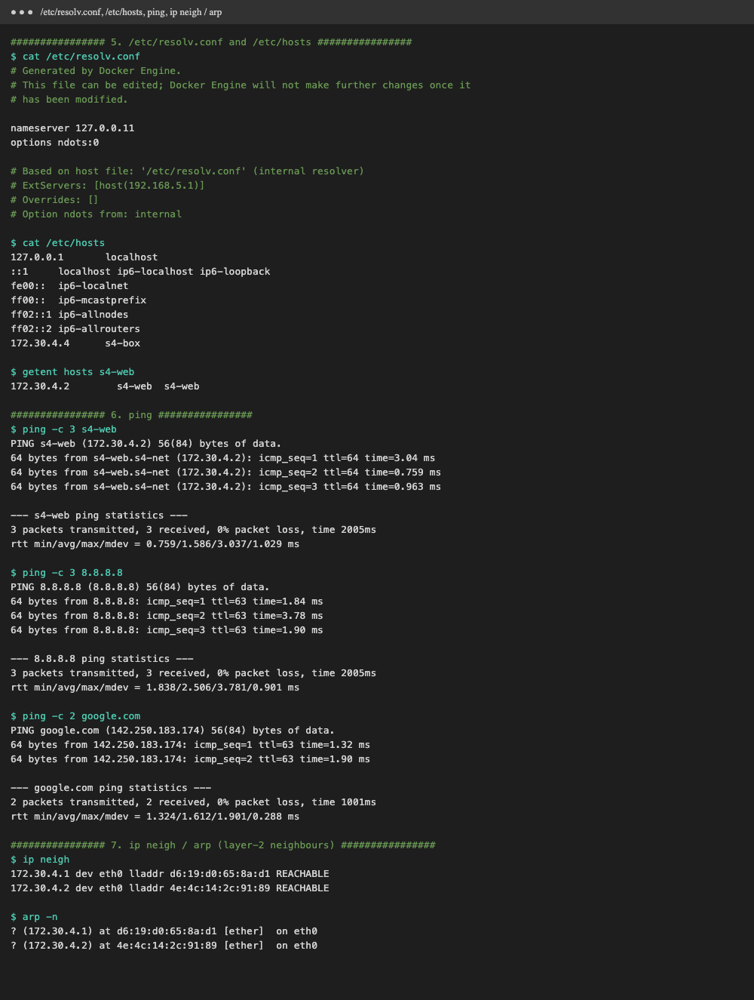
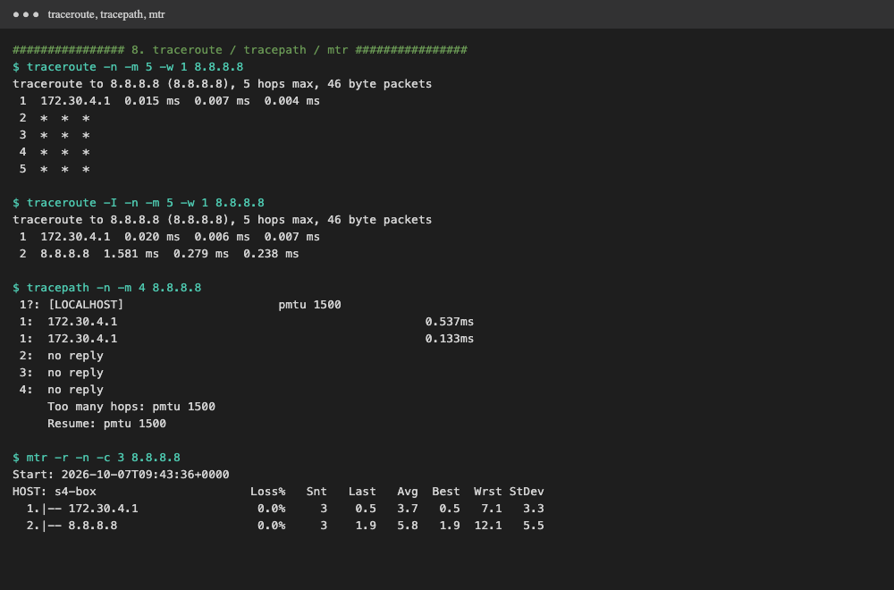
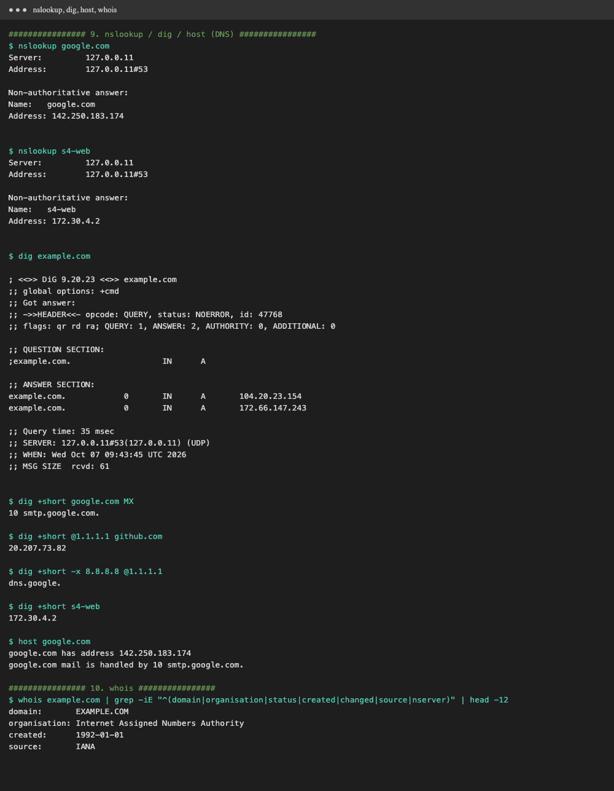
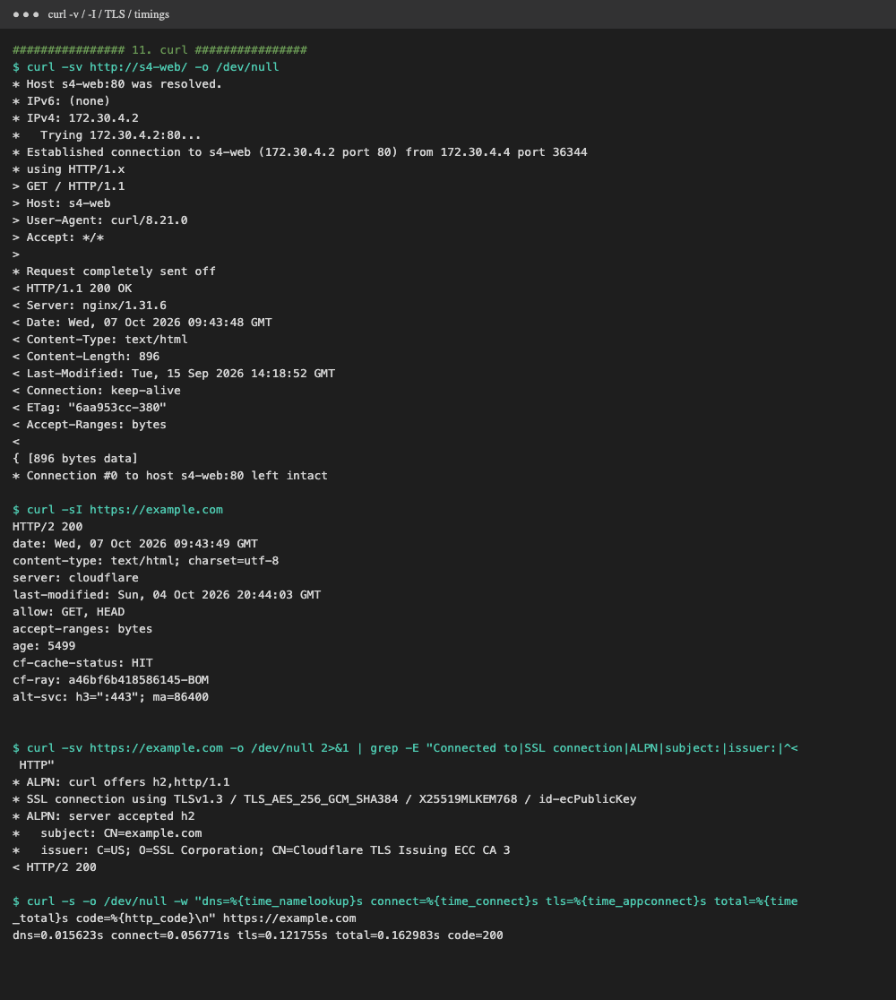
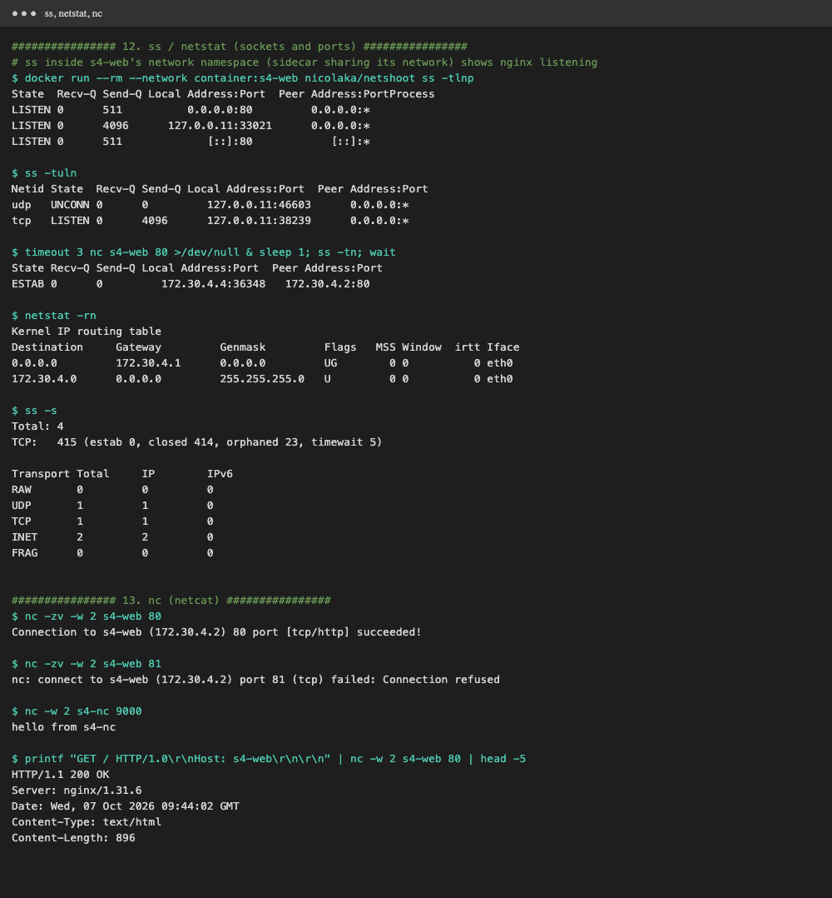
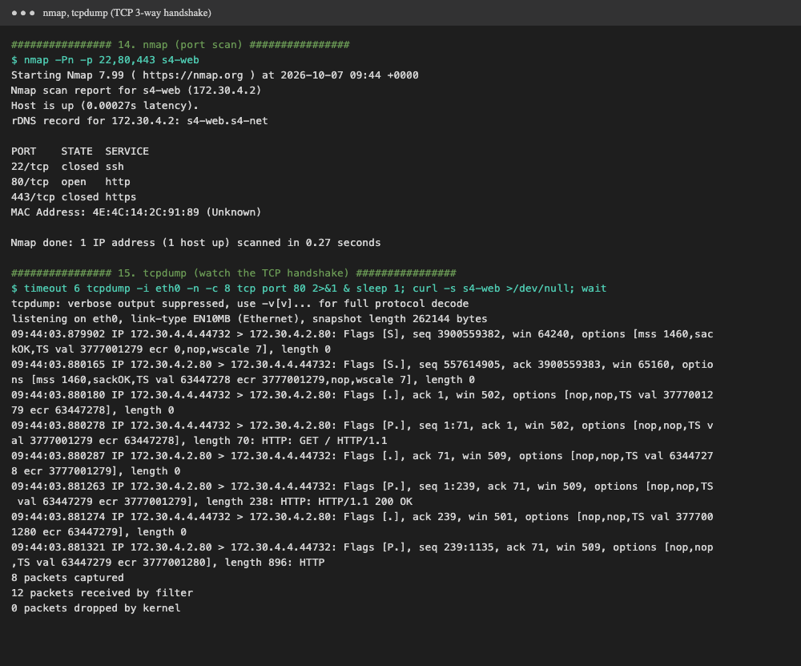

# Session 4: Networking

**Homework**
- **Task 1:** practise the commands and repos shared in the devops-heros GitHub repo ([`session4-networking/ip.md`](https://github.com/Nency-Ravaliya/devops-heros/blob/main/session4-networking/ip.md), [`resources.md`](https://github.com/Nency-Ravaliya/devops-heros/blob/main/session4-networking/resources.md)).
- **Task 2:** create a Markdown file, run the networking commands, add their output and screenshots, and explain each command in a few lines.

This `README.md` is that Markdown file. Every command was run for real with [`demo.sh`](demo.sh), and the raw log is in [`output.txt`](output.txt). The screenshots in [`screenshots/`](screenshots) are rendered from that log.

## Lab setup

The commands run **inside a Linux container**, so the outputs are real Linux outputs, not macOS ones. I used
[`nicolaka/netshoot`](https://github.com/nicolaka/netshoot), an image that ships every common network tool.
The lab is a small Docker network with three containers:

```text
           Docker bridge network  s4-net  172.30.4.0/24   (gateway 172.30.4.1)
   ┌───────────────────────┬────────────────────────┬────────────────────────┐
   │ s4-box  172.30.4.4    │ s4-web  172.30.4.2     │ s4-nc  172.30.4.3      │
   │ netshoot: I run every │ nginx:alpine on :80    │ netcat server on :9000 │
   │ command here          │ (target for curl/nc…)  │ ("hello from s4-nc")   │
   └───────────────────────┴────────────────────────┴────────────────────────┘
                 │ default route → 172.30.4.1 → Colima VM → Mac → Internet
```

```bash
./demo.sh > output.txt     # creates the lab, runs every command, then removes the containers and network
```

```text
$ docker network create --subnet 172.30.4.0/24 s4-net
f74e1a7075f068a58b551952d9020be6ac53b26b69baa01d86c33482a21e1d66

$ docker run -d --name s4-web --network s4-net nginx:alpine
eef05fa73e2a810e8e0483327360f91b996612e415368db4a66b29af0025f5c6

$ docker run -d --name s4-nc --network s4-net nicolaka/netshoot sh -c 'echo hello from s4-nc | nc -l -p 9000'
aa173938a17d1fc8d976c78eee68fa77dc178b976cd882cf60d06e0b11c3ba7a

$ docker run -d --name s4-box --hostname s4-box --network s4-net nicolaka/netshoot sleep 600
1c0e28867cdb6741533b50327b981ea941d3bbf23bc84e8f99b3a03b71ce0082

$ docker network inspect s4-net --format '{{range .Containers}}{{.Name}}={{.IPv4Address}} {{end}}'
s4-box=172.30.4.4/24 s4-nc=172.30.4.3/24 s4-web=172.30.4.2/24 

# From here on, every command runs INSIDE the Linux container s4-box
```

---

## 0. IP address basics (from `ip.md`)

An **IP address** (IPv4) is a 32-bit number that uniquely identifies a device on a network, written as 4 octets: `197.23.45.10`.
The **subnet mask** splits it into a **network part** (which network) and a **host part** (which device on it).
**CIDR** writes the mask as the number of network bits: `/24` = `255.255.255.0`.

| Class | First octet | Default mask | CIDR | Network / host bits |
|---|---|---|---|---|
| A | 1 – 127 | 255.0.0.0 | /8 | 8 / 24 |
| B | 128 – 191 | 255.255.0.0 | /16 | 16 / 16 |
| C | 192 – 223 | 255.255.255.0 | /24 | 24 / 8 |
| D | 224 – 239 | (multicast) | – | – |
| E | 240 – 255 | (reserved) | – | – |

**Private ranges** (RFC 1918, not routed on the Internet): `10.0.0.0/8`, `172.16.0.0/12`, `192.168.0.0/16`.
The Docker lab network `172.30.4.0/24` sits inside `172.16.0.0/12`, so it is private.

**Formulas:** host bits `h = 32 − prefix`; total addresses `= 2^h`; usable hosts `= 2^h − 2`
(the first address is the **network address**, the last is the **broadcast address**).

**Worked example 1: `120.27.1.0/8`** (class A, from ip.md)
- 8 network bits, 32 − 8 = **24 host bits**
- mask `255.0.0.0` → network `120.0.0.0`, broadcast `120.255.255.255`
- total = 2^24 = **16,777,216**, usable = 2^24 − 2 = **16,777,214** (`120.0.0.1` – `120.255.255.254`)

**Worked example 2: `197.23.45.10/24`** (class C, from ip.md)
- 24 network bits, **8 host bits**
- mask `255.255.255.0` → network `197.23.45.0`, broadcast `197.23.45.255`
- total = 2^8 = 256, usable = **254** (`197.23.45.1` – `197.23.45.254`), and `.10` is host number 10 on that network

**Worked example 3, subnetting: split `192.168.10.0/24` into 4 subnets**
- 4 subnets need 2 extra network bits (2^2 = 4) → `/26`, mask `255.255.255.192`
- 6 host bits left → 64 addresses per subnet, **62 usable**
- block size 256 − 192 = 64 → subnets start at `.0`, `.64`, `.128`, `.192`

All three were checked with `ipcalc` and Python's `ipaddress` module inside the container ([`subnet.py`](subnet.py)):



```text
$ ipcalc -bnmp 197.23.45.10/24
NETMASK=255.255.255.0
BROADCAST=197.23.45.255
NETWORK=197.23.45.0
PREFIX=24

$ ipcalc -bnmp 120.27.1.0/8
NETMASK=255.0.0.0
BROADCAST=120.255.255.255
NETWORK=120.0.0.0
PREFIX=8

$ ipcalc -bnmp 172.30.4.2/24
NETMASK=255.255.255.0
BROADCAST=172.30.4.255
NETWORK=172.30.4.0
PREFIX=24

$ ipcalc -m 10.1.2.3; ipcalc -m 150.1.2.3; ipcalc -m 200.1.2.3
NETMASK=255.0.0.0
NETMASK=255.255.0.0
NETMASK=255.255.255.0

$ python3 /tmp/subnet.py
120.27.1.0/8      network=120.0.0.0 mask=255.0.0.0 broadcast=120.255.255.255
                  network bits=8 host bits=24 total=2^24=16777216 usable=16777214 range=120.0.0.1-120.255.255.254
197.23.45.10/24   network=197.23.45.0 mask=255.255.255.0 broadcast=197.23.45.255
                  network bits=24 host bits=8 total=2^8=256 usable=254 range=197.23.45.1-197.23.45.254
192.168.10.0/26   network=192.168.10.0 mask=255.255.255.192 broadcast=192.168.10.63
                  network bits=26 host bits=6 total=2^6=64 usable=62 range=192.168.10.1-192.168.10.62

Split 192.168.10.0/24 into 4 subnets (/26):
  192.168.10.0/26  hosts 192.168.10.1 - 192.168.10.62  broadcast 192.168.10.63
  192.168.10.64/26  hosts 192.168.10.65 - 192.168.10.126  broadcast 192.168.10.127
  192.168.10.128/26  hosts 192.168.10.129 - 192.168.10.190  broadcast 192.168.10.191
  192.168.10.192/26  hosts 192.168.10.193 - 192.168.10.254  broadcast 192.168.10.255

  10.20.30.40   private=True
  172.16.5.4    private=True
  192.168.1.1   private=True
  172.30.4.2    private=True
  8.8.8.8       private=False
  197.23.45.10  private=False
```

`ipcalc -m` with no prefix prints the **classful default mask**: 10.x → /8 (A), 150.x → /16 (B), 200.x → /24 (C), which matches the class table.
`is_private` confirms `10.x`, `172.16.x`, `192.168.x` and the Docker network are private, while `8.8.8.8` and `197.23.45.10` are public.

---

## 1. `hostname`, `hostname -i`, `uname -sr`

```text
$ hostname; hostname -i; uname -sr
s4-box
172.30.4.4
Linux 6.8.0-117-generic
```

- `hostname` prints the machine's name. Docker set it to `s4-box` because of `--hostname s4-box`.
- `hostname -i` prints the IP that the name resolves to: `172.30.4.4`.
- `uname -sr` prints the kernel name and release. The container shares the **Linux kernel of the Colima VM**, because containers don't have a kernel of their own.

## 2. `ip addr` / `ip -br addr` / `ip -br link`



```text
$ ip addr show
1: lo: <LOOPBACK,UP,LOWER_UP> mtu 65536 qdisc noqueue state UNKNOWN group default qlen 1000
    link/loopback 00:00:00:00:00:00 brd 00:00:00:00:00:00
    inet 127.0.0.1/8 scope host lo
       valid_lft forever preferred_lft forever
    inet6 ::1/128 scope host proto kernel_lo 
       valid_lft forever preferred_lft forever
2: eth0@if262: <BROADCAST,MULTICAST,UP,LOWER_UP> mtu 1500 qdisc noqueue state UP group default 
    link/ether 8e:43:b7:bc:00:5e brd ff:ff:ff:ff:ff:ff link-netnsid 0
    inet 172.30.4.4/24 brd 172.30.4.255 scope global eth0
       valid_lft forever preferred_lft forever

$ ip -br addr
lo               UNKNOWN        127.0.0.1/8 ::1/128 
eth0@if262       UP             172.30.4.4/24 

$ ip -br link
lo               UNKNOWN        00:00:00:00:00:00 <LOOPBACK,UP,LOWER_UP> 
eth0@if262       UP             8e:43:b7:bc:00:5e <BROADCAST,MULTICAST,UP,LOWER_UP> 
```

`ip` (iproute2) is the modern tool for interfaces, addresses and routes.
- `lo` is the **loopback** interface, `127.0.0.1/8`, which the machine uses to talk to itself.
- `eth0@ifNNN` is the container's end of a **veth pair**. The other end (`ifNNN`) is plugged into the Docker bridge on the host.
- `inet 172.30.4.4/24 brd 172.30.4.255` is the IPv4 address, prefix and broadcast address, which match the `/24` worked example.
- `link/ether …` is the **MAC address** (layer 2). `mtu 1500` is the largest frame size, and `state UP` means the link is up.
- `-br` (brief) prints one line per interface.

## 3. `ifconfig`

```text
$ ifconfig eth0
eth0      Link encap:Ethernet  HWaddr 8E:43:B7:BC:00:5E  
          inet addr:172.30.4.4  Bcast:172.30.4.255  Mask:255.255.255.0
          UP BROADCAST RUNNING MULTICAST  MTU:1500  Metric:1
          RX packets:7 errors:0 dropped:0 overruns:0 frame:0
          TX packets:3 errors:0 dropped:0 overruns:0 carrier:0
          collisions:0 txqueuelen:0 
          RX bytes:558 (558.0 B)  TX bytes:126 (126.0 B)
```

`ifconfig` is the **older net-tools** command and is deprecated in favour of `ip`, but still common. It shows the same
facts (`inet addr`, `Bcast`, `Mask:255.255.255.0`, `HWaddr` = MAC, `MTU`) plus **RX/TX packet and byte counters**, which are useful for spotting errors or drops.

## 4. `ip route` / `ip route get` / `route -n`

```text
$ ip route
default via 172.30.4.1 dev eth0 
172.30.4.0/24 dev eth0 proto kernel scope link src 172.30.4.4 

$ ip route get 8.8.8.8
8.8.8.8 via 172.30.4.1 dev eth0 src 172.30.4.4 uid 0 
    cache 

$ route -n
Kernel IP routing table
Destination     Gateway         Genmask         Flags Metric Ref    Use Iface
0.0.0.0         172.30.4.1      0.0.0.0         UG    0      0        0 eth0
172.30.4.0      0.0.0.0         255.255.255.0   U     0      0        0 eth0
```

The **routing table** decides where each packet goes.
- `default via 172.30.4.1`: anything not on a known network goes to the **default gateway** `172.30.4.1` (the Docker bridge).
- `172.30.4.0/24 dev eth0 … scope link`: the local subnet is reached **directly**, with no gateway.
- `ip route get 8.8.8.8` asks the kernel which route a real packet would take: via the gateway, out of `eth0`, from source `172.30.4.4`.
- `route -n` is the net-tools version. `UG` = route is **U**p and uses a **G**ateway, `0.0.0.0/0.0.0.0` = default route, and `-n` skips DNS lookups.

## 5. `/etc/resolv.conf`, `/etc/hosts`, `getent hosts`



```text
$ cat /etc/resolv.conf
# Generated by Docker Engine.
# This file can be edited; Docker Engine will not make further changes once it
# has been modified.

nameserver 127.0.0.11
options ndots:0

# Based on host file: '/etc/resolv.conf' (internal resolver)
# ExtServers: [host(192.168.5.1)]
# Overrides: []
# Option ndots from: internal

$ cat /etc/hosts
127.0.0.1	localhost
::1	localhost ip6-localhost ip6-loopback
fe00::	ip6-localnet
ff00::	ip6-mcastprefix
ff02::1	ip6-allnodes
ff02::2	ip6-allrouters
172.30.4.4	s4-box

$ getent hosts s4-web
172.30.4.2        s4-web  s4-web
```

- **`/etc/resolv.conf`** tells the system **which DNS server to ask**. Here it is `nameserver 127.0.0.11`, Docker's **embedded DNS server**,
  which resolves container names (`s4-web`) and forwards everything else to the host's resolver (`ExtServers: host(192.168.5.1)`, the Colima VM).
- **`/etc/hosts`** is a static name → IP table that is checked **before** DNS. Docker wrote `172.30.4.4 s4-box` into it.
- `getent hosts s4-web` resolves a name the way applications do (hosts file, then DNS): `s4-web` → `172.30.4.2`.

## 6. `ping`

```text
$ ping -c 3 s4-web
PING s4-web (172.30.4.2) 56(84) bytes of data.
64 bytes from s4-web.s4-net (172.30.4.2): icmp_seq=1 ttl=64 time=3.04 ms
64 bytes from s4-web.s4-net (172.30.4.2): icmp_seq=2 ttl=64 time=0.759 ms
64 bytes from s4-web.s4-net (172.30.4.2): icmp_seq=3 ttl=64 time=0.963 ms

--- s4-web ping statistics ---
3 packets transmitted, 3 received, 0% packet loss, time 2005ms
rtt min/avg/max/mdev = 0.759/1.586/3.037/1.029 ms

$ ping -c 3 8.8.8.8
PING 8.8.8.8 (8.8.8.8) 56(84) bytes of data.
64 bytes from 8.8.8.8: icmp_seq=1 ttl=63 time=1.84 ms
64 bytes from 8.8.8.8: icmp_seq=2 ttl=63 time=3.78 ms
64 bytes from 8.8.8.8: icmp_seq=3 ttl=63 time=1.90 ms

--- 8.8.8.8 ping statistics ---
3 packets transmitted, 3 received, 0% packet loss, time 2005ms
rtt min/avg/max/mdev = 1.838/2.506/3.781/0.901 ms

$ ping -c 2 google.com
PING google.com (142.250.183.174) 56(84) bytes of data.
64 bytes from 142.250.183.174: icmp_seq=1 ttl=63 time=1.32 ms
64 bytes from 142.250.183.174: icmp_seq=2 ttl=63 time=1.90 ms

--- google.com ping statistics ---
2 packets transmitted, 2 received, 0% packet loss, time 1001ms
rtt min/avg/max/mdev = 1.324/1.612/1.901/0.288 ms
```

`ping` sends **ICMP echo requests** and waits for echo replies, to check whether a host is reachable and how fast.
- `ping -c 3` sends 3 packets and stops. `time=` is the round-trip time (RTT), and the summary shows `0% packet loss` and min/avg/max RTT.
- `ttl=64` from `s4-web` means it is on the **same network** (Linux starts TTL at 64 and no router decremented it).
- `ttl=63` from `8.8.8.8` and Google is the number this VM's user-mode NAT hands back (see the traceroute note below), not the real Internet hop count.
- `ping google.com` first resolves the name with DNS, then pings the IP.

## 7. `ip neigh` / `arp -n`

```text
$ ip neigh
172.30.4.1 dev eth0 lladdr d6:19:d0:65:8a:d1 REACHABLE 
172.30.4.2 dev eth0 lladdr 4e:4c:14:2c:91:89 REACHABLE 

$ arp -n
? (172.30.4.1) at d6:19:d0:65:8a:d1 [ether]  on eth0
? (172.30.4.2) at 4e:4c:14:2c:91:89 [ether]  on eth0
```

The **ARP / neighbour table** maps **IP addresses to MAC addresses** on the local network (layer 3 → layer 2).
Because I had just pinged `s4-web` and the gateway, both appear with their MACs and state `REACHABLE`.
`arp -n` is the legacy net-tools view of the same table.

## 8. `traceroute`, `tracepath`, `mtr`



```text
$ traceroute -n -m 5 -w 1 8.8.8.8
traceroute to 8.8.8.8 (8.8.8.8), 5 hops max, 46 byte packets
 1  172.30.4.1  0.015 ms  0.007 ms  0.004 ms
 2  *  *  *
 3  *  *  *
 4  *  *  *
 5  *  *  *

$ traceroute -I -n -m 5 -w 1 8.8.8.8
traceroute to 8.8.8.8 (8.8.8.8), 5 hops max, 46 byte packets
 1  172.30.4.1  0.020 ms  0.006 ms  0.007 ms
 2  8.8.8.8  1.581 ms  0.279 ms  0.238 ms

$ tracepath -n -m 4 8.8.8.8
 1?: [LOCALHOST]                      pmtu 1500
 1:  172.30.4.1                                            0.537ms 
 1:  172.30.4.1                                            0.133ms 
 2:  no reply
 3:  no reply
 4:  no reply
     Too many hops: pmtu 1500
     Resume: pmtu 1500 

$ mtr -r -n -c 3 8.8.8.8
Start: 2026-10-07T09:43:36+0000
HOST: s4-box                      Loss%   Snt   Last   Avg  Best  Wrst StDev
  1.|-- 172.30.4.1                 0.0%     3    0.5   3.7   0.5   7.1   3.3
  2.|-- 8.8.8.8                    0.0%     3    1.9   5.8   1.9  12.1   5.5
```

`traceroute` shows **every router (hop) on the path** to a destination. It sends packets with TTL 1, 2, 3 …, and
each router that drops a packet when its TTL hits 0 sends back an ICMP "time exceeded" message, which reveals that router's address.
- Default `traceroute` uses **UDP** probes. Hop 1 is the Docker gateway `172.30.4.1`, then `* * *` means **no reply**.
- `traceroute -I` uses **ICMP** probes, and the trace reaches `8.8.8.8` at hop 2.
- `tracepath` is similar, needs no root, and also discovers the **path MTU** (`pmtu 1500`).
- `mtr -r` combines ping and traceroute, giving loss % and latency per hop (`-r` = report mode, `-c 3` = 3 cycles).

**Why only 2 hops?** On this Mac, Docker runs inside the **Colima VM**, whose network is **user-mode NAT**: the VM re-creates the
connection on the Mac's side. The routers between the Mac and Google therefore never see the container's TTL-limited probes, so
they never answer. The real Internet path is hidden, and ICMP shows up as a direct hop to `8.8.8.8`. On a normal Linux server
the same command lists the ISP's routers. (This also means no public IP of mine appears in the output.)

## 9. `nslookup`, `dig`, `host` (DNS)



```text
$ nslookup google.com
Server:		127.0.0.11
Address:	127.0.0.11#53

Non-authoritative answer:
Name:	google.com
Address: 142.250.183.174


$ nslookup s4-web
Server:		127.0.0.11
Address:	127.0.0.11#53

Non-authoritative answer:
Name:	s4-web
Address: 172.30.4.2


$ dig example.com

; <<>> DiG 9.20.23 <<>> example.com
;; global options: +cmd
;; Got answer:
;; ->>HEADER<<- opcode: QUERY, status: NOERROR, id: 47768
;; flags: qr rd ra; QUERY: 1, ANSWER: 2, AUTHORITY: 0, ADDITIONAL: 0

;; QUESTION SECTION:
;example.com.			IN	A

;; ANSWER SECTION:
example.com.		0	IN	A	104.20.23.154
example.com.		0	IN	A	172.66.147.243

;; Query time: 35 msec
;; SERVER: 127.0.0.11#53(127.0.0.11) (UDP)
;; WHEN: Wed Oct 07 09:43:45 UTC 2026
;; MSG SIZE  rcvd: 61


$ dig +short google.com MX
10 smtp.google.com.

$ dig +short @1.1.1.1 github.com
20.207.73.82

$ dig +short -x 8.8.8.8 @1.1.1.1
dns.google.

$ dig +short s4-web
172.30.4.2

$ host google.com
google.com has address 142.250.183.174
google.com mail is handled by 10 smtp.google.com.
```

DNS turns **names into IP addresses**.
- `nslookup google.com` prints the server used (`127.0.0.11`, Docker DNS) and the answer. *Non-authoritative* means it came from a resolver or cache, not from Google's own name server.
- `nslookup s4-web` shows Docker DNS resolving a **container name** to its IP.
- `dig example.com` gives the full answer: `status: NOERROR`, the **QUESTION** (`IN A`), and an **ANSWER** with two A records (TTL, class, type, IP), plus query time and server.
- `dig +short google.com MX` prints only the answer. **MX** = mail server for the domain.
- `dig @1.1.1.1 github.com` queries a **specific DNS server** (Cloudflare) instead of the default one.
- `dig -x 8.8.8.8` does a **reverse lookup** (PTR record), IP → name: `dns.google.`.
- `host google.com` is the short, human-friendly lookup: A record and mail handler.

## 10. `whois`

```text
$ whois example.com | grep -iE "^(domain|organisation|status|created|changed|source|nserver)" | head -12
domain:       EXAMPLE.COM
organisation: Internet Assigned Numbers Authority
created:      1992-01-01
source:       IANA
```

`whois` queries the **registration database** for a domain or IP block: who owns it, when it was created, and which registry holds it.
`example.com` is reserved by **IANA** (created 1992). I filtered the long output down to the key fields with `grep`.

## 11. `curl`



```text
$ curl -sv http://s4-web/ -o /dev/null
* Host s4-web:80 was resolved.
* IPv6: (none)
* IPv4: 172.30.4.2
*   Trying 172.30.4.2:80...
* Established connection to s4-web (172.30.4.2 port 80) from 172.30.4.4 port 36344 
* using HTTP/1.x
> GET / HTTP/1.1
> Host: s4-web
> User-Agent: curl/8.21.0
> Accept: */*
> 
* Request completely sent off
< HTTP/1.1 200 OK
< Server: nginx/1.31.6
< Date: Wed, 07 Oct 2026 09:43:48 GMT
< Content-Type: text/html
< Content-Length: 896
< Last-Modified: Tue, 15 Sep 2026 14:18:52 GMT
< Connection: keep-alive
< ETag: "6aa953cc-380"
< Accept-Ranges: bytes
< 
{ [896 bytes data]
* Connection #0 to host s4-web:80 left intact

$ curl -sI https://example.com
HTTP/2 200 
date: Wed, 07 Oct 2026 09:43:49 GMT
content-type: text/html; charset=utf-8
server: cloudflare
last-modified: Sun, 04 Oct 2026 20:44:03 GMT
allow: GET, HEAD
accept-ranges: bytes
age: 5499
cf-cache-status: HIT
cf-ray: a46bf6b418586145-BOM
alt-svc: h3=":443"; ma=86400


$ curl -sv https://example.com -o /dev/null 2>&1 | grep -E "Connected to|SSL connection|ALPN|subject:|issuer:|^< HTTP"
* ALPN: curl offers h2,http/1.1
* SSL connection using TLSv1.3 / TLS_AES_256_GCM_SHA384 / X25519MLKEM768 / id-ecPublicKey
* ALPN: server accepted h2
*   subject: CN=example.com
*   issuer: C=US; O=SSL Corporation; CN=Cloudflare TLS Issuing ECC CA 3
< HTTP/2 200 

$ curl -s -o /dev/null -w "dns=%{time_namelookup}s connect=%{time_connect}s tls=%{time_appconnect}s total=%{time_total}s code=%{http_code}\n" https://example.com
dns=0.015623s connect=0.056771s tls=0.121755s total=0.162983s code=200
```

`curl` transfers data with URLs and is the standard tool for testing HTTP APIs and web servers.
- `curl -v` (verbose) shows the whole conversation: DNS resolution → TCP connect (`Established connection … port 80`) →
  request headers (`> GET / HTTP/1.1`, `> Host:`) → response status and headers (`< HTTP/1.1 200 OK`, `< Server: nginx`). `-o /dev/null` discards the body.
- `curl -I` sends a **HEAD** request, which returns headers only. `example.com` answers over **HTTP/2** from Cloudflare.
- On HTTPS, the verbose lines show the **TLS handshake**: `TLSv1.3`, the cipher, **ALPN** agreeing on `h2`, and the certificate `subject` and `issuer`.
- `-w` prints timings: DNS lookup → TCP connect → TLS done → total, plus the HTTP status code `200`.

## 12. `ss` / `netstat`



```text
# ss inside s4-web's network namespace (sidecar sharing its network) shows nginx listening
$ docker run --rm --network container:s4-web nicolaka/netshoot ss -tlnp
State  Recv-Q Send-Q Local Address:Port  Peer Address:PortProcess
LISTEN 0      511          0.0.0.0:80         0.0.0.0:*   
LISTEN 0      4096      127.0.0.11:33021      0.0.0.0:*   
LISTEN 0      511             [::]:80            [::]:*   

$ ss -tuln
Netid State  Recv-Q Send-Q Local Address:Port  Peer Address:Port
udp   UNCONN 0      0         127.0.0.11:46603      0.0.0.0:*
tcp   LISTEN 0      4096      127.0.0.11:38239      0.0.0.0:*

$ timeout 3 nc s4-web 80 >/dev/null & sleep 1; ss -tn; wait
State Recv-Q Send-Q Local Address:Port  Peer Address:Port
ESTAB 0      0         172.30.4.4:36348   172.30.4.2:80

$ netstat -rn
Kernel IP routing table
Destination     Gateway         Genmask         Flags   MSS Window  irtt Iface
0.0.0.0         172.30.4.1      0.0.0.0         UG        0 0          0 eth0
172.30.4.0      0.0.0.0         255.255.255.0   U         0 0          0 eth0

$ ss -s
Total: 4
TCP:   415 (estab 0, closed 414, orphaned 23, timewait 5)

Transport Total     IP        IPv6
RAW	  0         0         0        
UDP	  1         1         0        
TCP	  1         1         0        
INET	  2         2         0        
FRAG	  0         0         0        
```

`ss` (socket statistics) replaces `netstat` and lists **open sockets and listening ports**.
Flags: `-t` TCP, `-u` UDP, `-l` listening only, `-n` numeric (no name lookups), `-p` show process.
- In `s4-web`'s network namespace, `ss -tlnp` shows **port 80 (nginx) listening on `0.0.0.0:80` and `[::]:80`** (all IPv4 and IPv6 addresses).
  The `Process` column is empty because the sidecar shares only the *network* namespace. nginx's PID lives in another container's PID namespace, so `-p` cannot name it.
  The `127.0.0.11:<port>` sockets belong to Docker's embedded DNS.
- In `s4-box`, `ss -tn` while `nc` holds a connection shows an **`ESTAB`lished** TCP connection `172.30.4.4:<ephemeral port> → 172.30.4.2:80`.
- `netstat -rn` is another way to print the routing table. `ss -s` prints socket summary counters.

## 13. `nc` (netcat)

```text
$ nc -zv -w 2 s4-web 80
Connection to s4-web (172.30.4.2) 80 port [tcp/http] succeeded!

$ nc -zv -w 2 s4-web 81
nc: connect to s4-web (172.30.4.2) port 81 (tcp) failed: Connection refused

$ nc -w 2 s4-nc 9000
hello from s4-nc

$ printf "GET / HTTP/1.0\r\nHost: s4-web\r\n\r\n" | nc -w 2 s4-web 80 | head -5
HTTP/1.1 200 OK
Server: nginx/1.31.6
Date: Wed, 07 Oct 2026 09:44:02 GMT
Content-Type: text/html
Content-Length: 896
```

`nc` is the "Swiss army knife" for raw TCP/UDP connections.
- `nc -zv host port` does a **port check**: `-z` connects without sending data, `-v` is verbose. Port 80 `succeeded`, while port 81 gives `Connection refused` (nothing listening, so the host answered with a TCP RST).
- `nc s4-nc 9000` connects to the netcat **server** I started with `nc -l -p 9000` (`-l` = listen) and receives its message.
- Piping a hand-written HTTP request into `nc` shows that HTTP is just text over TCP: nginx replied `HTTP/1.1 200 OK`.

## 14. `nmap`



```text
$ nmap -Pn -p 22,80,443 s4-web
Starting Nmap 7.99 ( https://nmap.org ) at 2026-10-07 09:44 +0000
Nmap scan report for s4-web (172.30.4.2)
Host is up (0.00027s latency).
rDNS record for 172.30.4.2: s4-web.s4-net

PORT    STATE  SERVICE
22/tcp  closed ssh
80/tcp  open   http
443/tcp closed https
MAC Address: 4E:4C:14:2C:91:89 (Unknown)

Nmap done: 1 IP address (1 host up) scanned in 0.27 seconds
```

`nmap` is a **port scanner**. `-p 22,80,443` scans those ports, and `-Pn` skips the host-discovery ping.
`open` = a service is listening (nginx on 80). `closed` = the host is reachable but nothing listens there.
It also reports the reverse-DNS name `s4-web.s4-net` and the target's MAC, because the target is on the same layer-2 network.
(Only scan machines you own.)

## 15. `tcpdump`

```text
$ timeout 6 tcpdump -i eth0 -n -c 8 tcp port 80 2>&1 & sleep 1; curl -s s4-web >/dev/null; wait
tcpdump: verbose output suppressed, use -v[v]... for full protocol decode
listening on eth0, link-type EN10MB (Ethernet), snapshot length 262144 bytes
09:44:03.879902 IP 172.30.4.4.44732 > 172.30.4.2.80: Flags [S], seq 3900559382, win 64240, options [mss 1460,sackOK,TS val 3777001279 ecr 0,nop,wscale 7], length 0
09:44:03.880165 IP 172.30.4.2.80 > 172.30.4.4.44732: Flags [S.], seq 557614905, ack 3900559383, win 65160, options [mss 1460,sackOK,TS val 63447278 ecr 3777001279,nop,wscale 7], length 0
09:44:03.880180 IP 172.30.4.4.44732 > 172.30.4.2.80: Flags [.], ack 1, win 502, options [nop,nop,TS val 3777001279 ecr 63447278], length 0
09:44:03.880278 IP 172.30.4.4.44732 > 172.30.4.2.80: Flags [P.], seq 1:71, ack 1, win 502, options [nop,nop,TS val 3777001279 ecr 63447278], length 70: HTTP: GET / HTTP/1.1
09:44:03.880287 IP 172.30.4.2.80 > 172.30.4.4.44732: Flags [.], ack 71, win 509, options [nop,nop,TS val 63447278 ecr 3777001279], length 0
09:44:03.881263 IP 172.30.4.2.80 > 172.30.4.4.44732: Flags [P.], seq 1:239, ack 71, win 509, options [nop,nop,TS val 63447279 ecr 3777001279], length 238: HTTP: HTTP/1.1 200 OK
09:44:03.881274 IP 172.30.4.4.44732 > 172.30.4.2.80: Flags [.], ack 239, win 501, options [nop,nop,TS val 3777001280 ecr 63447279], length 0
09:44:03.881321 IP 172.30.4.2.80 > 172.30.4.4.44732: Flags [P.], seq 239:1135, ack 71, win 509, options [nop,nop,TS val 63447279 ecr 3777001280], length 896: HTTP
8 packets captured
12 packets received by filter
0 packets dropped by kernel
```

`tcpdump` **captures packets** on an interface. `-i eth0` = interface, `-n` = no DNS, `-c 8` = stop after 8 packets, `tcp port 80` = filter.
While it ran, `curl` fetched the page, and the capture shows the **TCP three-way handshake** and the HTTP exchange:

| # | Flags | Meaning |
|---|---|---|
| 1 | `[S]` box → web | **SYN**: "let's connect" (client from an ephemeral port to port 80) |
| 2 | `[S.]` web → box | **SYN-ACK**: "OK" |
| 3 | `[.]` box → web | **ACK**: connection established |
| 4 | `[P.]` `HTTP: GET / HTTP/1.1` | request data (PUSH) |
| 6 | `[P.]` `HTTP: HTTP/1.1 200 OK` | response headers, then the 896-byte body |

## Summary

| Command | Layer / purpose | Key thing I learned |
|---|---|---|
| `ip addr`, `ifconfig` | interfaces | IP/prefix, MAC, MTU; `ip` is the modern replacement |
| `ip route`, `route -n` | routing | default gateway vs directly connected subnet |
| `/etc/resolv.conf`, `/etc/hosts` | name resolution config | hosts file first, then the DNS server in resolv.conf |
| `ping` | ICMP reachability | RTT, packet loss, TTL |
| `ip neigh`, `arp` | L2 ↔ L3 | IP → MAC mapping on the local network |
| `traceroute`, `tracepath`, `mtr` | path | TTL trick to find each hop; NAT can hide hops |
| `nslookup`, `dig`, `host` | DNS | A, MX, PTR records; choosing a DNS server |
| `whois` | registration | who owns a domain |
| `curl` | HTTP / TLS | full request and response, TLS handshake, timings |
| `ss`, `netstat` | sockets | listening ports and established connections |
| `nc`, `nmap` | ports | open vs refused (closed) ports |
| `tcpdump` | packets | SYN → SYN-ACK → ACK |
| `ipcalc`, `ipaddress` | addressing | network, broadcast, usable hosts, subnetting |

**Networking repos from resources.md:** [Network-Troubleshooting](https://github.com/Nency-Ravaliya/Network-Troubleshooting),
[OSI-Network-devices](https://github.com/Nency-Ravaliya/OSI-Network-devices), [Networking](https://github.com/Nency-Ravaliya/Networking),
[Subnetting](https://github.com/Nency-Ravaliya/Subnetting), [IP-quest](https://github.com/Nency-Ravaliya/IP-quest),
[IPFIX-NETFLOW-NTP](https://github.com/Nency-Ravaliya/IPFIX-NETFLOW-NTP), [How-DHCP-Works](https://github.com/Nency-Ravaliya/How-DHCP-Works).

## Full command output

```text
################ Lab setup (on the Mac host) ################
$ docker network create --subnet 172.30.4.0/24 s4-net
f74e1a7075f068a58b551952d9020be6ac53b26b69baa01d86c33482a21e1d66

$ docker run -d --name s4-web --network s4-net nginx:alpine
eef05fa73e2a810e8e0483327360f91b996612e415368db4a66b29af0025f5c6

$ docker run -d --name s4-nc --network s4-net nicolaka/netshoot sh -c 'echo hello from s4-nc | nc -l -p 9000'
aa173938a17d1fc8d976c78eee68fa77dc178b976cd882cf60d06e0b11c3ba7a

$ docker run -d --name s4-box --hostname s4-box --network s4-net nicolaka/netshoot sleep 600
1c0e28867cdb6741533b50327b981ea941d3bbf23bc84e8f99b3a03b71ce0082

$ docker network inspect s4-net --format '{{range .Containers}}{{.Name}}={{.IPv4Address}} {{end}}'
s4-box=172.30.4.4/24 s4-nc=172.30.4.3/24 s4-web=172.30.4.2/24 

# From here on, every command runs INSIDE the Linux container s4-box

################ 1. hostname / uname ################
$ hostname; hostname -i; uname -sr
s4-box
172.30.4.4
Linux 6.8.0-117-generic

################ 2. ip addr / ip link ################
$ ip addr show
1: lo: <LOOPBACK,UP,LOWER_UP> mtu 65536 qdisc noqueue state UNKNOWN group default qlen 1000
    link/loopback 00:00:00:00:00:00 brd 00:00:00:00:00:00
    inet 127.0.0.1/8 scope host lo
       valid_lft forever preferred_lft forever
    inet6 ::1/128 scope host proto kernel_lo 
       valid_lft forever preferred_lft forever
2: eth0@if262: <BROADCAST,MULTICAST,UP,LOWER_UP> mtu 1500 qdisc noqueue state UP group default 
    link/ether 8e:43:b7:bc:00:5e brd ff:ff:ff:ff:ff:ff link-netnsid 0
    inet 172.30.4.4/24 brd 172.30.4.255 scope global eth0
       valid_lft forever preferred_lft forever

$ ip -br addr
lo               UNKNOWN        127.0.0.1/8 ::1/128 
eth0@if262       UP             172.30.4.4/24 

$ ip -br link
lo               UNKNOWN        00:00:00:00:00:00 <LOOPBACK,UP,LOWER_UP> 
eth0@if262       UP             8e:43:b7:bc:00:5e <BROADCAST,MULTICAST,UP,LOWER_UP> 

################ 3. ifconfig (legacy, net-tools) ################
$ ifconfig eth0
eth0      Link encap:Ethernet  HWaddr 8E:43:B7:BC:00:5E  
          inet addr:172.30.4.4  Bcast:172.30.4.255  Mask:255.255.255.0
          UP BROADCAST RUNNING MULTICAST  MTU:1500  Metric:1
          RX packets:7 errors:0 dropped:0 overruns:0 frame:0
          TX packets:3 errors:0 dropped:0 overruns:0 carrier:0
          collisions:0 txqueuelen:0 
          RX bytes:558 (558.0 B)  TX bytes:126 (126.0 B)


################ 4. ip route / route -n ################
$ ip route
default via 172.30.4.1 dev eth0 
172.30.4.0/24 dev eth0 proto kernel scope link src 172.30.4.4 

$ ip route get 8.8.8.8
8.8.8.8 via 172.30.4.1 dev eth0 src 172.30.4.4 uid 0 
    cache 

$ route -n
Kernel IP routing table
Destination     Gateway         Genmask         Flags Metric Ref    Use Iface
0.0.0.0         172.30.4.1      0.0.0.0         UG    0      0        0 eth0
172.30.4.0      0.0.0.0         255.255.255.0   U     0      0        0 eth0

################ 5. /etc/resolv.conf and /etc/hosts ################
$ cat /etc/resolv.conf
# Generated by Docker Engine.
# This file can be edited; Docker Engine will not make further changes once it
# has been modified.

nameserver 127.0.0.11
options ndots:0

# Based on host file: '/etc/resolv.conf' (internal resolver)
# ExtServers: [host(192.168.5.1)]
# Overrides: []
# Option ndots from: internal

$ cat /etc/hosts
127.0.0.1	localhost
::1	localhost ip6-localhost ip6-loopback
fe00::	ip6-localnet
ff00::	ip6-mcastprefix
ff02::1	ip6-allnodes
ff02::2	ip6-allrouters
172.30.4.4	s4-box

$ getent hosts s4-web
172.30.4.2        s4-web  s4-web

################ 6. ping ################
$ ping -c 3 s4-web
PING s4-web (172.30.4.2) 56(84) bytes of data.
64 bytes from s4-web.s4-net (172.30.4.2): icmp_seq=1 ttl=64 time=3.04 ms
64 bytes from s4-web.s4-net (172.30.4.2): icmp_seq=2 ttl=64 time=0.759 ms
64 bytes from s4-web.s4-net (172.30.4.2): icmp_seq=3 ttl=64 time=0.963 ms

--- s4-web ping statistics ---
3 packets transmitted, 3 received, 0% packet loss, time 2005ms
rtt min/avg/max/mdev = 0.759/1.586/3.037/1.029 ms

$ ping -c 3 8.8.8.8
PING 8.8.8.8 (8.8.8.8) 56(84) bytes of data.
64 bytes from 8.8.8.8: icmp_seq=1 ttl=63 time=1.84 ms
64 bytes from 8.8.8.8: icmp_seq=2 ttl=63 time=3.78 ms
64 bytes from 8.8.8.8: icmp_seq=3 ttl=63 time=1.90 ms

--- 8.8.8.8 ping statistics ---
3 packets transmitted, 3 received, 0% packet loss, time 2005ms
rtt min/avg/max/mdev = 1.838/2.506/3.781/0.901 ms

$ ping -c 2 google.com
PING google.com (142.250.183.174) 56(84) bytes of data.
64 bytes from 142.250.183.174: icmp_seq=1 ttl=63 time=1.32 ms
64 bytes from 142.250.183.174: icmp_seq=2 ttl=63 time=1.90 ms

--- google.com ping statistics ---
2 packets transmitted, 2 received, 0% packet loss, time 1001ms
rtt min/avg/max/mdev = 1.324/1.612/1.901/0.288 ms

################ 7. ip neigh / arp (layer-2 neighbours) ################
$ ip neigh
172.30.4.1 dev eth0 lladdr d6:19:d0:65:8a:d1 REACHABLE 
172.30.4.2 dev eth0 lladdr 4e:4c:14:2c:91:89 REACHABLE 

$ arp -n
? (172.30.4.1) at d6:19:d0:65:8a:d1 [ether]  on eth0
? (172.30.4.2) at 4e:4c:14:2c:91:89 [ether]  on eth0

################ 8. traceroute / tracepath / mtr ################
$ traceroute -n -m 5 -w 1 8.8.8.8
traceroute to 8.8.8.8 (8.8.8.8), 5 hops max, 46 byte packets
 1  172.30.4.1  0.015 ms  0.007 ms  0.004 ms
 2  *  *  *
 3  *  *  *
 4  *  *  *
 5  *  *  *

$ traceroute -I -n -m 5 -w 1 8.8.8.8
traceroute to 8.8.8.8 (8.8.8.8), 5 hops max, 46 byte packets
 1  172.30.4.1  0.020 ms  0.006 ms  0.007 ms
 2  8.8.8.8  1.581 ms  0.279 ms  0.238 ms

$ tracepath -n -m 4 8.8.8.8
 1?: [LOCALHOST]                      pmtu 1500
 1:  172.30.4.1                                            0.537ms 
 1:  172.30.4.1                                            0.133ms 
 2:  no reply
 3:  no reply
 4:  no reply
     Too many hops: pmtu 1500
     Resume: pmtu 1500 

$ mtr -r -n -c 3 8.8.8.8
Start: 2026-10-07T09:43:36+0000
HOST: s4-box                      Loss%   Snt   Last   Avg  Best  Wrst StDev
  1.|-- 172.30.4.1                 0.0%     3    0.5   3.7   0.5   7.1   3.3
  2.|-- 8.8.8.8                    0.0%     3    1.9   5.8   1.9  12.1   5.5

################ 9. nslookup / dig / host (DNS) ################
$ nslookup google.com
Server:		127.0.0.11
Address:	127.0.0.11#53

Non-authoritative answer:
Name:	google.com
Address: 142.250.183.174


$ nslookup s4-web
Server:		127.0.0.11
Address:	127.0.0.11#53

Non-authoritative answer:
Name:	s4-web
Address: 172.30.4.2


$ dig example.com

; <<>> DiG 9.20.23 <<>> example.com
;; global options: +cmd
;; Got answer:
;; ->>HEADER<<- opcode: QUERY, status: NOERROR, id: 47768
;; flags: qr rd ra; QUERY: 1, ANSWER: 2, AUTHORITY: 0, ADDITIONAL: 0

;; QUESTION SECTION:
;example.com.			IN	A

;; ANSWER SECTION:
example.com.		0	IN	A	104.20.23.154
example.com.		0	IN	A	172.66.147.243

;; Query time: 35 msec
;; SERVER: 127.0.0.11#53(127.0.0.11) (UDP)
;; WHEN: Wed Oct 07 09:43:45 UTC 2026
;; MSG SIZE  rcvd: 61


$ dig +short google.com MX
10 smtp.google.com.

$ dig +short @1.1.1.1 github.com
20.207.73.82

$ dig +short -x 8.8.8.8 @1.1.1.1
dns.google.

$ dig +short s4-web
172.30.4.2

$ host google.com
google.com has address 142.250.183.174
google.com mail is handled by 10 smtp.google.com.

################ 10. whois ################
$ whois example.com | grep -iE "^(domain|organisation|status|created|changed|source|nserver)" | head -12
domain:       EXAMPLE.COM
organisation: Internet Assigned Numbers Authority
created:      1992-01-01
source:       IANA

################ 11. curl ################
$ curl -sv http://s4-web/ -o /dev/null
* Host s4-web:80 was resolved.
* IPv6: (none)
* IPv4: 172.30.4.2
*   Trying 172.30.4.2:80...
* Established connection to s4-web (172.30.4.2 port 80) from 172.30.4.4 port 36344 
* using HTTP/1.x
> GET / HTTP/1.1
> Host: s4-web
> User-Agent: curl/8.21.0
> Accept: */*
> 
* Request completely sent off
< HTTP/1.1 200 OK
< Server: nginx/1.31.6
< Date: Wed, 07 Oct 2026 09:43:48 GMT
< Content-Type: text/html
< Content-Length: 896
< Last-Modified: Tue, 15 Sep 2026 14:18:52 GMT
< Connection: keep-alive
< ETag: "6aa953cc-380"
< Accept-Ranges: bytes
< 
{ [896 bytes data]
* Connection #0 to host s4-web:80 left intact

$ curl -sI https://example.com
HTTP/2 200 
date: Wed, 07 Oct 2026 09:43:49 GMT
content-type: text/html; charset=utf-8
server: cloudflare
last-modified: Sun, 04 Oct 2026 20:44:03 GMT
allow: GET, HEAD
accept-ranges: bytes
age: 5499
cf-cache-status: HIT
cf-ray: a46bf6b418586145-BOM
alt-svc: h3=":443"; ma=86400


$ curl -sv https://example.com -o /dev/null 2>&1 | grep -E "Connected to|SSL connection|ALPN|subject:|issuer:|^< HTTP"
* ALPN: curl offers h2,http/1.1
* SSL connection using TLSv1.3 / TLS_AES_256_GCM_SHA384 / X25519MLKEM768 / id-ecPublicKey
* ALPN: server accepted h2
*   subject: CN=example.com
*   issuer: C=US; O=SSL Corporation; CN=Cloudflare TLS Issuing ECC CA 3
< HTTP/2 200 

$ curl -s -o /dev/null -w "dns=%{time_namelookup}s connect=%{time_connect}s tls=%{time_appconnect}s total=%{time_total}s code=%{http_code}\n" https://example.com
dns=0.015623s connect=0.056771s tls=0.121755s total=0.162983s code=200

################ 12. ss / netstat (sockets and ports) ################
# ss inside s4-web's network namespace (sidecar sharing its network) shows nginx listening
$ docker run --rm --network container:s4-web nicolaka/netshoot ss -tlnp
State  Recv-Q Send-Q Local Address:Port  Peer Address:PortProcess
LISTEN 0      511          0.0.0.0:80         0.0.0.0:*   
LISTEN 0      4096      127.0.0.11:33021      0.0.0.0:*   
LISTEN 0      511             [::]:80            [::]:*   

$ ss -tuln
Netid State  Recv-Q Send-Q Local Address:Port  Peer Address:Port
udp   UNCONN 0      0         127.0.0.11:46603      0.0.0.0:*
tcp   LISTEN 0      4096      127.0.0.11:38239      0.0.0.0:*

$ timeout 3 nc s4-web 80 >/dev/null & sleep 1; ss -tn; wait
State Recv-Q Send-Q Local Address:Port  Peer Address:Port
ESTAB 0      0         172.30.4.4:36348   172.30.4.2:80

$ netstat -rn
Kernel IP routing table
Destination     Gateway         Genmask         Flags   MSS Window  irtt Iface
0.0.0.0         172.30.4.1      0.0.0.0         UG        0 0          0 eth0
172.30.4.0      0.0.0.0         255.255.255.0   U         0 0          0 eth0

$ ss -s
Total: 4
TCP:   415 (estab 0, closed 414, orphaned 23, timewait 5)

Transport Total     IP        IPv6
RAW	  0         0         0        
UDP	  1         1         0        
TCP	  1         1         0        
INET	  2         2         0        
FRAG	  0         0         0        


################ 13. nc (netcat) ################
$ nc -zv -w 2 s4-web 80
Connection to s4-web (172.30.4.2) 80 port [tcp/http] succeeded!

$ nc -zv -w 2 s4-web 81
nc: connect to s4-web (172.30.4.2) port 81 (tcp) failed: Connection refused

$ nc -w 2 s4-nc 9000
hello from s4-nc

$ printf "GET / HTTP/1.0\r\nHost: s4-web\r\n\r\n" | nc -w 2 s4-web 80 | head -5
HTTP/1.1 200 OK
Server: nginx/1.31.6
Date: Wed, 07 Oct 2026 09:44:02 GMT
Content-Type: text/html
Content-Length: 896

################ 14. nmap (port scan) ################
$ nmap -Pn -p 22,80,443 s4-web
Starting Nmap 7.99 ( https://nmap.org ) at 2026-10-07 09:44 +0000
Nmap scan report for s4-web (172.30.4.2)
Host is up (0.00027s latency).
rDNS record for 172.30.4.2: s4-web.s4-net

PORT    STATE  SERVICE
22/tcp  closed ssh
80/tcp  open   http
443/tcp closed https
MAC Address: 4E:4C:14:2C:91:89 (Unknown)

Nmap done: 1 IP address (1 host up) scanned in 0.27 seconds

################ 15. tcpdump (watch the TCP handshake) ################
$ timeout 6 tcpdump -i eth0 -n -c 8 tcp port 80 2>&1 & sleep 1; curl -s s4-web >/dev/null; wait
tcpdump: verbose output suppressed, use -v[v]... for full protocol decode
listening on eth0, link-type EN10MB (Ethernet), snapshot length 262144 bytes
09:44:03.879902 IP 172.30.4.4.44732 > 172.30.4.2.80: Flags [S], seq 3900559382, win 64240, options [mss 1460,sackOK,TS val 3777001279 ecr 0,nop,wscale 7], length 0
09:44:03.880165 IP 172.30.4.2.80 > 172.30.4.4.44732: Flags [S.], seq 557614905, ack 3900559383, win 65160, options [mss 1460,sackOK,TS val 63447278 ecr 3777001279,nop,wscale 7], length 0
09:44:03.880180 IP 172.30.4.4.44732 > 172.30.4.2.80: Flags [.], ack 1, win 502, options [nop,nop,TS val 3777001279 ecr 63447278], length 0
09:44:03.880278 IP 172.30.4.4.44732 > 172.30.4.2.80: Flags [P.], seq 1:71, ack 1, win 502, options [nop,nop,TS val 3777001279 ecr 63447278], length 70: HTTP: GET / HTTP/1.1
09:44:03.880287 IP 172.30.4.2.80 > 172.30.4.4.44732: Flags [.], ack 71, win 509, options [nop,nop,TS val 63447278 ecr 3777001279], length 0
09:44:03.881263 IP 172.30.4.2.80 > 172.30.4.4.44732: Flags [P.], seq 1:239, ack 71, win 509, options [nop,nop,TS val 63447279 ecr 3777001279], length 238: HTTP: HTTP/1.1 200 OK
09:44:03.881274 IP 172.30.4.4.44732 > 172.30.4.2.80: Flags [.], ack 239, win 501, options [nop,nop,TS val 3777001280 ecr 63447279], length 0
09:44:03.881321 IP 172.30.4.2.80 > 172.30.4.4.44732: Flags [P.], seq 239:1135, ack 71, win 509, options [nop,nop,TS val 63447279 ecr 3777001280], length 896: HTTP
8 packets captured
12 packets received by filter
0 packets dropped by kernel

################ 16. IP addressing and subnetting (ipcalc + python ipaddress) ################
$ ipcalc -bnmp 197.23.45.10/24
NETMASK=255.255.255.0
BROADCAST=197.23.45.255
NETWORK=197.23.45.0
PREFIX=24

$ ipcalc -bnmp 120.27.1.0/8
NETMASK=255.0.0.0
BROADCAST=120.255.255.255
NETWORK=120.0.0.0
PREFIX=8

$ ipcalc -bnmp 172.30.4.2/24
NETMASK=255.255.255.0
BROADCAST=172.30.4.255
NETWORK=172.30.4.0
PREFIX=24

$ ipcalc -m 10.1.2.3; ipcalc -m 150.1.2.3; ipcalc -m 200.1.2.3
NETMASK=255.0.0.0
NETMASK=255.255.0.0
NETMASK=255.255.255.0

$ python3 /tmp/subnet.py
120.27.1.0/8      network=120.0.0.0 mask=255.0.0.0 broadcast=120.255.255.255
                  network bits=8 host bits=24 total=2^24=16777216 usable=16777214 range=120.0.0.1-120.255.255.254
197.23.45.10/24   network=197.23.45.0 mask=255.255.255.0 broadcast=197.23.45.255
                  network bits=24 host bits=8 total=2^8=256 usable=254 range=197.23.45.1-197.23.45.254
192.168.10.0/26   network=192.168.10.0 mask=255.255.255.192 broadcast=192.168.10.63
                  network bits=26 host bits=6 total=2^6=64 usable=62 range=192.168.10.1-192.168.10.62

Split 192.168.10.0/24 into 4 subnets (/26):
  192.168.10.0/26  hosts 192.168.10.1 - 192.168.10.62  broadcast 192.168.10.63
  192.168.10.64/26  hosts 192.168.10.65 - 192.168.10.126  broadcast 192.168.10.127
  192.168.10.128/26  hosts 192.168.10.129 - 192.168.10.190  broadcast 192.168.10.191
  192.168.10.192/26  hosts 192.168.10.193 - 192.168.10.254  broadcast 192.168.10.255

  10.20.30.40   private=True
  172.16.5.4    private=True
  192.168.1.1   private=True
  172.30.4.2    private=True
  8.8.8.8       private=False
  197.23.45.10  private=False

################ Cleanup ################
$ docker rm -f s4-box s4-web s4-nc
s4-box
s4-web
s4-nc

$ docker network rm s4-net
s4-net
```
