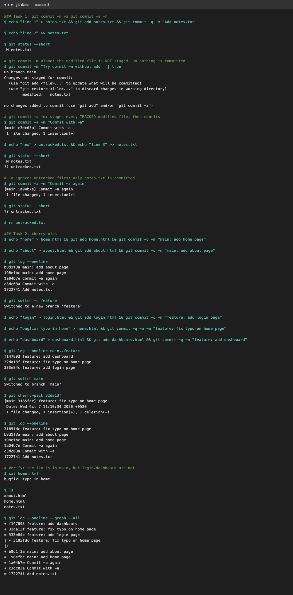

# Session 5: Git and GitHub

Everything below was run with [`demo.sh`](demo.sh), which builds a throwaway repo and runs each command.
Run `./demo.sh` to reproduce it. The full raw log is in [`output.txt`](output.txt).



## Task 1: `git commit -m` vs `git commit -a -m`

| | `git commit -m "msg"` | `git commit -a -m "msg"` |
|---|---|---|
| What it commits | Only what is already **staged** (`git add`) | Stages every **tracked, modified or deleted** file automatically, then commits |
| New (untracked) files | Committed only if you `git add` them | **Never** included; `-a` skips untracked files |
| Typical use | Careful, selective commits | Quick commit of edits to files Git already knows |

What I saw:
1. I edited `notes.txt`, then ran `git commit -m` without `git add` → **"no changes added to commit"**. Nothing was committed.
2. `git commit -a -m` on the same change → committed, `1 file changed`.
3. I created `untracked.txt` and edited `notes.txt`, then ran `git commit -a -m` → only `notes.txt` was committed. `git status` still showed `?? untracked.txt`.

**Takeaway:** `-a` equals `git add -u` plus commit. It never adds new files.

## Task 2: Git cherry-pick

`git cherry-pick <hash>` copies the change from one commit onto the current branch as a **new commit**,
with a new hash. Nothing else from the other branch comes with it.

Steps performed:
1. Made 2 commits on `main` (`add home page`, `add about page`), plus 3 from Task 1.
2. `git log --oneline` to view them.
3. `git switch -c feature` to create a new branch.
4. Made 3 commits on `feature`: `add login page`, `fix typo on home page`, `add dashboard`.
5. `git log --oneline main..feature` to find the hash of **`fix typo on home page`**.
6. `git switch main`, then `git cherry-pick <hash>`.
7. Checked the result:
   - `git log --oneline` on main shows the new commit `feature: fix typo on home page`.
   - `cat home.html` shows the fixed content.
   - `ls` shows **no** `login.html` or `dashboard.html`. Only the one picked commit came over.
   - `git log --graph --all` shows the same change on both branches, under different hashes.

**When to use it:** backport a hotfix to a release branch, or pull one commit out of a branch that isn't ready to merge.

## Full command output

```text
### Task 1: git commit -m vs git commit -a -m
$ echo "line 1" > notes.txt && git add notes.txt && git commit -q -m "Add notes.txt"

$ echo "line 2" >> notes.txt

$ git status --short
 M notes.txt

# git commit -m alone: the modified file is NOT staged, so nothing is committed
$ git commit -m "Try commit -m without add" || true
On branch main
Changes not staged for commit:
  (use "git add <file>..." to update what will be committed)
  (use "git restore <file>..." to discard changes in working directory)
	modified:   notes.txt

no changes added to commit (use "git add" and/or "git commit -a")

# git commit -a -m: stages every TRACKED modified file, then commits
$ git commit -a -m "Commit with -a"
[main c3dc03a] Commit with -a
 1 file changed, 1 insertion(+)

$ echo "new" > untracked.txt && echo "line 3" >> notes.txt

$ git status --short
 M notes.txt
?? untracked.txt

# -a ignores untracked files: only notes.txt is committed
$ git commit -a -m "Commit -a again"
[main 1a04b7e] Commit -a again
 1 file changed, 1 insertion(+)

$ git status --short
?? untracked.txt

$ rm untracked.txt

### Task 2: cherry-pick
$ echo "home" > home.html && git add home.html && git commit -q -m "main: add home page"

$ echo "about" > about.html && git add about.html && git commit -q -m "main: add about page"

$ git log --oneline
b8d1f3a main: add about page
198efbc main: add home page
1a04b7e Commit -a again
c3dc03a Commit with -a
1722741 Add notes.txt

$ git switch -c feature
Switched to a new branch 'feature'

$ echo "login" > login.html && git add login.html && git commit -q -m "feature: add login page"

$ echo "bugfix: typo in home" > home.html && git commit -q -a -m "feature: fix typo on home page"

$ echo "dashboard" > dashboard.html && git add dashboard.html && git commit -q -m "feature: add dashboard"

$ git log --oneline main..feature
f147893 feature: add dashboard
32da13f feature: fix typo on home page
333e84c feature: add login page

$ git switch main
Switched to branch 'main'

$ git cherry-pick 32da13f
[main 3185fdc] feature: fix typo on home page
 Date: Wed Oct 7 11:19:34 2026 +0530
 1 file changed, 1 insertion(+), 1 deletion(-)

$ git log --oneline
3185fdc feature: fix typo on home page
b8d1f3a main: add about page
198efbc main: add home page
1a04b7e Commit -a again
c3dc03a Commit with -a
1722741 Add notes.txt

# Verify: the fix is in main, but login/dashboard are not
$ cat home.html
bugfix: typo in home

$ ls
about.html
home.html
notes.txt

$ git log --oneline --graph --all
* f147893 feature: add dashboard
* 32da13f feature: fix typo on home page
* 333e84c feature: add login page
| * 3185fdc feature: fix typo on home page
|/  
* b8d1f3a main: add about page
* 198efbc main: add home page
* 1a04b7e Commit -a again
* c3dc03a Commit with -a
* 1722741 Add notes.txt

```
