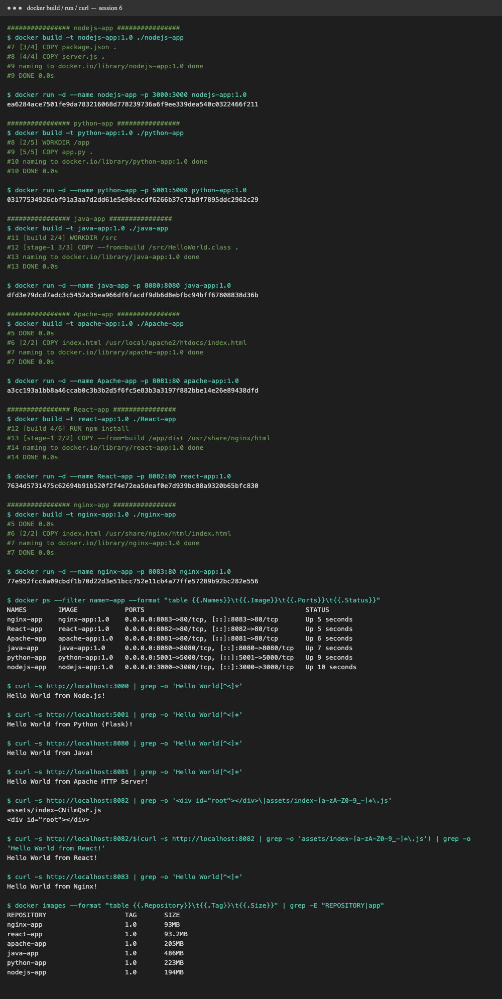

# Session 6: Docker Fundamentals — Hello World Applications

Six Hello World web apps, each in its own folder with its own `Dockerfile`.

| Folder | Stack | Base image(s) | Container port | Host port | Image size |
|---|---|---|---|---|---|
| [`nodejs-app/`](nodejs-app) | Node.js `http` module | `node:20-alpine` | 3000 | 3000 | 194 MB |
| [`python-app/`](python-app) | Python + Flask | `python:3.12-slim` | 5000 | 5001* | 223 MB |
| [`java-app/`](java-app) | Java `HttpServer` | `eclipse-temurin:21-jdk` → `21-jre` (multi-stage) | 8080 | 8080 | 486 MB |
| [`Apache-app/`](Apache-app) | Apache httpd | `httpd:2.4` | 80 | 8081 | 205 MB |
| [`React-app/`](React-app) | React 18 + Vite | `node:20-alpine` → `nginx:alpine` (multi-stage) | 80 | 8082 | 93 MB |
| [`nginx-app/`](nginx-app) | Nginx static page | `nginx:alpine` | 80 | 8083 | 93 MB |

\* On macOS, port 5000 is taken by AirPlay Receiver, so the Python container is published on host port 5001.

## How to build and run (example: Node.js)

```bash
cd nodejs-app
docker build -t nodejs-app:1.0 .
docker run -d --name nodejs-app -p 3000:3000 nodejs-app:1.0
curl http://localhost:3000          # or open it in a browser
```

[`demo.sh`](demo.sh) builds, runs and verifies all six in one go. Its full output is in [`output.txt`](output.txt).

## Notes on the Dockerfiles

- **Node.js / Python:** copy the dependency file first (`package.json`, `requirements.txt`), then the code. Code changes then reuse the cached dependency layer.
- **Java:** a **multi-stage build**. `javac` runs in the JDK image, and only `HelloWorld.class` is copied into the smaller JRE image.
- **React:** also multi-stage. `npm install && npm run build` runs in Node, and only the static `dist/` folder ships, served by Nginx. That's why it's the smallest image.
- **Apache / Nginx:** no build step. Copy `index.html` into the server's web root (`/usr/local/apache2/htdocs/` or `/usr/share/nginx/html/`).

## Verification: Hello World displayed on a webpage

Browser screenshots (headless Chrome) of each running container:

| App | Screenshot |
|---|---|
| Node.js — http://localhost:3000 |  |
| Python — http://localhost:5001 |  |
| Java — http://localhost:8080 |  |
| Apache — http://localhost:8081 |  |
| React — http://localhost:8082 |  |
| Nginx — http://localhost:8083 |  |

Terminal: build → run → `docker ps` → `curl`:



## Full command output

```text
################ nodejs-app ################
$ docker build -t nodejs-app:1.0 ./nodejs-app
#7 [3/4] COPY package.json .
#8 [4/4] COPY server.js .
#9 naming to docker.io/library/nodejs-app:1.0 done
#9 DONE 0.0s

$ docker run -d --name nodejs-app -p 3000:3000 nodejs-app:1.0
ea6284ace7501fe9da783216068d778239736a6f9ee339dea540c0322466f211

################ python-app ################
$ docker build -t python-app:1.0 ./python-app
#8 [2/5] WORKDIR /app
#9 [5/5] COPY app.py .
#10 naming to docker.io/library/python-app:1.0 done
#10 DONE 0.0s

$ docker run -d --name python-app -p 5001:5000 python-app:1.0
03177534926cbf91a3aa7d2dd61e5e98cecdf6266b37c73a9f7895ddc2962c29

################ java-app ################
$ docker build -t java-app:1.0 ./java-app
#11 [build 2/4] WORKDIR /src
#12 [stage-1 3/3] COPY --from=build /src/HelloWorld.class .
#13 naming to docker.io/library/java-app:1.0 done
#13 DONE 0.0s

$ docker run -d --name java-app -p 8080:8080 java-app:1.0
dfd3e79dcd7adc3c5452a35ea966df6facdf9db6d8ebfbc94bff67808838d36b

################ Apache-app ################
$ docker build -t apache-app:1.0 ./Apache-app
#5 DONE 0.0s
#6 [2/2] COPY index.html /usr/local/apache2/htdocs/index.html
#7 naming to docker.io/library/apache-app:1.0 done
#7 DONE 0.0s

$ docker run -d --name Apache-app -p 8081:80 apache-app:1.0
a3cc193a1bb8a46ccab0c3b3b2d5f6fc5e83b3a3197f882bbe14e26e89438dfd

################ React-app ################
$ docker build -t react-app:1.0 ./React-app
#12 [build 4/6] RUN npm install
#13 [stage-1 2/2] COPY --from=build /app/dist /usr/share/nginx/html
#14 naming to docker.io/library/react-app:1.0 done
#14 DONE 0.0s

$ docker run -d --name React-app -p 8082:80 react-app:1.0
7634d5731475c62694b91b520f2f4e72ea5deaf0e7d939bc88a9320b65bfc830

################ nginx-app ################
$ docker build -t nginx-app:1.0 ./nginx-app
#5 DONE 0.0s
#6 [2/2] COPY index.html /usr/share/nginx/html/index.html
#7 naming to docker.io/library/nginx-app:1.0 done
#7 DONE 0.0s

$ docker run -d --name nginx-app -p 8083:80 nginx-app:1.0
77e952fcc6a09cbdf1b70d22d3e51bcc752e11cb4a77ffe57289b92bc282e556

$ docker ps --filter name=-app --format "table {{.Names}}\t{{.Image}}\t{{.Ports}}\t{{.Status}}"
NAMES        IMAGE            PORTS                                         STATUS
nginx-app    nginx-app:1.0    0.0.0.0:8083->80/tcp, [::]:8083->80/tcp       Up 5 seconds
React-app    react-app:1.0    0.0.0.0:8082->80/tcp, [::]:8082->80/tcp       Up 5 seconds
Apache-app   apache-app:1.0   0.0.0.0:8081->80/tcp, [::]:8081->80/tcp       Up 6 seconds
java-app     java-app:1.0     0.0.0.0:8080->8080/tcp, [::]:8080->8080/tcp   Up 7 seconds
python-app   python-app:1.0   0.0.0.0:5001->5000/tcp, [::]:5001->5000/tcp   Up 9 seconds
nodejs-app   nodejs-app:1.0   0.0.0.0:3000->3000/tcp, [::]:3000->3000/tcp   Up 10 seconds

$ curl -s http://localhost:3000 | grep -o 'Hello World[^<]*'
Hello World from Node.js!

$ curl -s http://localhost:5001 | grep -o 'Hello World[^<]*'
Hello World from Python (Flask)!

$ curl -s http://localhost:8080 | grep -o 'Hello World[^<]*'
Hello World from Java!

$ curl -s http://localhost:8081 | grep -o 'Hello World[^<]*'
Hello World from Apache HTTP Server!

$ curl -s http://localhost:8082 | grep -o '<div id="root"></div>\|assets/index-[a-zA-Z0-9_-]*\.js'
assets/index-CNilmQsF.js
<div id="root"></div>

$ curl -s http://localhost:8082/$(curl -s http://localhost:8082 | grep -o 'assets/index-[a-zA-Z0-9_-]*\.js') | grep -o 'Hello World from React!'
Hello World from React!

$ curl -s http://localhost:8083 | grep -o 'Hello World[^<]*'
Hello World from Nginx!

$ docker images --format "table {{.Repository}}\t{{.Tag}}\t{{.Size}}" | grep -E "REPOSITORY|app"
REPOSITORY                    TAG       SIZE
nginx-app                     1.0       93MB
react-app                     1.0       93.2MB
apache-app                    1.0       205MB
java-app                      1.0       486MB
python-app                    1.0       223MB
nodejs-app                    1.0       194MB

```
