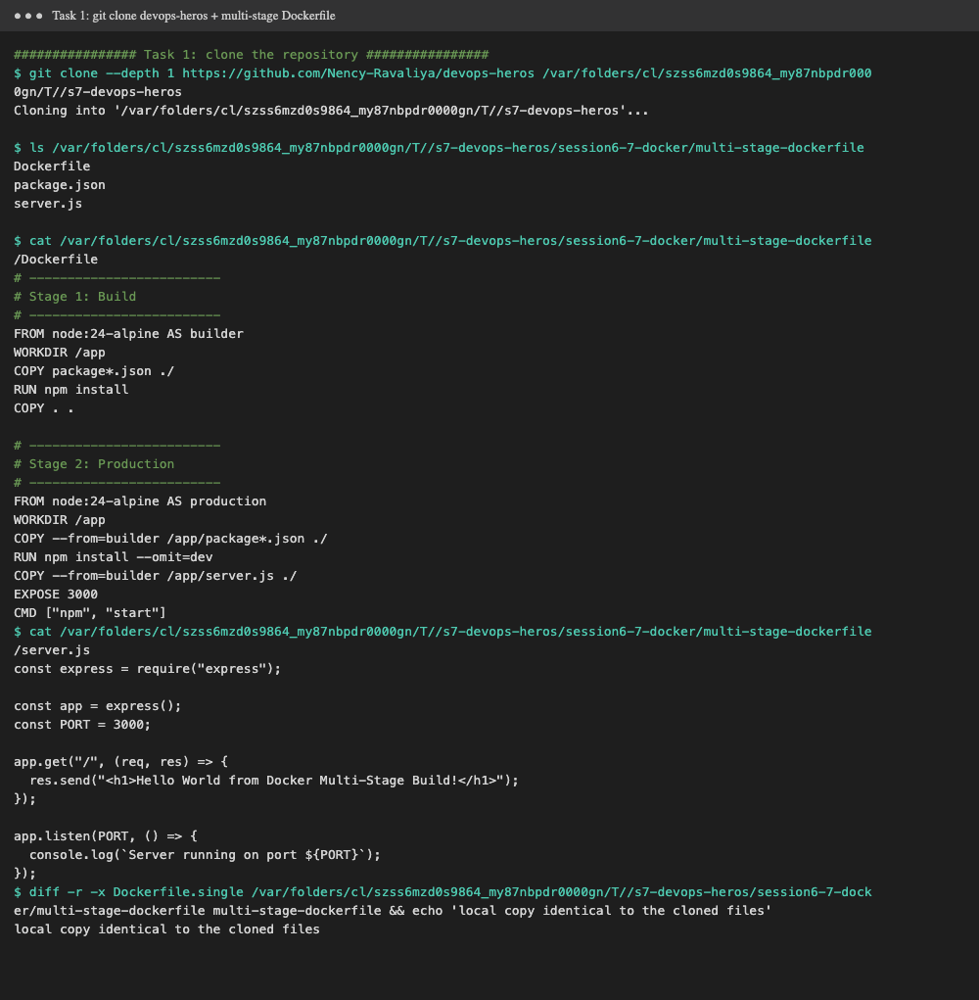
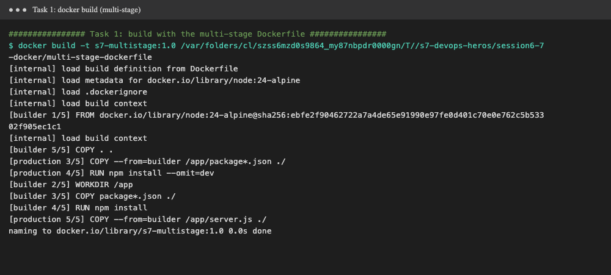
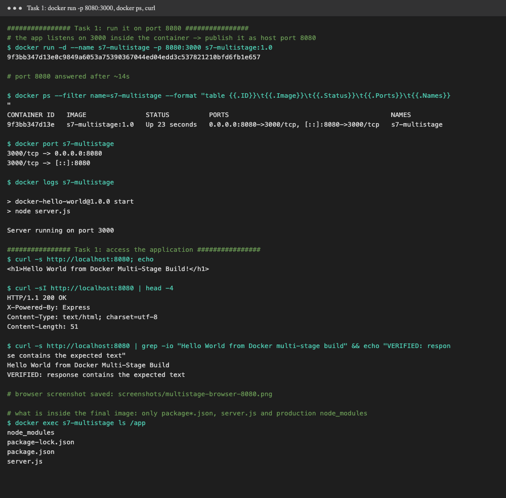
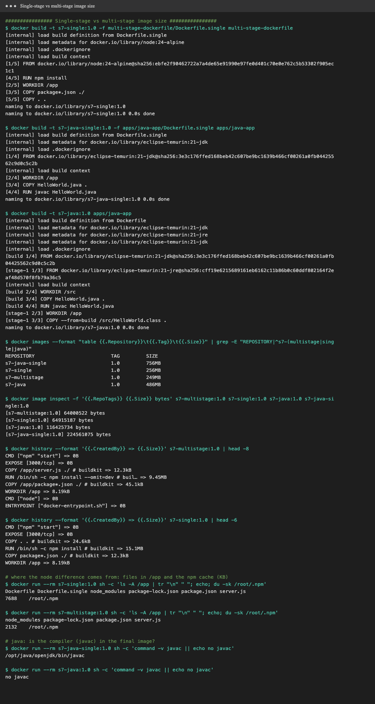
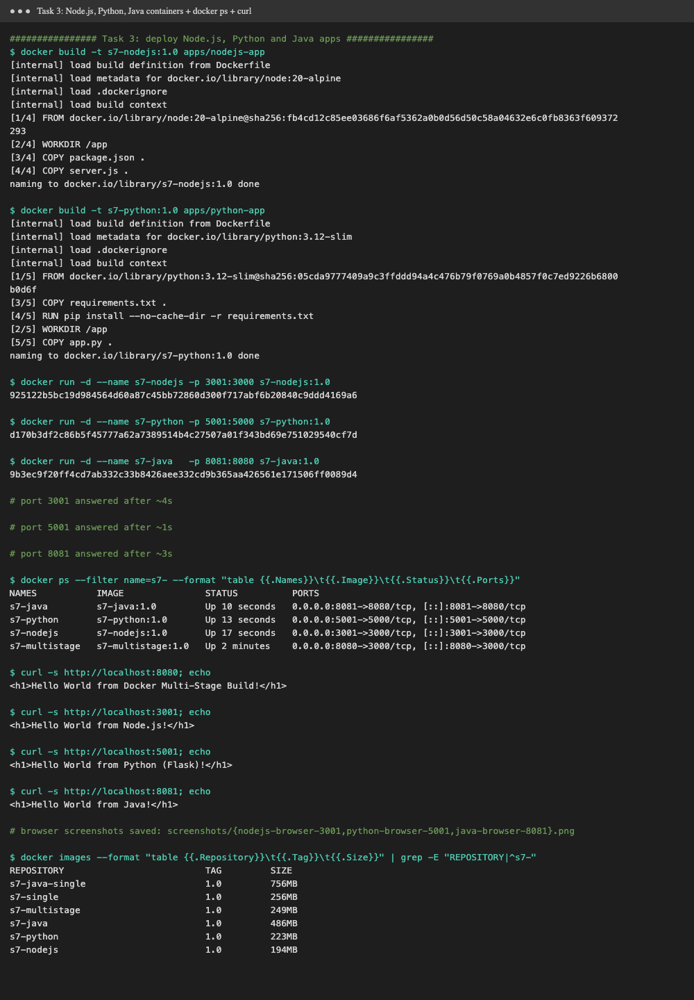

**Name:** Milap Kothari

**Enrollment number:** 24bcs10004

# Session 7: Docker Images, Multi-Stage Build & App Deployment

Everything below was run with [`demo.sh`](demo.sh) (`./demo.sh > output.txt`). The raw log is in [`output.txt`](output.txt) and
the full output is at the bottom of this page. The browser screenshots were taken with headless Chrome while the containers were running.
`demo.sh` removes all its containers and images (`s7-*`) at the end.

| Folder | What it is |
|---|---|
| [`multi-stage-dockerfile/`](multi-stage-dockerfile) | The course app, copied from the cloned repo (`Dockerfile`, `package.json`, `server.js`), plus my `Dockerfile.single` used only for the size comparison |
| [`apps/nodejs-app/`](apps/nodejs-app) | Node.js app (Task 3) |
| [`apps/python-app/`](apps/python-app) | Python Flask app (Task 3) |
| [`apps/java-app/`](apps/java-app) | Java app, multi-stage JDK → JRE (Task 3), plus `Dockerfile.single` for comparison |

---

## Task 1: Multi-stage build

### 1. Clone the repository

```bash
git clone --depth 1 https://github.com/Nency-Ravaliya/devops-heros
cd devops-heros/session6-7-docker/multi-stage-dockerfile
```



### 2. The multi-stage Dockerfile, line by line

```dockerfile
# Stage 1: Build
FROM node:24-alpine AS builder
WORKDIR /app
COPY package*.json ./
RUN npm install
COPY . .

# Stage 2: Production
FROM node:24-alpine AS production
WORKDIR /app
COPY --from=builder /app/package*.json ./
RUN npm install --omit=dev
COPY --from=builder /app/server.js ./
EXPOSE 3000
CMD ["npm", "start"]
```

| Line | What it does |
|---|---|
| `FROM node:24-alpine AS builder` | Starts **stage 1** from Node 24 on Alpine Linux (a small base). `AS builder` names the stage so later stages can copy from it. |
| `WORKDIR /app` | Creates `/app` and makes it the working directory for the following instructions. |
| `COPY package*.json ./` | Copies only `package.json` (and `package-lock.json` if present) **first**, so the next layer is cached until dependencies change. |
| `RUN npm install` | Installs **all** dependencies, dev ones included, which is what a build or test step would need. |
| `COPY . .` | Copies the rest of the source code into the builder stage. |
| `FROM node:24-alpine AS production` | Starts **stage 2** from a fresh base image. Nothing from stage 1 is carried over unless it is explicitly copied. **Only this last stage becomes the final image.** |
| `WORKDIR /app` | Same working directory in the new stage. |
| `COPY --from=builder /app/package*.json ./` | Copies the package files **out of the builder stage** (not from my machine). |
| `RUN npm install --omit=dev` | Installs **production dependencies only** (here: `express`). |
| `COPY --from=builder /app/server.js ./` | Copies only the file the app needs to run, so build leftovers, the Dockerfile and other source stay behind. |
| `EXPOSE 3000` | Documents that the app listens on port 3000. It does not publish the port, which `-p` does. |
| `CMD ["npm", "start"]` | Default command: runs `node server.js` (the `start` script in `package.json`). |

**Why multi-stage?** The tools needed to *build* an app (compilers, dev dependencies, build caches, source files) are not needed to *run* it.
A multi-stage build does the build in one image and copies only the result into a clean final image. The result is a **smaller, faster to
pull, and more secure** image, because there is less software that could be attacked.

### 3. Build the image

```bash
docker build -t s7-multistage:1.0 .
```



The build log shows both stages: `[builder 1/5 … 5/5]` and `[production 3/5 … 5/5]`, with `COPY --from=builder` pulling files across.

### 4. Run the container on port 8080, then check it with `docker ps` and the browser

`server.js` listens on **3000** inside the container, so I published it on **host port 8080**:

```bash
docker run -d --name s7-multistage -p 8080:3000 s7-multistage:1.0
docker ps
curl http://localhost:8080
```

**`docker ps` shows the container running on port 8080** (`0.0.0.0:8080->3000/tcp`):

```text
$ docker ps --filter name=s7-multistage --format "table {{.ID}}\t{{.Image}}\t{{.Status}}\t{{.Ports}}\t{{.Names}}"
CONTAINER ID   IMAGE               STATUS          PORTS                                         NAMES
9f3bb347d13e   s7-multistage:1.0   Up 23 seconds   0.0.0.0:8080->3000/tcp, [::]:8080->3000/tcp   s7-multistage
```

**The application in the browser, http://localhost:8080** (headless Chrome screenshot):


**Terminal: run → docker ps → docker port → logs → curl:**



```text
$ curl -s http://localhost:8080; echo
<h1>Hello World from Docker Multi-Stage Build!</h1>

$ curl -sI http://localhost:8080 | head -4
HTTP/1.1 200 OK
X-Powered-By: Express
Content-Type: text/html; charset=utf-8
Content-Length: 51

$ curl -s http://localhost:8080 | grep -io "Hello World from Docker multi-stage build" && echo "VERIFIED: response contains the expected text"
Hello World from Docker Multi-Stage Build
VERIFIED: response contains the expected text

# browser screenshot saved: screenshots/multistage-browser-8080.png

# what is inside the final image: only package*.json, server.js and production node_modules
$ docker exec s7-multistage ls /app
node_modules
package-lock.json
package.json
server.js
```

**Verification result:** the app returns `<h1>Hello World from Docker Multi-Stage Build!</h1>`. That is the required text,
*Hello World from Docker multi-stage build*. The only differences are capital letters ("Multi-Stage Build") and a final `!`,
exactly as written in the course's `server.js`. A case-insensitive `grep -i` for the required sentence matched, and
`curl -I` shows `HTTP/1.1 200 OK` from Express.
`docker exec … ls /app` confirms the final image holds only `node_modules`, `package*.json` and `server.js`. The Dockerfile and other build-context files stayed in the builder stage.

### 5. Single-stage vs multi-stage: image size

To measure the difference I also built **single-stage** versions:
- [`multi-stage-dockerfile/Dockerfile.single`](multi-stage-dockerfile/Dockerfile.single): one `FROM node:24-alpine`, `npm install`, `COPY . .` (the course's `node-app` style)
- [`apps/java-app/Dockerfile.single`](apps/java-app/Dockerfile.single): compile **and** run in `eclipse-temurin:21-jdk`, versus the multi-stage [`Dockerfile`](apps/java-app/Dockerfile) that compiles in the JDK and runs in `eclipse-temurin:21-jre`



| App | Single-stage | Multi-stage | Saved |
|---|---|---|---|
| Node.js / Express (course app), size on disk | 256 MB | **249 MB** | 7 MB (~3 %) |
| Node.js / Express, compressed content | 64,915,187 B | **64,000,522 B** | ~0.9 MB |
| Java (JDK → JRE), size on disk | 756 MB | **486 MB** | **270 MB (~36 %)** |
| Java, compressed content | 224,561,075 B | **116,425,734 B** | **~108 MB (~48 %)** |

(`docker images` SIZE is the unpacked size on disk. `docker image inspect .Size` is the compressed size that gets pulled or pushed.)

**What the numbers show:**
- **Node:** only a small saving, and that is the honest result. Both stages use the **same** `node:24-alpine` base, and `express` has no dev
  dependencies, so the final image cannot drop much. The difference that remains is real: the single-stage image also carries
  `Dockerfile` and `Dockerfile.single` in `/app` and a bigger npm cache (`/root/.npm` 7,688 KB vs 2,132 KB). Its `npm install`
  layer is 15.1 MB, versus 9.45 MB for `npm install --omit=dev`.
- **Java:** a big saving. The single-stage image ships the whole **JDK** (`javac` is present: `/opt/java/openjdk/bin/javac`), while the
  multi-stage image has only the **JRE** plus one `.class` file (`no javac`). This is the typical case where multi-stage pays off:
  compiled languages and front-end builds (the React app in session 6 dropped from a Node image to `nginx:alpine`, 93 MB).

---

## Task 2: Documentation

This file is the documentation. My name and enrollment number are at the top. The evidence is above:
- Application running successfully: browser screenshot [`multistage-browser-8080.png`](screenshots/multistage-browser-8080.png) and the `curl` output
- `docker ps` showing the container on port **8080**: [`task1-run-docker-ps-8080.png`](screenshots/task1-run-docker-ps-8080.png) and the `docker ps` output above

---

## Task 3: Deploying three different types of applications

| App | Folder | Base image(s) | Container port | Host port | Image size |
|---|---|---|---|---|---|
| **Node.js** (`http` module) | [`apps/nodejs-app`](apps/nodejs-app) | `node:20-alpine` | 3000 | **3001** * | 194 MB |
| **Python** (Flask) | [`apps/python-app`](apps/python-app) | `python:3.12-slim` | 5000 | **5001** ** | 223 MB |
| **Java** (`HttpServer`) | [`apps/java-app`](apps/java-app) | `eclipse-temurin:21-jdk` → `21-jre` (multi-stage) | 8080 | **8081** *** | 486 MB |
| Node.js / Express (Task 1) | [`multi-stage-dockerfile`](multi-stage-dockerfile) | `node:24-alpine` (multi-stage) | 3000 | **8080** | 249 MB |

\* host port 3000 was already in use on this Mac, so I used 3001. \*\* macOS AirPlay uses port 5000. \*\*\* 8080 is taken by the Task 1 app.

```bash
docker build -t s7-nodejs:1.0 apps/nodejs-app && docker run -d --name s7-nodejs -p 3001:3000 s7-nodejs:1.0
docker build -t s7-python:1.0 apps/python-app && docker run -d --name s7-python -p 5001:5000 s7-python:1.0
docker build -t s7-java:1.0   apps/java-app   && docker run -d --name s7-java   -p 8081:8080 s7-java:1.0
docker ps
```

Dockerfile notes:
- **Node.js:** `FROM node:20-alpine`, copy `package.json` then `server.js`, `CMD ["npm","start"]`. The app has no npm dependencies, so there is no install step.
- **Python:** copy `requirements.txt` first and `pip install --no-cache-dir`, so the dependency layer is cached and has no pip cache. Then copy `app.py`. Flask binds `0.0.0.0` so it is reachable from outside the container.
- **Java:** multi-stage. `javac` runs in the JDK stage, and only `HelloWorld.class` is copied into the JRE stage.

**All four containers running at the same time (`docker ps`) and each one answering `curl`:**



```text
$ docker ps --filter name=s7- --format "table {{.Names}}\t{{.Image}}\t{{.Status}}\t{{.Ports}}"
NAMES           IMAGE               STATUS          PORTS
s7-java         s7-java:1.0         Up 10 seconds   0.0.0.0:8081->8080/tcp, [::]:8081->8080/tcp
s7-python       s7-python:1.0       Up 13 seconds   0.0.0.0:5001->5000/tcp, [::]:5001->5000/tcp
s7-nodejs       s7-nodejs:1.0       Up 17 seconds   0.0.0.0:3001->3000/tcp, [::]:3001->3000/tcp
s7-multistage   s7-multistage:1.0   Up 2 minutes    0.0.0.0:8080->3000/tcp, [::]:8080->3000/tcp

$ curl -s http://localhost:8080; echo
<h1>Hello World from Docker Multi-Stage Build!</h1>

$ curl -s http://localhost:3001; echo
<h1>Hello World from Node.js!</h1>

$ curl -s http://localhost:5001; echo
<h1>Hello World from Python (Flask)!</h1>

$ curl -s http://localhost:8081; echo
<h1>Hello World from Java!</h1>
```

**Browser screenshots (headless Chrome):**

| Node.js, http://localhost:3001 | Python, http://localhost:5001 | Java, http://localhost:8081 |
|---|---|---|
|  |  |  |

## What I learned

- An image is built in **layers**. Copying the dependency file before the source keeps the slow install layer cached.
- **Multi-stage builds** separate *build* from *run*. Only the last `FROM` stage ends up in the image, and `COPY --from=<stage>` brings over only what is needed.
  The saving is small when both stages share the same runtime base (the Node example) and large when the build needs a heavy toolchain (Java JDK → JRE).
- `EXPOSE` only documents a port. `-p host:container` actually publishes it, and the app inside can use a different port than the host (8080 → 3000).
- Different stacks deploy the same way: a Dockerfile, `docker build`, `docker run -p`, and `docker ps` to check.

## Full command output

```text
################ Task 1: clone the repository ################
$ git clone --depth 1 https://github.com/Nency-Ravaliya/devops-heros /var/folders/cl/szss6mzd0s9864_my87nbpdr0000gn/T//s7-devops-heros
Cloning into '/var/folders/cl/szss6mzd0s9864_my87nbpdr0000gn/T//s7-devops-heros'...

$ ls /var/folders/cl/szss6mzd0s9864_my87nbpdr0000gn/T//s7-devops-heros/session6-7-docker/multi-stage-dockerfile
Dockerfile
package.json
server.js

$ cat /var/folders/cl/szss6mzd0s9864_my87nbpdr0000gn/T//s7-devops-heros/session6-7-docker/multi-stage-dockerfile/Dockerfile
# -------------------------
# Stage 1: Build
# -------------------------
FROM node:24-alpine AS builder
WORKDIR /app
COPY package*.json ./
RUN npm install
COPY . .

# -------------------------
# Stage 2: Production
# -------------------------
FROM node:24-alpine AS production
WORKDIR /app
COPY --from=builder /app/package*.json ./
RUN npm install --omit=dev
COPY --from=builder /app/server.js ./
EXPOSE 3000
CMD ["npm", "start"]
$ cat /var/folders/cl/szss6mzd0s9864_my87nbpdr0000gn/T//s7-devops-heros/session6-7-docker/multi-stage-dockerfile/server.js
const express = require("express");

const app = express();
const PORT = 3000;

app.get("/", (req, res) => {
  res.send("<h1>Hello World from Docker Multi-Stage Build!</h1>");
});

app.listen(PORT, () => {
  console.log(`Server running on port ${PORT}`);
});
$ diff -r -x Dockerfile.single /var/folders/cl/szss6mzd0s9864_my87nbpdr0000gn/T//s7-devops-heros/session6-7-docker/multi-stage-dockerfile multi-stage-dockerfile && echo 'local copy identical to the cloned files'
local copy identical to the cloned files

################ Task 1: build with the multi-stage Dockerfile ################
$ docker build -t s7-multistage:1.0 /var/folders/cl/szss6mzd0s9864_my87nbpdr0000gn/T//s7-devops-heros/session6-7-docker/multi-stage-dockerfile
[internal] load build definition from Dockerfile
[internal] load metadata for docker.io/library/node:24-alpine
[internal] load .dockerignore
[internal] load build context
[builder 1/5] FROM docker.io/library/node:24-alpine@sha256:ebfe2f90462722a7a4de65e91990e97fe0d401c70e0e762c5b53302f905ec1c1
[internal] load build context
[builder 5/5] COPY . .
[production 3/5] COPY --from=builder /app/package*.json ./
[production 4/5] RUN npm install --omit=dev
[builder 2/5] WORKDIR /app
[builder 3/5] COPY package*.json ./
[builder 4/5] RUN npm install
[production 5/5] COPY --from=builder /app/server.js ./
naming to docker.io/library/s7-multistage:1.0 0.0s done

################ Task 1: run it on port 8080 ################
# the app listens on 3000 inside the container -> publish it as host port 8080
$ docker run -d --name s7-multistage -p 8080:3000 s7-multistage:1.0
9f3bb347d13e0c9849a6053a75390367044ed04edd3c537821210bfd6fb1e657

# port 8080 answered after ~14s

$ docker ps --filter name=s7-multistage --format "table {{.ID}}\t{{.Image}}\t{{.Status}}\t{{.Ports}}\t{{.Names}}"
CONTAINER ID   IMAGE               STATUS          PORTS                                         NAMES
9f3bb347d13e   s7-multistage:1.0   Up 23 seconds   0.0.0.0:8080->3000/tcp, [::]:8080->3000/tcp   s7-multistage

$ docker port s7-multistage
3000/tcp -> 0.0.0.0:8080
3000/tcp -> [::]:8080

$ docker logs s7-multistage

> docker-hello-world@1.0.0 start
> node server.js

Server running on port 3000

################ Task 1: access the application ################
$ curl -s http://localhost:8080; echo
<h1>Hello World from Docker Multi-Stage Build!</h1>

$ curl -sI http://localhost:8080 | head -4
HTTP/1.1 200 OK
X-Powered-By: Express
Content-Type: text/html; charset=utf-8
Content-Length: 51

$ curl -s http://localhost:8080 | grep -io "Hello World from Docker multi-stage build" && echo "VERIFIED: response contains the expected text"
Hello World from Docker Multi-Stage Build
VERIFIED: response contains the expected text

# browser screenshot saved: screenshots/multistage-browser-8080.png

# what is inside the final image: only package*.json, server.js and production node_modules
$ docker exec s7-multistage ls /app
node_modules
package-lock.json
package.json
server.js

################ Single-stage vs multi-stage image size ################
$ docker build -t s7-single:1.0 -f multi-stage-dockerfile/Dockerfile.single multi-stage-dockerfile
[internal] load build definition from Dockerfile.single
[internal] load metadata for docker.io/library/node:24-alpine
[internal] load .dockerignore
[internal] load build context
[1/5] FROM docker.io/library/node:24-alpine@sha256:ebfe2f90462722a7a4de65e91990e97fe0d401c70e0e762c5b53302f905ec1c1
[4/5] RUN npm install
[2/5] WORKDIR /app
[3/5] COPY package*.json ./
[5/5] COPY . .
naming to docker.io/library/s7-single:1.0
naming to docker.io/library/s7-single:1.0 0.0s done

$ docker build -t s7-java-single:1.0 -f apps/java-app/Dockerfile.single apps/java-app
[internal] load build definition from Dockerfile.single
[internal] load metadata for docker.io/library/eclipse-temurin:21-jdk
[internal] load .dockerignore
[1/4] FROM docker.io/library/eclipse-temurin:21-jdk@sha256:3e3c176ffed168beb42c607be9bc1639b466cf00261a0fb04425562c9d0c5c2b
[internal] load build context
[2/4] WORKDIR /app
[3/4] COPY HelloWorld.java .
[4/4] RUN javac HelloWorld.java
naming to docker.io/library/s7-java-single:1.0 0.0s done

$ docker build -t s7-java:1.0 apps/java-app
[internal] load build definition from Dockerfile
[internal] load metadata for docker.io/library/eclipse-temurin:21-jdk
[internal] load metadata for docker.io/library/eclipse-temurin:21-jre
[internal] load metadata for docker.io/library/eclipse-temurin:21-jdk
[internal] load .dockerignore
[build 1/4] FROM docker.io/library/eclipse-temurin:21-jdk@sha256:3e3c176ffed168beb42c607be9bc1639b466cf00261a0fb04425562c9d0c5c2b
[stage-1 1/3] FROM docker.io/library/eclipse-temurin:21-jre@sha256:cff19e6215689161eb6162c11b86b0c60ddf802164f2eaf48d570f8fb79a36c5
[internal] load build context
[build 2/4] WORKDIR /src
[build 3/4] COPY HelloWorld.java .
[build 4/4] RUN javac HelloWorld.java
[stage-1 2/3] WORKDIR /app
[stage-1 3/3] COPY --from=build /src/HelloWorld.class .
naming to docker.io/library/s7-java:1.0 0.0s done

$ docker images --format "table {{.Repository}}\t{{.Tag}}\t{{.Size}}" | grep -E "REPOSITORY|^s7-(multistage|single|java)"
REPOSITORY                          TAG         SIZE
s7-java-single                      1.0         756MB
s7-single                           1.0         256MB
s7-multistage                       1.0         249MB
s7-java                             1.0         486MB

$ docker image inspect -f '{{.RepoTags}} {{.Size}} bytes' s7-multistage:1.0 s7-single:1.0 s7-java:1.0 s7-java-single:1.0
[s7-multistage:1.0] 64000522 bytes
[s7-single:1.0] 64915187 bytes
[s7-java:1.0] 116425734 bytes
[s7-java-single:1.0] 224561075 bytes

$ docker history --format '{{.CreatedBy}} => {{.Size}}' s7-multistage:1.0 | head -8
CMD ["npm" "start"] => 0B
EXPOSE [3000/tcp] => 0B
COPY /app/server.js ./ # buildkit => 12.3kB
RUN /bin/sh -c npm install --omit=dev # buil… => 9.45MB
COPY /app/package*.json ./ # buildkit => 45.1kB
WORKDIR /app => 8.19kB
CMD ["node"] => 0B
ENTRYPOINT ["docker-entrypoint.sh"] => 0B

$ docker history --format '{{.CreatedBy}} => {{.Size}}' s7-single:1.0 | head -6
CMD ["npm" "start"] => 0B
EXPOSE [3000/tcp] => 0B
COPY . . # buildkit => 24.6kB
RUN /bin/sh -c npm install # buildkit => 15.1MB
COPY package*.json ./ # buildkit => 12.3kB
WORKDIR /app => 8.19kB

# where the node difference comes from: files in /app and the npm cache (KB)
$ docker run --rm s7-single:1.0 sh -c 'ls -A /app | tr "\n" " "; echo; du -sk /root/.npm'
Dockerfile Dockerfile.single node_modules package-lock.json package.json server.js 
7688	/root/.npm

$ docker run --rm s7-multistage:1.0 sh -c 'ls -A /app | tr "\n" " "; echo; du -sk /root/.npm'
node_modules package-lock.json package.json server.js 
2132	/root/.npm

# java: is the compiler (javac) in the final image?
$ docker run --rm s7-java-single:1.0 sh -c 'command -v javac || echo no javac'
/opt/java/openjdk/bin/javac

$ docker run --rm s7-java:1.0 sh -c 'command -v javac || echo no javac'
no javac

################ Task 3: deploy Node.js, Python and Java apps ################
$ docker build -t s7-nodejs:1.0 apps/nodejs-app
[internal] load build definition from Dockerfile
[internal] load metadata for docker.io/library/node:20-alpine
[internal] load .dockerignore
[internal] load build context
[1/4] FROM docker.io/library/node:20-alpine@sha256:fb4cd12c85ee03686f6af5362a0b0d56d50c58a04632e6c0fb8363f609372293
[2/4] WORKDIR /app
[3/4] COPY package.json .
[4/4] COPY server.js .
naming to docker.io/library/s7-nodejs:1.0 done

$ docker build -t s7-python:1.0 apps/python-app
[internal] load build definition from Dockerfile
[internal] load metadata for docker.io/library/python:3.12-slim
[internal] load .dockerignore
[internal] load build context
[1/5] FROM docker.io/library/python:3.12-slim@sha256:05cda9777409a9c3ffddd94a4c476b79f0769a0b4857f0c7ed9226b6800b0d6f
[3/5] COPY requirements.txt .
[4/5] RUN pip install --no-cache-dir -r requirements.txt
[2/5] WORKDIR /app
[5/5] COPY app.py .
naming to docker.io/library/s7-python:1.0 done

$ docker run -d --name s7-nodejs -p 3001:3000 s7-nodejs:1.0
925122b5bc19d984564d60a87c45bb72860d300f717abf6b20840c9ddd4169a6

$ docker run -d --name s7-python -p 5001:5000 s7-python:1.0
d170b3df2c86b5f45777a62a7389514b4c27507a01f343bd69e751029540cf7d

$ docker run -d --name s7-java   -p 8081:8080 s7-java:1.0
9b3ec9f20ff4cd7ab332c33b8426aee332cd9b365aa426561e171506ff0089d4

# port 3001 answered after ~4s

# port 5001 answered after ~1s

# port 8081 answered after ~3s

$ docker ps --filter name=s7- --format "table {{.Names}}\t{{.Image}}\t{{.Status}}\t{{.Ports}}"
NAMES           IMAGE               STATUS          PORTS
s7-java         s7-java:1.0         Up 10 seconds   0.0.0.0:8081->8080/tcp, [::]:8081->8080/tcp
s7-python       s7-python:1.0       Up 13 seconds   0.0.0.0:5001->5000/tcp, [::]:5001->5000/tcp
s7-nodejs       s7-nodejs:1.0       Up 17 seconds   0.0.0.0:3001->3000/tcp, [::]:3001->3000/tcp
s7-multistage   s7-multistage:1.0   Up 2 minutes    0.0.0.0:8080->3000/tcp, [::]:8080->3000/tcp

$ curl -s http://localhost:8080; echo
<h1>Hello World from Docker Multi-Stage Build!</h1>

$ curl -s http://localhost:3001; echo
<h1>Hello World from Node.js!</h1>

$ curl -s http://localhost:5001; echo
<h1>Hello World from Python (Flask)!</h1>

$ curl -s http://localhost:8081; echo
<h1>Hello World from Java!</h1>

# browser screenshots saved: screenshots/{nodejs-browser-3001,python-browser-5001,java-browser-8081}.png

$ docker images --format "table {{.Repository}}\t{{.Tag}}\t{{.Size}}" | grep -E "REPOSITORY|^s7-"
REPOSITORY                          TAG         SIZE
s7-java-single                      1.0         756MB
s7-single                           1.0         256MB
s7-multistage                       1.0         249MB
s7-java                             1.0         486MB
s7-python                           1.0         223MB
s7-nodejs                           1.0         194MB

################ Cleanup ################
$ docker rm -f s7-multistage s7-nodejs s7-python s7-java
s7-multistage
s7-nodejs
s7-python
s7-java

$ docker rmi s7-multistage:1.0 s7-single:1.0 s7-java-single:1.0 s7-java:1.0 s7-nodejs:1.0 s7-python:1.0
Untagged: s7-multistage:1.0
Deleted: sha256:a3b8f1269be101a853f84fbaa9760dc9592fd135b7de31b8ebfb5e61fcff85c7
Untagged: s7-single:1.0
Deleted: sha256:8691b337c0172f3a020ecef71a28843f60fa1348a0c0c7c4789171c42ce3e968
Untagged: s7-java-single:1.0
Deleted: sha256:a6f8d40dcde60a86540a342cba74f794834205645dc06b907bc892621a9e54fc
Untagged: s7-java:1.0
Deleted: sha256:39d23b864c889742e9e6279595ee02025771a0933016dfa8bf10a8211038dfee
Untagged: s7-nodejs:1.0
Deleted: sha256:cdc496abd59f17233a3cdc61c1ebe0c3013afdf616ceb3932153028134ed1c19
Untagged: s7-python:1.0
Deleted: sha256:5cff64b68f46f71635a5fca7d336912280f3d7d268d7e049ca60f6651af781a0
```
