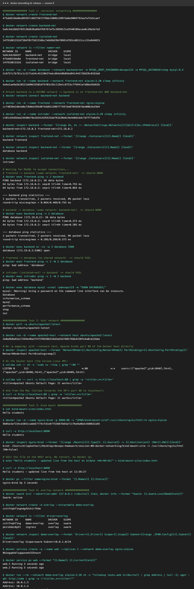
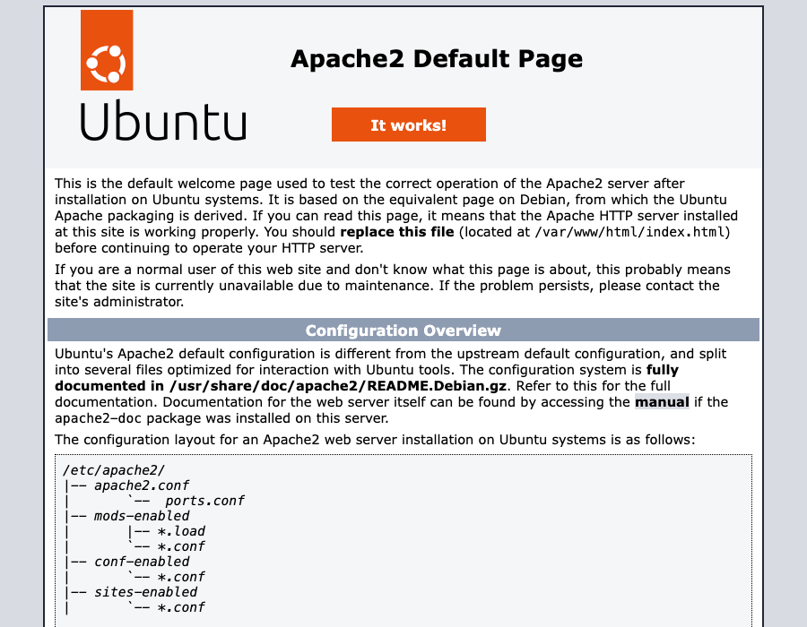

# Session 8: Docker Networking & Volumes

Everything here was run with [`demo.sh`](demo.sh). Raw output is in [`output.txt`](output.txt), and the full log is at the bottom of this page.



---

## Task 1: Container networking (frontend / backend / database)

```text
          frontend-net                     backend-net
   ┌──────────────────────────┐   ┌──────────────────────────┐
   │  frontend (nginx:alpine) │   │   database (mysql:8.4)   │
   │            │             │   │            ▲             │
   │            ▼             │   │            │             │
   │        backend (alpine:3.20) ◄──── on BOTH networks      │
   └──────────────────────────┘   └──────────────────────────┘

          isolated-net:  intruder (alpine)  — shares nothing
```

| Command | Purpose |
|---|---|
| `docker network create frontend-net` / `backend-net` / `isolated-net` | 3 user-defined bridge networks |
| `docker run -d --name database --network backend-net -e MYSQL_ROOT_PASSWORD=… mysql:8.4` | DB only on the backend network |
| `docker run -d --name backend --network frontend-net alpine:3.20 sleep infinity` | backend starts on frontend-net |
| `docker network connect backend-net backend` | **backend joins a 2nd network** |
| `docker run -d --name frontend --network frontend-net nginx:alpine` | frontend only on frontend-net |

Result: `docker inspect backend` shows **two IPs**, `backend-net=172.19.0.3 frontend-net=172.18.0.2`.

| Test | Result | Why |
|---|---|---|
| frontend → backend (`ping backend`) | ✅ 0% packet loss | both on `frontend-net` |
| backend → database (`ping database`) | ✅ 0% packet loss | both on `backend-net` |
| backend → database:3306 (`nc -zv`) | ✅ `open` | MySQL reachable by **name** |
| frontend → database | ❌ `bad address 'database'` | no shared network, so DNS can't even resolve the name |
| intruder → backend | ❌ `bad address 'backend'` | `isolated-net` is isolated |

**What I learned:** user-defined bridge networks come with **built-in DNS**, so containers reach each
other by container name. Containers can only talk if they share a network. Putting the backend on two
networks keeps the database unreachable from the frontend, which is the classic 3-tier isolation.

## Task 2: Host network

```bash
docker pull ubuntu/apache2:latest
docker run -d --name apache2-host --network host ubuntu/apache2:latest
curl http://localhost:80
```

- `PortBindings=map[]`: **no `-p` flag at all**. With `--network host` the container shares the host's
  network stack, so Apache binds **port 80 of the host** directly (`ss -ltnp` shows `apache2` on `*:80`).
- No NAT and no port mapping means the best network performance, but no isolation, and port clashes with the host are possible.
- On this Mac, Docker runs inside a Linux VM (Colima). The "host" is that VM, and Colima forwards its port 80 to the Mac.



## Task 3: Bind mount

```bash
mkdir bind-mount-site && echo "Hello students" > bind-mount-site/index.html
docker run -d --name nginx-bind -p 8090:80 \
  -v "$PWD/bind-mount-site":/usr/share/nginx/html:ro nginx:alpine
curl http://localhost:8090                      # Hello students
echo "Hello students - updated live ..." > bind-mount-site/index.html
curl http://localhost:8090                      # new content, container never restarted
```

| Before edit | After edit (no restart) |
|---|---|
|  |  |

`docker ps` still showed `Up 2 seconds` from the original start, so the container was never restarted.
A bind mount maps a **host folder** into the container, and both see the same files instantly. `:ro` makes it read-only inside the container.

**Bind mount vs volume:** a bind mount is any host path you choose, good for development. A volume
(`docker volume create`) is managed by Docker under `/var/lib/docker/volumes`, which makes it portable and the better choice for databases.

## Task 4: Overlay networks (research + demo)

**What it is:** a network driver that creates **one virtual layer-2 network spanning many Docker hosts**.
Containers on different machines get IPs on the same subnet and reach each other by name, as if they were on one host.

**How it works across hosts:**
- Built on **VXLAN**. Each container packet is wrapped in a UDP packet (port **4789**) and sent over the real network to the other host, where it is unwrapped.
- It needs a control plane that knows which container lives on which host. That's **Docker Swarm** (`docker swarm init` / `join`), which shares this state over its Raft store and gossip (port 7946).
- Swarm adds **built-in DNS** and **load balancing**. A service name resolves to a virtual IP, and `tasks.<service>` resolves to every replica.
- Optional `--opt encrypted` encrypts the VXLAN traffic with IPsec.

**Use cases:** Swarm services spread across several servers, microservices that must talk across hosts,
and multi-host apps without exposing every port publicly.

| Driver | Scope | Use |
|---|---|---|
| bridge | single host | default, containers on one machine |
| host | single host | no isolation, max performance |
| **overlay** | **multi-host (swarm)** | containers across machines |
| none | — | fully isolated |
| macvlan | single host | container gets its own MAC/IP on the LAN |

**Demo (single-node swarm):** `docker network create -d overlay --attachable demo-overlay` →
`Driver=overlay Scope=swarm Subnet=10.0.1.0/24`. A 2-replica `web` service on it, and from a test container
on the same overlay, `tasks.web` → `10.0.1.3`, `10.0.1.4`. `wget http://web` returned the nginx page.

## Full command output

```text
################ Task 1: container networking ################
$ docker network create frontend-net
4f5dd819de0ed89397c682f5672f0de1980b12097da6e9004792aafaf2e5caa7

$ docker network create backend-net
5a9c4dc6b63f83138d636a66d76676faf5c5030121a3540109acea8c28a2e7a3

$ docker network create isolated-net
14f91881332df38df02f563158bc7e8d9d29bf0981d783cd8512ccc31e8d4015

$ docker network ls --filter name=-net
NETWORK ID     NAME           DRIVER    SCOPE
5a9c4dc6b63f   backend-net    bridge    local
4f5dd819de0e   frontend-net   bridge    local
14f91881332d   isolated-net   bridge    local

$ docker run -d --name database --network backend-net -e MYSQL_ROOT_PASSWORD=devops123 -e MYSQL_DATABASE=shop mysql:8.4
2c6f57c7b761c1c3171e54c45120b3fedcd64a50b05bd841445728d29c0183a8

$ docker run -d --name backend --network frontend-net alpine:3.20 sleep infinity
4a4a1ae9a5b20231d60633505df5f03c93c119e1c8753cff6941afd8be56d62b

# Attach backend to a SECOND network -> backend is on frontend-net AND backend-net
$ docker network connect backend-net backend

$ docker run -d --name frontend --network frontend-net nginx:alpine
ccf4039e2db4a0a73b0e5395d074dd651306ff7497da8784928fded00b3e29d4

$ docker run -d --name intruder --network isolated-net alpine:3.20 sleep infinity
c101c64d5bda244d0e79a1b54c626525daf61b38e6c9e4e0dcbdcfd7ff7e6dfb

$ docker inspect backend --format '{{range $k, $v := .NetworkSettings.Networks}}{{$k}}={{$v.IPAddress}} {{end}}'
backend-net=172.19.0.3 frontend-net=172.18.0.2 

$ docker network inspect frontend-net --format '{{range .Containers}}{{.Name}} {{end}}'
backend frontend 

$ docker network inspect backend-net --format '{{range .Containers}}{{.Name}} {{end}}'
database backend 

$ docker network inspect isolated-net --format '{{range .Containers}}{{.Name}} {{end}}'
intruder 

# Waiting for MySQL to accept connections...
# frontend -> backend (same network: frontend-net)  => should WORK
$ docker exec frontend ping -c 2 backend
PING backend (172.18.0.2): 56 data bytes
64 bytes from 172.18.0.2: seq=0 ttl=64 time=0.755 ms
64 bytes from 172.18.0.2: seq=1 ttl=64 time=0.064 ms

--- backend ping statistics ---
2 packets transmitted, 2 packets received, 0% packet loss
round-trip min/avg/max = 0.064/0.409/0.755 ms

# backend -> database (same network: backend-net)  => should WORK
$ docker exec backend ping -c 2 database
PING database (172.19.0.2): 56 data bytes
64 bytes from 172.19.0.2: seq=0 ttl=64 time=0.373 ms
64 bytes from 172.19.0.2: seq=1 ttl=64 time=0.205 ms

--- database ping statistics ---
2 packets transmitted, 2 packets received, 0% packet loss
round-trip min/avg/max = 0.205/0.289/0.373 ms

$ docker exec backend nc -zv -w 3 database 3306
database (172.19.0.2:3306) open

# frontend -> database (no shared network)  => should FAIL
$ docker exec frontend ping -c 2 -W 2 database
ping: bad address 'database'

# intruder (isolated-net) -> backend  => should FAIL
$ docker exec intruder ping -c 2 -W 2 backend
ping: bad address 'backend'

$ docker exec database mysql -uroot -pdevops123 -e "SHOW DATABASES;"
mysql: [Warning] Using a password on the command line interface can be insecure.
Database
information_schema
mysql
performance_schema
shop
sys

################ Task 2: host network ################
$ docker pull -q ubuntu/apache2:latest
docker.io/ubuntu/apache2:latest

$ docker run -d --name apache2-host --network host ubuntu/apache2:latest
2e0a9b8a92a17594e40a2f4f3f03586316d3a5547601f66b4230fe4a0cb22bbe

# No -p mapping: with --network host, Apache binds port 80 of the Docker host directly
$ docker inspect apache2-host --format 'NetworkMode={{.HostConfig.NetworkMode}} PortBindings={{.HostConfig.PortBindings}}'
NetworkMode=host PortBindings=map[]

# On the Docker host (the Colima Linux VM):
$ colima ssh -- sh -c 'sudo ss -ltnp | grep ":80 "'
LISTEN 0      511                                   *:80               *:*    users:(("apache2",pid=10407,fd=4),("apache2",pid=10406,fd=4),("apache2",pid=10405,fd=4))

$ colima ssh -- curl -s http://localhost:80 | grep -o '<title>.*</title>'
<title>Apache2 Ubuntu Default Page: It works</title>

# And from the Mac (Colima forwards the VM's port 80 to localhost):
$ curl -s http://localhost:80 | grep -o '<title>.*</title>'
<title>Apache2 Ubuntu Default Page: It works</title>

################ Task 3: bind mount ################
$ cat bind-mount-site/index.html
Hello students

$ docker run -d --name nginx-bind -p 8090:80 -v "$PWD/bind-mount-site":/usr/share/nginx/html:ro nginx:alpine
9b05e3af154ce5851cabb677741fd1e6f753687b83a711f6e9a0bdc9d0832a95

$ curl -s http://localhost:8090
Hello students

$ docker inspect nginx-bind --format '{{range .Mounts}}{{.Type}}: {{.Source}} -> {{.Destination}} (RW={{.RW}}){{end}}'
bind: /Users/milapkothari/Desktop/devops-homework/session-08-docker-networking/bind-mount-site -> /usr/share/nginx/html (RW=false)

# Edit the file on the HOST only. No restart, no docker cp.
$ echo "Hello students - updated live from the host at $(date +%H:%M:%S)" > bind-mount-site/index.html

$ curl -s http://localhost:8090
Hello students - updated live from the host at 11:36:27

$ docker ps --filter name=nginx-bind --format '{{.Names}} {{.Status}}'
nginx-bind Up 3 seconds

################ Task 4: overlay network ################
$ docker swarm init --advertise-addr 127.0.0.1 >/dev/null 2>&1; docker info --format "Swarm: {{.Swarm.LocalNodeState}}"
Swarm: active

$ docker network create -d overlay --attachable demo-overlay
cxttfnqhf1ngndg43shir7hhm

$ docker network ls --filter driver=overlay
NETWORK ID     NAME           DRIVER    SCOPE
cxttfnqhf1ng   demo-overlay   overlay   swarm
pkz1ddaz8p5l   ingress        overlay   swarm

$ docker network inspect demo-overlay --format 'Driver={{.Driver}} Scope={{.Scope}} Subnet={{range .IPAM.Config}}{{.Subnet}}{{end}}'
Driver=overlay Scope=swarm Subnet=10.0.1.0/24

$ docker service create -q --name web --replicas 2 --network demo-overlay nginx:alpine
0b1egqm5dlsgqwseeh325nwc4

$ docker service ps web --format "{{.Name}} {{.CurrentState}}"
web.1 Running 5 seconds ago
web.2 Running 5 seconds ago

$ docker run --rm --network demo-overlay alpine:3.20 sh -c "nslookup tasks.web 2>/dev/null | grep Address | tail -2; wget -qO- http://web | grep -o \"<title>.*</title>\""
Address: 10.0.1.3
Address: 10.0.1.4
<title>Welcome to nginx!</title>

```
