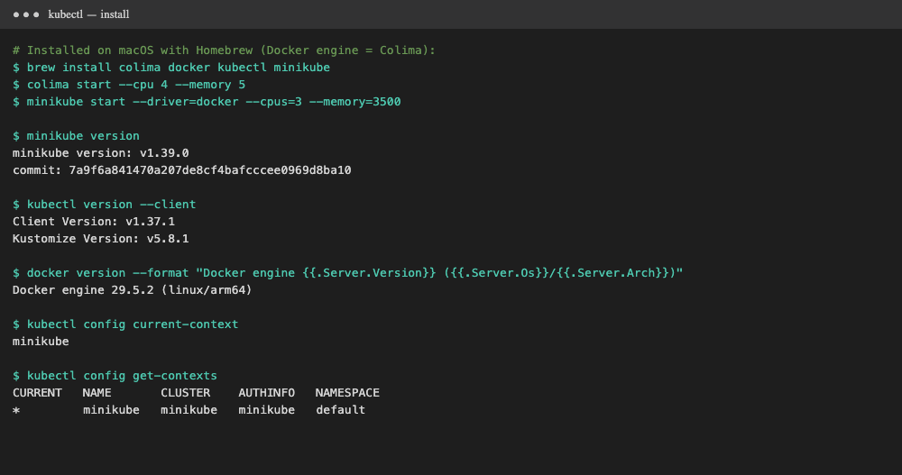
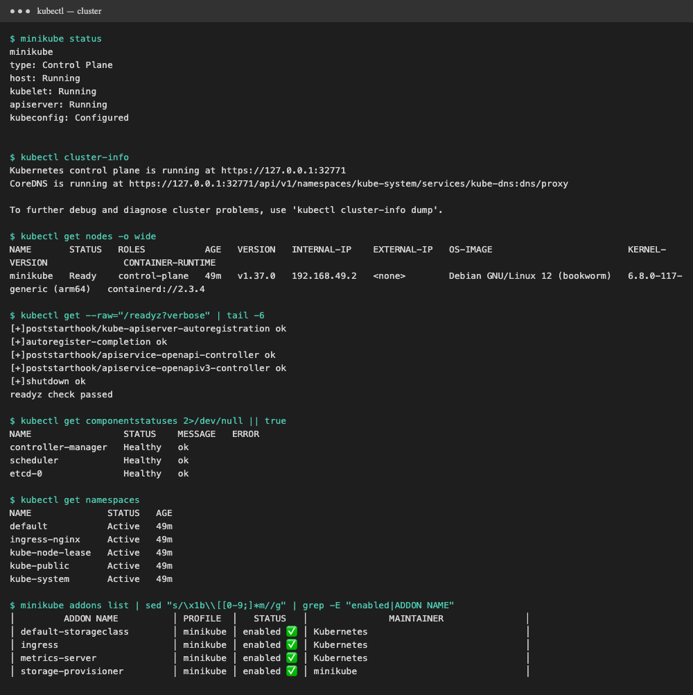
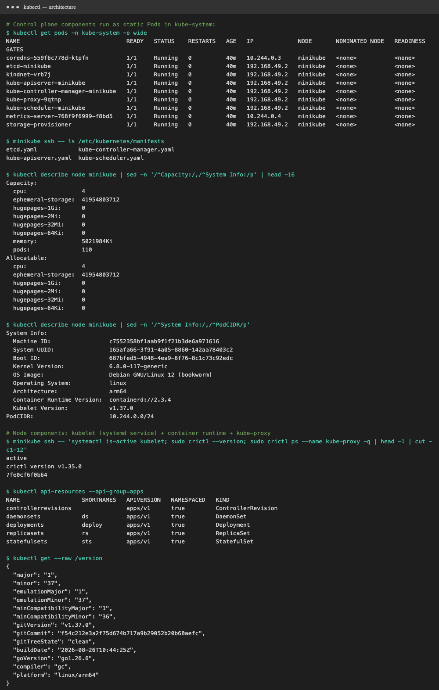
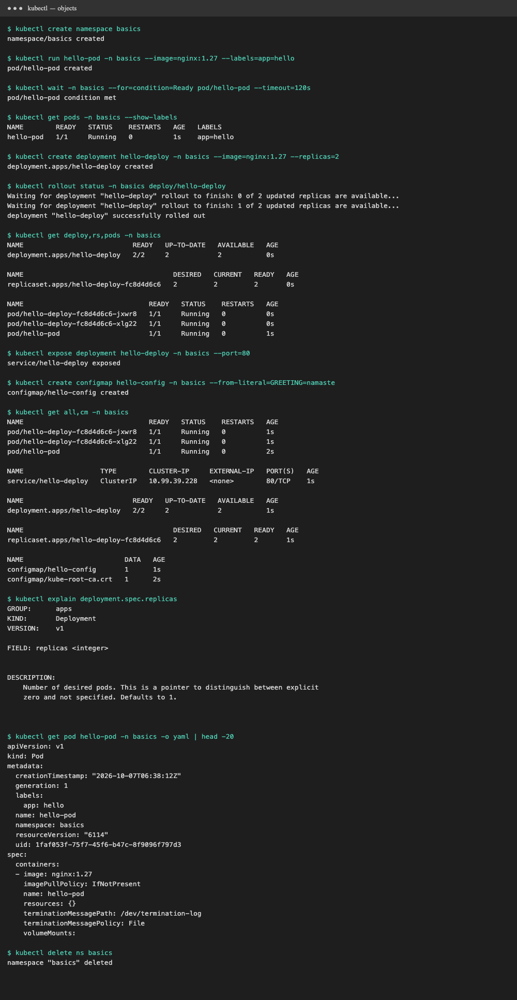
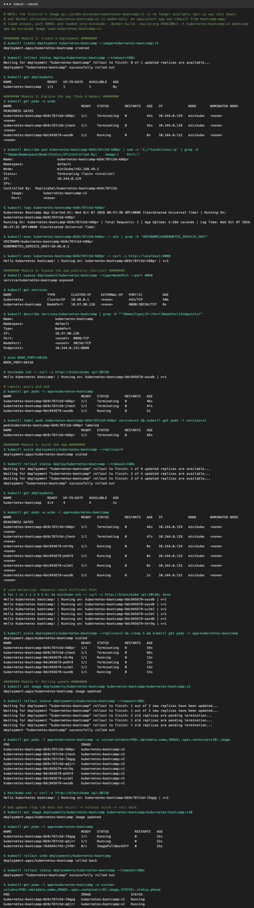

# Session 9: Kubernetes Fundamentals

Every command below was run on this machine with [`demo.sh`](demo.sh)
(`./demo.sh install|cluster|architecture|objects|tutorial`). Raw logs are in `output-*.txt`.

Resources used: [Kubernetes Basics tutorial](https://kubernetes.io/docs/tutorials/kubernetes-basics/) ·
[minikube start](https://minikube.sigs.k8s.io/docs/start/) ·
[Cluster architecture](https://kubernetes.io/docs/concepts/architecture/) ·
[kubernetes/kubernetes](https://github.com/kubernetes/kubernetes)

---

## 1. Install and configure minikube

Machine: MacBook Air (Apple Silicon, 8 GB RAM), macOS. Docker Desktop isn't installed, so **Colima** provides the Docker engine.

```bash
brew install colima docker kubectl minikube
colima start --cpu 4 --memory 5                            # Linux VM running dockerd
minikube start --driver=docker --cpus=3 --memory=3500 \
  --addons=ingress,metrics-server                          # 1-node cluster inside a container
```

Versions: minikube **v1.37**, Kubernetes **v1.37.0**, containerd 2.3, Docker engine 29.5 (linux/arm64).



## 2. Verify cluster status

| Check | Command | Result |
|---|---|---|
| minikube components | `minikube status` | host, kubelet, apiserver **Running**, kubeconfig **Configured** |
| API endpoint | `kubectl cluster-info` | control plane at `https://127.0.0.1:32771`, CoreDNS running |
| Node | `kubectl get nodes -o wide` | `minikube  Ready  control-plane  v1.37.0`, containerd |
| API health | `kubectl get --raw='/readyz?verbose'` | `readyz check passed` |
| Control plane health | `kubectl get componentstatuses` | scheduler, controller-manager, etcd-0 **Healthy** |
| Addons | `minikube addons list` | ingress, metrics-server, storage-provisioner enabled |



## 3. Kubernetes architecture

```text
                         ┌──────────────────────── CONTROL PLANE ────────────────────────┐
  kubectl / CI / UI ───► │  kube-apiserver  ◄──►  etcd (cluster state, key-value store)  │
     (REST + auth)       │       ▲   ▲                                                   │
                         │       │   └── kube-scheduler        (picks a node for Pods)   │
                         │       └────── kube-controller-manager (Deployment, ReplicaSet,│
                         │               Node, Job, EndpointSlice ... control loops)     │
                         │               cloud-controller-manager (cloud LBs, volumes)   │
                         └───────────────────────────┬───────────────────────────────────┘
                                                     │ watch / report status
                  ┌──────────────────────────────────┴───────────────────────────┐
                  │                       WORKER NODE(s)                          │
                  │  kubelet ──► container runtime (containerd) ──► Pods           │
                  │  kube-proxy (iptables/IPVS rules for Services)                 │
                  │  CNI plugin (kindnet here) gives every Pod an IP               │
                  └───────────────────────────────────────────────────────────────┘
  Add-ons: CoreDNS (cluster DNS), metrics-server, ingress-nginx, storage-provisioner
```

**Short notes**

| Component | Where | Job |
|---|---|---|
| **kube-apiserver** | control plane | Front door of the cluster. Every component and `kubectl` talks only to it (REST, authn/authz, admission). The only thing that talks to etcd. |
| **etcd** | control plane | Consistent, distributed key-value store holding **all cluster state** (desired and actual). Back it up! |
| **kube-scheduler** | control plane | Watches for Pods with no node and picks one (resources, affinity, taints). Saw it in Session 10: `FailedScheduling … Insufficient cpu`. |
| **kube-controller-manager** | control plane | Runs control loops that keep **actual state = desired state** (ReplicaSet controller recreates deleted Pods, and so on). |
| **cloud-controller-manager** | control plane (cloud only) | Talks to AWS/GCP/Azure for LoadBalancers, routes and node lifecycle. Not present on minikube. |
| **kubelet** | every node | Agent that takes PodSpecs from the API server and makes the runtime run them, runs probes, and reports status. A **systemd service**, not a Pod. |
| **container runtime** | every node | Pulls images and runs containers (containerd, CRI-O) through the CRI. |
| **kube-proxy** | every node (DaemonSet) | Programs iptables/IPVS so Service IPs load-balance to Pod IPs. |
| **CNI plugin** | every node | Pod networking: an IP per Pod, Pod-to-Pod routing (kindnet, Calico, Cilium). |

**What I verified on the cluster:**
- `kubectl get pods -n kube-system` shows `etcd-minikube`, `kube-apiserver-minikube`, `kube-controller-manager-minikube`,
  `kube-scheduler-minikube`, plus `kube-proxy`, `kindnet`, `coredns`, `metrics-server` and `storage-provisioner`.
- The 4 control-plane components are **static Pods**. The kubelet starts them straight from
  `/etc/kubernetes/manifests/{etcd,kube-apiserver,kube-controller-manager,kube-scheduler}.yaml`, which is why they carry the node name as a suffix.
- `systemctl is-active kubelet` → `active`. The kubelet runs on the host, not in a Pod.
- On minikube the **one node is both control plane and worker**. Production clusters keep 3+ control-plane nodes for HA.

**Request flow, `kubectl create deployment` → running Pod:**
1. kubectl → **API server** (authenticate, authorize, admission) → stored in **etcd**.
2. The **Deployment controller** creates a ReplicaSet, and the **ReplicaSet controller** creates Pod objects (no node yet).
3. The **scheduler** binds each Pod to a node.
4. That node's **kubelet** sees the Pod and tells **containerd** to pull and start the container. **CNI** assigns an IP.
5. The kubelet reports `Running`/`Ready`. The **EndpointSlice controller** adds the Pod to matching Services, and **kube-proxy** updates its rules.



## 4. Basic Kubernetes objects and commands

| Object | What it is | Create with |
|---|---|---|
| **Pod** | Smallest unit: one or more containers sharing network and storage | `kubectl run hello-pod --image=nginx` |
| **ReplicaSet** | Keeps N identical Pods running | created by a Deployment |
| **Deployment** | Declarative app versions: rolling updates, rollback, scaling | `kubectl create deployment hello-deploy --image=nginx --replicas=2` |
| **Service** | Stable name/IP + load balancing to Pods | `kubectl expose deployment hello-deploy --port=80` |
| **Namespace** | Virtual cluster for isolating and grouping resources | `kubectl create namespace basics` |
| **ConfigMap / Secret** | Configuration / sensitive data for Pods | `kubectl create configmap hello-config --from-literal=K=V` |
| **Node** | A worker machine | joins the cluster (`kubectl get nodes`) |

| Command | Purpose |
|---|---|
| `kubectl get <type>` / `-o wide` / `-o yaml` | list resources, more columns, full object |
| `kubectl describe <type> <name>` | details + **Events** (first stop when debugging) |
| `kubectl create` / `apply -f file.yaml` | imperative create / declarative create-or-update |
| `kubectl logs <pod>` / `exec -it <pod> -- sh` | container logs / shell inside the container |
| `kubectl scale` / `set image` / `rollout status\|undo\|history` | scale / update / manage rollouts |
| `kubectl expose` | create a Service |
| `kubectl explain <type.field>` | built-in API docs |
| `kubectl delete <type> <name>` | remove |



## 5. Kubernetes Basics tutorial, hands-on

> **Note:** the tutorial's image `gcr.io/k8s-minikube/kubernetes-bootcamp:v1` **no longer exists** (`not found`,
> because Google Container Registry has been shut down), and `jocatalin/kubernetes-bootcamp:v2` kept crashing on this
> Apple Silicon Mac (most likely an Intel-only build). I rebuilt an equivalent app in [`bootcamp-app/`](bootcamp-app):
> same `Hello Kubernetes bootcamp! | Running on: <pod> | v=<n>` response, port 8080, built as v1 and v2.
> Then I followed every module of the tutorial with it.
> ```bash
> docker build --build-arg VERSION=1 -t kubernetes-bootcamp:v1 bootcamp-app && minikube image load kubernetes-bootcamp:v1
> docker build --build-arg VERSION=2 -t kubernetes-bootcamp:v2 bootcamp-app && minikube image load kubernetes-bootcamp:v2
> ```

| Module | Commands | What I saw |
|---|---|---|
| **2. Create a Deployment** | `kubectl create deployment kubernetes-bootcamp --image=kubernetes-bootcamp:v1` | `READY 1/1` |
| **3. Explore the app** | `get pods -o wide`, `describe pod`, `logs`, `exec -- env`, `exec -- curl localhost:8080` | Pod IP, node, `Controlled By: ReplicaSet/...`; logs show `Kubernetes Bootcamp App Started At …`; curl from inside the Pod works |
| **4. Expose publicly** | `kubectl expose deployment/kubernetes-bootcamp --type=NodePort --port 8080`; `get services`; `label pods … version=v1`; `get pods -l version=v1` | NodePort assigned; `curl $(minikube ip):$NODE_PORT` → `Hello Kubernetes bootcamp!`; label selectors filter Pods |
| **5. Scale** | `kubectl scale deployments/kubernetes-bootcamp --replicas=4`, then back to 2 | 4 Pods with different IPs; 6 curls hit **3 different Pods**, so the Service load-balances |
| **6. Rolling update** | `kubectl set image … kubernetes-bootcamp=kubernetes-bootcamp:v2`; `rollout status` | Pods replaced one by one; curl now returns `v=2` |
| **6b. Bad update + rollback** | `set image … :v10` (doesn't exist) → `rollout undo` | New Pod stuck in `ImagePullBackOff` while the old v2 Pods **kept serving**; `rollout undo` → back to 2 × v2 |



## Commands used (summary)

```bash
minikube start --driver=docker ; minikube status ; kubectl cluster-info ; kubectl get nodes -o wide
kubectl get pods -n kube-system ; minikube ssh -- ls /etc/kubernetes/manifests
kubectl create deployment kubernetes-bootcamp --image=kubernetes-bootcamp:v1
kubectl get deployments ; kubectl get pods -o wide ; kubectl describe pod <pod> ; kubectl logs <pod>
kubectl exec <pod> -- env ; kubectl exec <pod> -- curl -s localhost:8080
kubectl expose deployment/kubernetes-bootcamp --type=NodePort --port 8080 ; kubectl get services
kubectl label pods <pod> version=v1 ; kubectl get pods -l version=v1
kubectl scale deployments/kubernetes-bootcamp --replicas=4
kubectl set image deployments/kubernetes-bootcamp kubernetes-bootcamp=kubernetes-bootcamp:v2
kubectl rollout status deployments/kubernetes-bootcamp ; kubectl rollout undo deployments/kubernetes-bootcamp
kubectl delete service kubernetes-bootcamp ; kubectl delete deployment kubernetes-bootcamp
```
