# Session 10: Kubernetes Pods, ReplicaSets & Deployments

Cluster: **minikube v1.37** (single node, Docker driver) on macOS.
Every command and output below comes from [`demo.sh`](demo.sh). Run `./demo.sh` for everything, or
`./demo.sh rolling` / `bluegreen` / `canary` / `recreate` / `lifecycle` for one part.
Each part writes its full raw log to `output-<part>.txt`.

| Folder | What it contains |
|---|---|
| [`01-rolling-update/`](01-rolling-update) | Deployment with `RollingUpdate` (`maxSurge: 1`, `maxUnavailable: 1`) |
| [`02-blue-green/`](02-blue-green) | `blue.yaml`, `green.yaml`, and a `service.yaml` that selects one colour |
| [`03-canary/`](03-canary) | `stable.yaml` (9 replicas), `canary.yaml` (1 replica), and a Service matching both |
| [`04-recreate/`](04-recreate) | Deployment with `strategy: Recreate` |
| [`05-pod-lifecycle/`](05-pod-lifecycle) | 8 Pod YAMLs, one per lifecycle state |

---

# Task 1: Deployment strategies

## 01. Rolling update

```bash
kubectl apply -f 01-rolling-update/deployment.yaml        # create (4 x nginx:1.26)
kubectl rollout status deployment/web-rolling
kubectl set image deployment/web-rolling nginx=nginx:1.27  # perform the update
kubectl get pods -l app=web-rolling                        # watch old + new side by side
kubectl get rs -l app=web-rolling
kubectl rollout history deployment/web-rolling
kubectl rollout undo deployment/web-rolling                # bonus: roll back
```

Configuration ([`deployment.yaml`](01-rolling-update/deployment.yaml)):
```yaml
strategy:
  type: RollingUpdate
  rollingUpdate:
    maxSurge: 1          # at most 1 extra Pod above 4 during the update
    maxUnavailable: 1    # at most 1 Pod down at any moment
minReadySeconds: 5
```

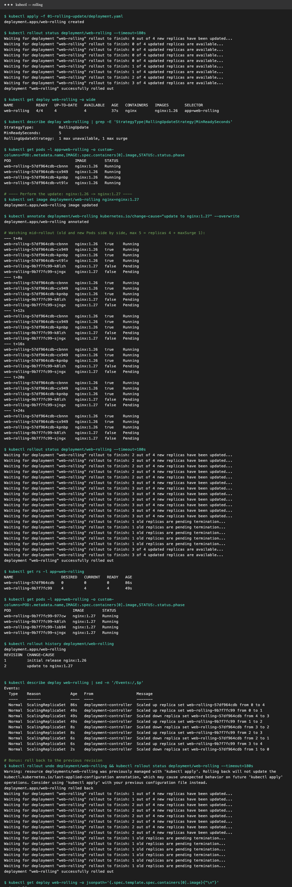

**What I observed**
- During the update, **old `nginx:1.26` and new `nginx:1.27` Pods run at the same time**. The Deployment
  creates a **new ReplicaSet** (`web-rolling-9b7f7fc99`) and moves Pods over a few at a time.
- The events show the pattern: *scaled up new 0→1, scaled down old 4→3, new 1→2, old 3→2 … old 1→0*.
  Capacity never drops below 3 (`replicas - maxUnavailable`) or rises above 5 (`replicas + maxSurge`).
- When it finishes, the old ReplicaSet stays at `DESIRED 0`. It's kept for rollback.
  `rollout history` shows revision 1 (1.26) and revision 2 (1.27), and `rollout undo` brought back `nginx:1.26`.
- **Zero downtime**, but for a short time both versions serve traffic.

## 02. Blue-green deployment

```bash
kubectl apply -f 02-blue-green/blue.yaml -f 02-blue-green/service.yaml   # live = blue
kubectl apply -f 02-blue-green/green.yaml                                # green runs, gets no traffic
kubectl patch service shop -p '{"spec":{"selector":{"app":"shop","version":"green"}}}'   # SWITCH
kubectl exec tester -- curl -s http://shop                               # verify active version
```

The Service selects **one colour** with the `version` label. Both Deployments run in full, and switching
traffic is a single, atomic change to the Service selector.

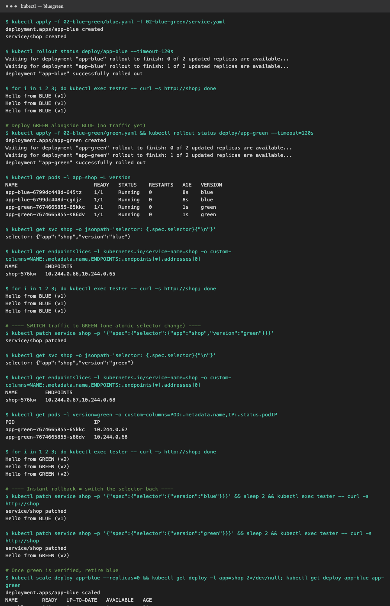

**What I observed**
- Before the switch, every request returned `Hello from BLUE (v1)`, even though green Pods were already running and ready.
- After the patch, the Service's EndpointSlice pointed at the **green Pod IPs**, and every request returned `Hello from GREEN (v2)`.
- **Rollback is instant**: patching the selector back to `blue` switched traffic straight back. Then I switched to green again and scaled blue to 0.
- Trade-off: you need **double the resources** while both colours run, but there's no mixed-version window.

## 03. Canary deployment

```bash
kubectl apply -f 03-canary/stable.yaml -f 03-canary/service.yaml   # 9 x "stable v1"
kubectl apply -f 03-canary/canary.yaml                             # 1 x "canary v2"
kubectl exec tester -- sh -c 'for i in $(seq 200); do curl -s http://checkout; done' | sort | uniq -c
kubectl scale deploy app-stable --replicas=7 && kubectl scale deploy app-canary --replicas=3
```

The Service selects only `app: checkout`, so it matches **both** tracks. kube-proxy spreads requests
evenly across all ready Pods, so **the traffic share follows the replica ratio**.

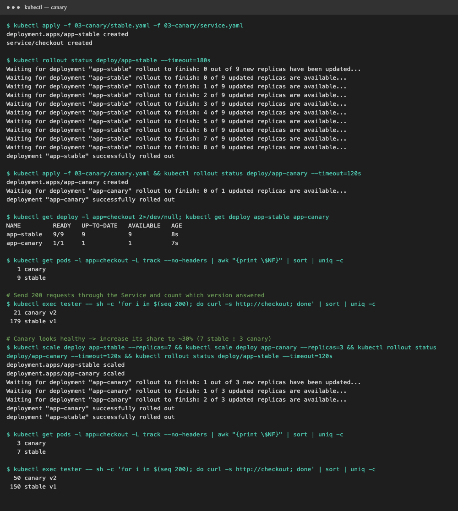

**What I observed** (200 requests each time)

| Replicas (stable : canary) | Expected canary share | Measured |
|---|---|---|
| 9 : 1 | 10% | **21 / 200 = 10.5%** |
| 7 : 3 | 30% | **50 / 200 = 25%** |

- Both versions served at the same time, and only a small fraction of users hit v2.
  If the canary looked healthy, I'd promote it by scaling it up and stable down. If not, I'd delete `app-canary`.
- Limitation: with plain Services, the split is only as fine as the replica count (10% needs 10 Pods).
  For an exact 1% split without extra Pods, you need an Ingress controller (NGINX canary annotations), a service mesh (Istio), or Argo Rollouts.
- Lesson learned: my first run measured a low canary share. New Pods show up in EndpointSlices a few
  seconds before kube-proxy programs the node's rules. The demo now waits for the endpoints, and for kube-proxy to sync, before sending traffic.

## 04. Recreate deployment

```bash
kubectl apply -f 04-recreate/deployment.yaml               # 3 x nginx:1.26
kubectl get pods -l app=web-recreate --watch-only &        # watch every change
kubectl set image deploy/web-recreate nginx=nginx:1.27     # update
```

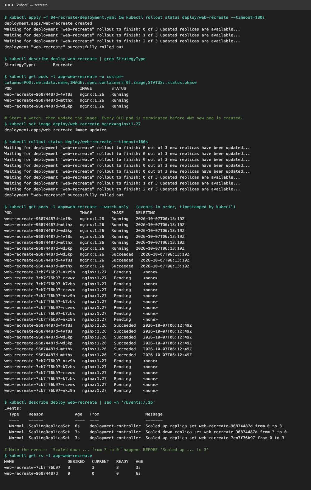

**What I observed**
- The watch shows **all 3 old Pods** marked for deletion (`DELETING` timestamp set), then going to
  `Succeeded` (terminated). **Only after that** do the 3 new `nginx:1.27` Pods appear as `Pending` and then `Running`.
- The Deployment events confirm the order: `Scaled down replica set web-recreate-96874487d from 3 to 0`, **then**
  `Scaled up replica set web-recreate-7cb7f76b97 from 0 to 3`.
- Result: a **short window with zero Pods, which means downtime**. Use it when two versions must never run together
  (database schema changes, singleton workers, a `ReadWriteOnce` volume shared by all Pods).

## Strategy comparison

| Strategy | Downtime | Both versions live at once? | Extra resources | Rollback |
|---|---|---|---|---|
| Rolling update | none | yes, briefly | +`maxSurge` Pods | `kubectl rollout undo` (gradual) |
| Blue-green | none | no, switch is atomic | 2× while both run | instant: flip the selector |
| Canary | none | yes, on purpose (small %) | a few canary Pods | delete the canary |
| Recreate | **yes** | never | none | redeploy old version (downtime again) |

---

# Task 2: Pod lifecycle

**Pod phases:** `Pending` → `Running` → `Succeeded` / `Failed` (plus `Unknown` if the node is lost).
The kubectl **STATUS** column shows more detail than the phase (for example `ContainerCreating`, `Init:1/2`, `CrashLoopBackOff`, `ImagePullBackOff`, `Completed`).

For each YAML I ran:
```bash
kubectl apply -f 05-pod-lifecycle/<file>.yaml                  # 1. apply
kubectl get pod <name> -o wide                                 # 2. status
kubectl get pod <name> -o jsonpath='{.status.phase} ...'       #    phase / reason / restarts
kubectl describe pod <name>                                    # 3. details: Conditions + Events
kubectl logs <name>                                            #    where relevant
```

| # | YAML | Final STATUS | Phase |
|---|---|---|---|
| 1 | [`01-pending.yaml`](05-pod-lifecycle/01-pending.yaml) | `Pending` | Pending |
| 2 | [`02-running.yaml`](05-pod-lifecycle/02-running.yaml) | `Running` | Running |
| 3 | [`03-succeeded.yaml`](05-pod-lifecycle/03-succeeded.yaml) | `Completed` | Succeeded |
| 4 | [`04-failed.yaml`](05-pod-lifecycle/04-failed.yaml) | `Error` | Failed |
| 5 | [`05-crashloop.yaml`](05-pod-lifecycle/05-crashloop.yaml) | `CrashLoopBackOff` | Running |
| 6 | [`06-init-container.yaml`](05-pod-lifecycle/06-init-container.yaml) | `Init:0/2` → `Init:1/2` → `Running` | Pending → Running |
| 7 | [`07-image-pull-error.yaml`](05-pod-lifecycle/07-image-pull-error.yaml) | `ErrImagePull` → `ImagePullBackOff` | Pending |
| 8 | [`08-probes-and-hooks.yaml`](05-pod-lifecycle/08-probes-and-hooks.yaml) | `Running` 0/1 → 1/1, then `Terminating` | Running |

### 1. Pending: cannot be scheduled
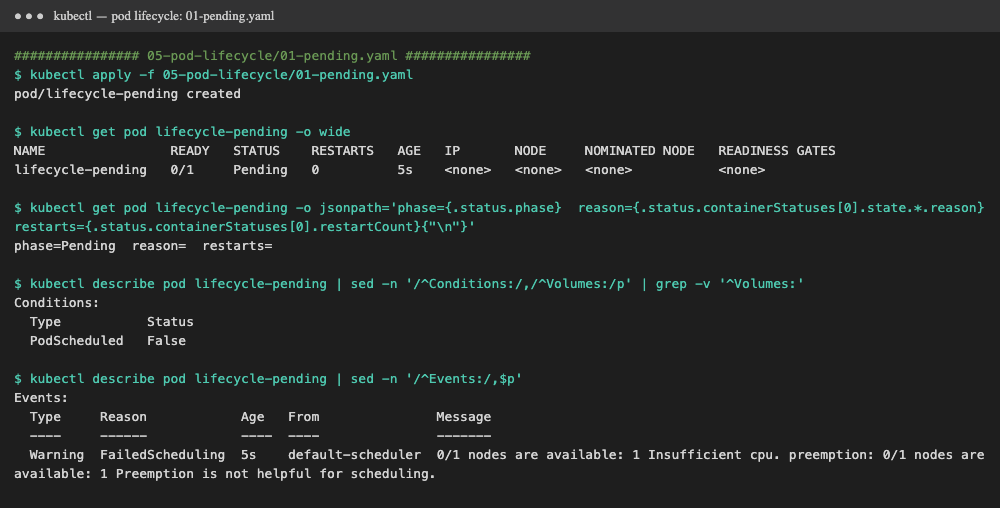

The Pod requests `cpu: "64"`, more than the node has. `NODE` is `<none>`, and the event says
`FailedScheduling  0/1 nodes are available: 1 Insufficient cpu`. The Pod sits in **Pending** forever.
The `PodScheduled` condition is `False`. Fix: lower the request or add nodes.

### 2. Running
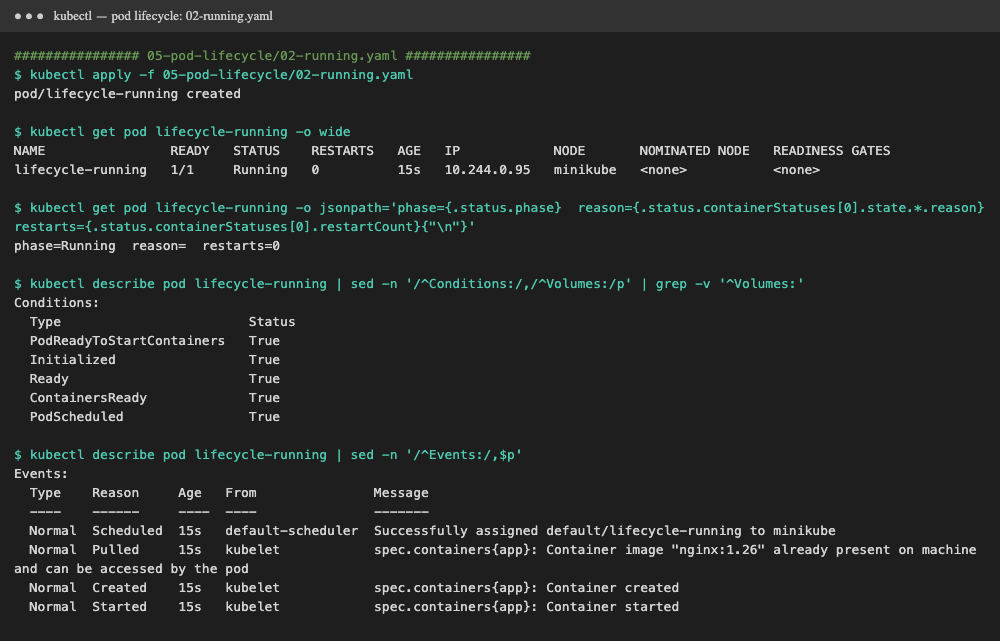

Normal path: `Scheduled` → `Pulled` → `Created` → `Started`. All conditions
(`Initialized`, `ContainersReady`, `Ready`, `PodScheduled`) are `True`, and the Pod gets an IP.

### 3. Succeeded (Completed)
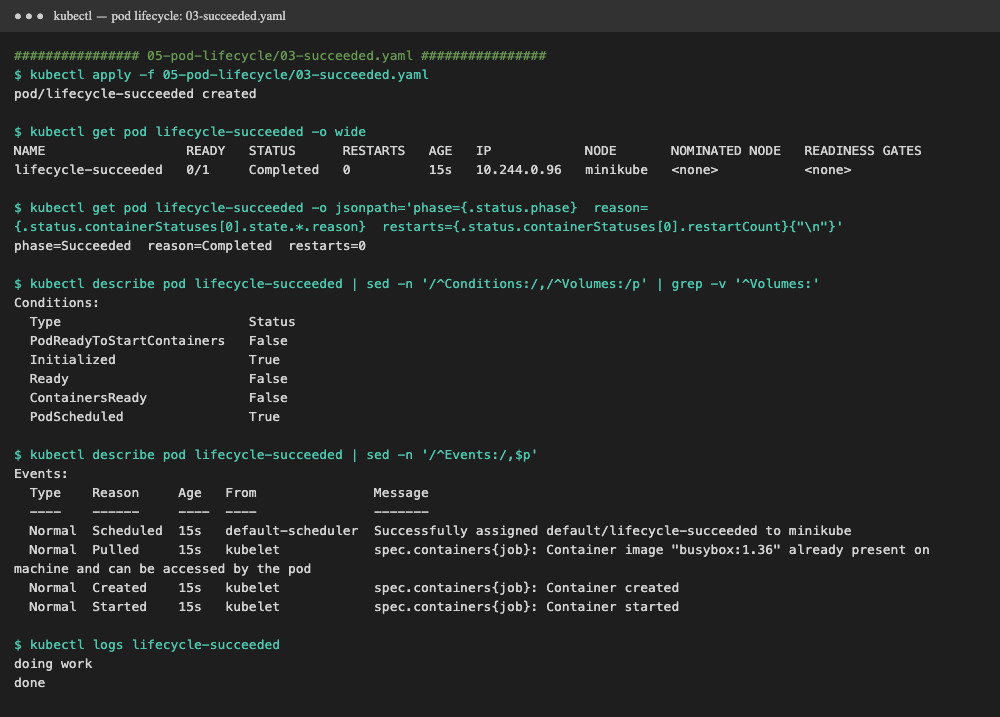

The command runs `exit 0` with `restartPolicy: Never`. STATUS shows **Completed**, phase is **Succeeded**,
and `kubectl logs` still shows `doing work … done`. This is how Jobs finish.

### 4. Failed (Error)
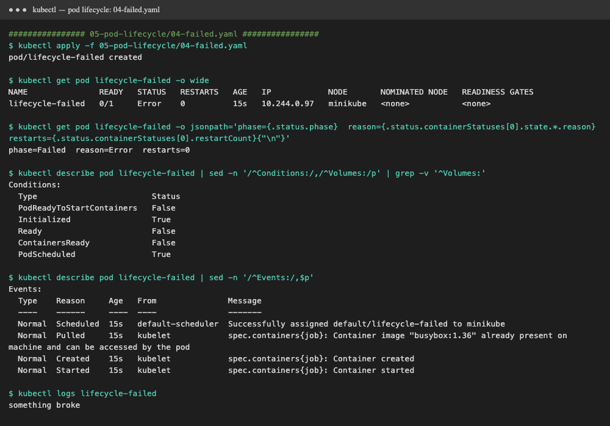

Same setup, but `exit 1`. STATUS shows **Error**, phase is **Failed**, and the container state is
`terminated` with `exitCode: 1`. With `restartPolicy: Never`, the kubelet does not retry.

### 5. CrashLoopBackOff
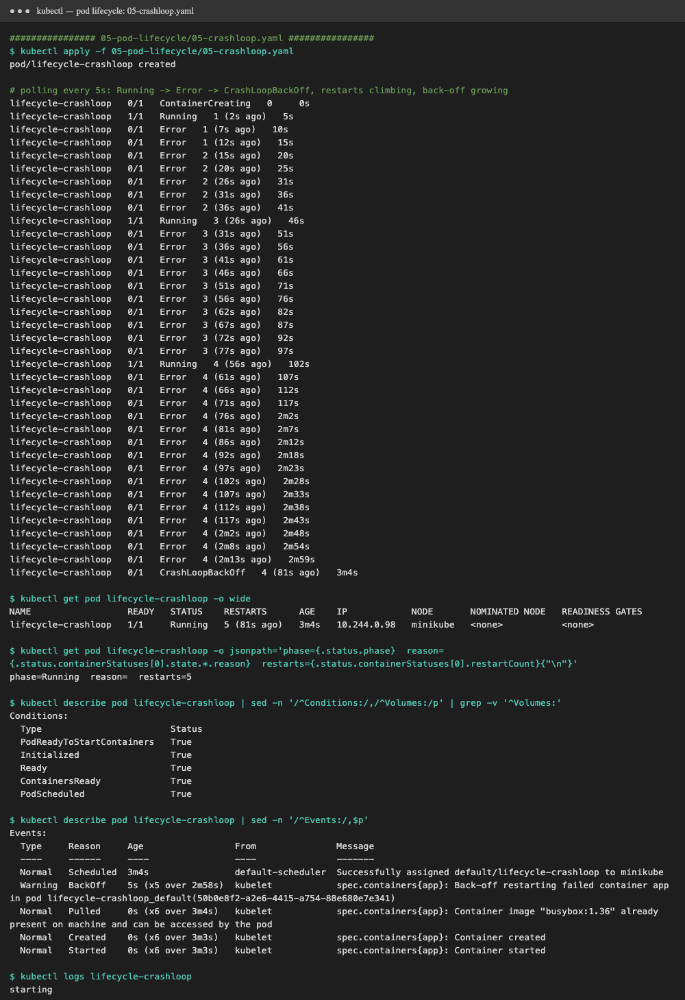
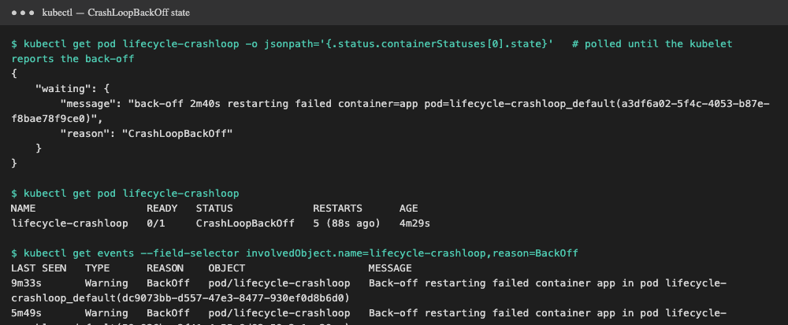

`exit 1` with `restartPolicy: Always`. The kubelet restarts it again and again: **RESTARTS climbs 1 → 2 → 3 → 4 → 5**,
and the delay between restarts doubles (10s, 20s, 40s, 80s, 160s, up to 5 min). Events show `Warning BackOff`.
Once the delay is long, the container state becomes `waiting: CrashLoopBackOff` with
`back-off 2m40s restarting failed container`. **The phase stays `Running`**: CrashLoopBackOff is a *container* state, not a Pod phase.
On this Kubernetes version (1.37), STATUS shows `Error` for most of the early, short back-offs and switches to
`CrashLoopBackOff` once the delay grows. Debug with `kubectl logs <pod> --previous`.

### 6. Init containers
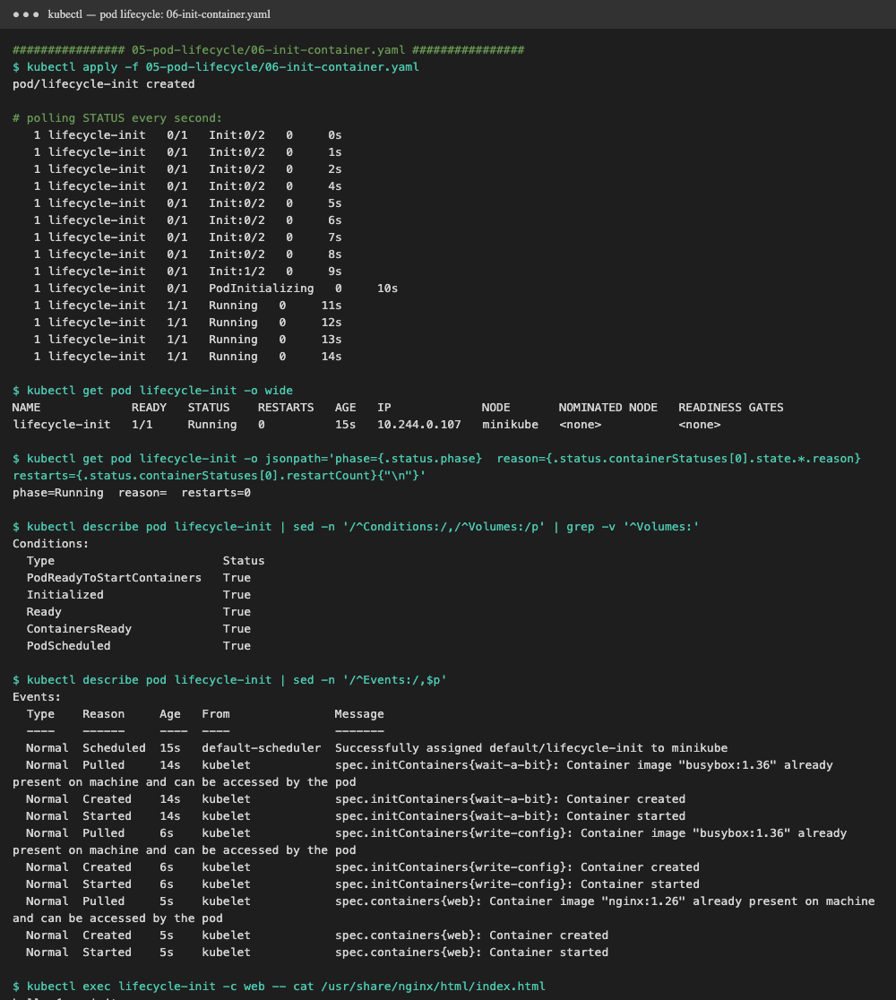

STATUS went **`Init:0/2` → `Init:1/2` → `Running`**. Init containers run **one at a time, in order**, and each must
finish before the next starts. The main `nginx` container started only after both were done. The second init container
wrote `index.html` into a shared `emptyDir`, and `curl`/`cat` in the web container shows `hello from init`.

### 7. ErrImagePull / ImagePullBackOff
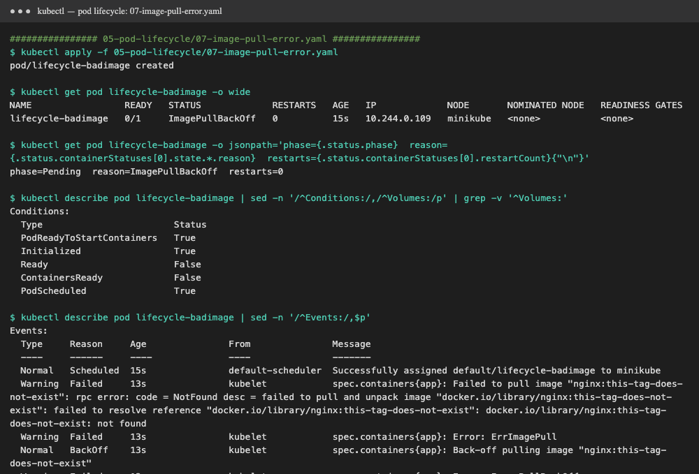

The tag `nginx:this-tag-does-not-exist` doesn't exist. Events: `Pulling` → `Failed ... not found` →
`Error: ErrImagePull` → `Back-off pulling image` → `Error: ImagePullBackOff`. The phase stays **Pending**
because the container never started. Fix the image name or tag (or the registry credentials).

### 8. Probes and lifecycle hooks
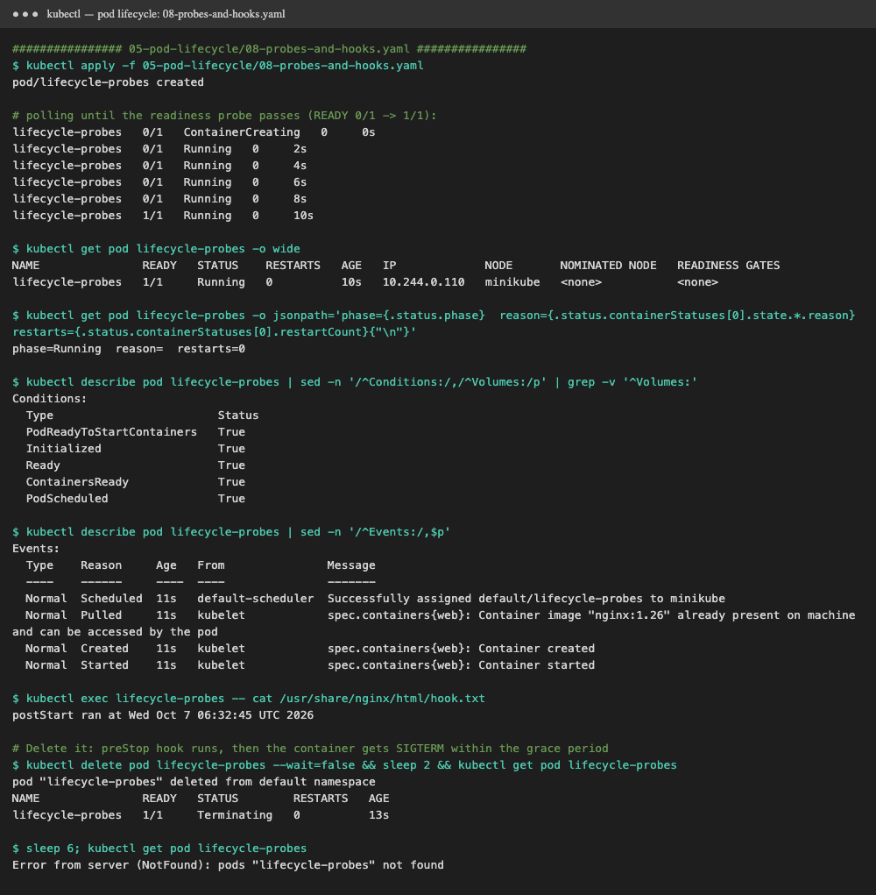

- **`postStart` hook** ran right after the container started and wrote `hook.txt` (`postStart ran at …`).
- **Readiness probe** (`initialDelaySeconds: 10`): READY stayed **`0/1` for about 10 seconds**, then `1/1`.
  Until then the Pod is `Running` but gets **no Service traffic**.
- **Liveness probe**: keeps checking `/`. If it failed, the kubelet would restart the container (RESTARTS would go up).
- **`preStop` hook** + `terminationGracePeriodSeconds: 15`: on `kubectl delete`, the Pod showed **`Terminating`**
  while `preStop` drained for 5s and ran `nginx -s quit`, then it was removed. This is graceful shutdown.

**Full lifecycle summary:**
```text
kubectl apply
   │
   ▼
Pending ── scheduler finds no node ───────────────► stays Pending (01)
   │ scheduled
   ▼
Init:0/N … Init:N/N  (init containers, in order)          (06)
   │
   ▼
ContainerCreating ── image pull fails ─► ErrImagePull → ImagePullBackOff (07)
   │
   ▼
Running ── postStart hook, readiness 0/1 → 1/1, liveness checks   (02, 08)
   │
   ├── exit 0, restartPolicy Never   ─► Succeeded / Completed     (03)
   ├── exit ≠0, restartPolicy Never  ─► Failed / Error            (04)
   ├── exit ≠0, restartPolicy Always ─► restart … CrashLoopBackOff (05)
   └── kubectl delete ─► Terminating (preStop, SIGTERM, grace period) ─► gone (08)
```
