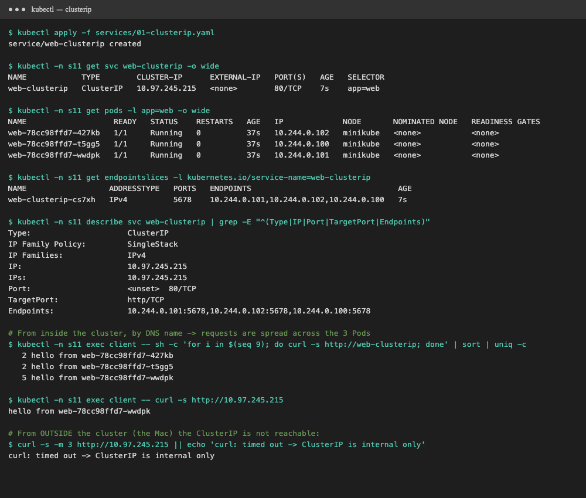
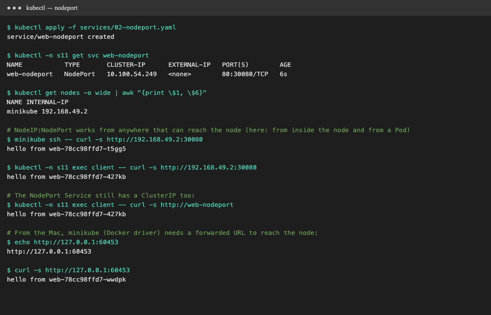
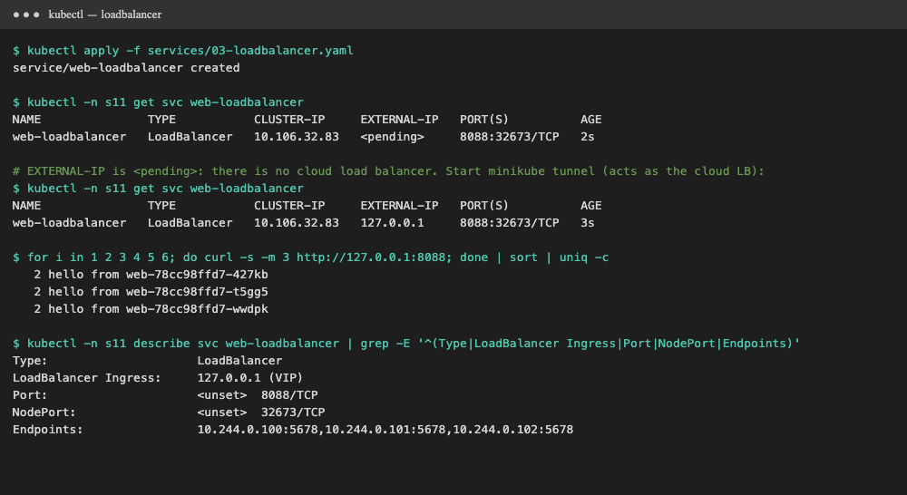
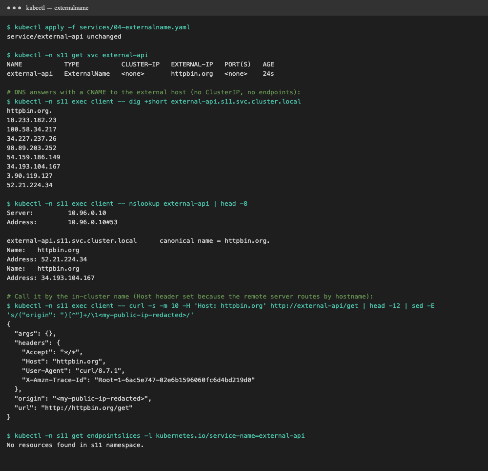
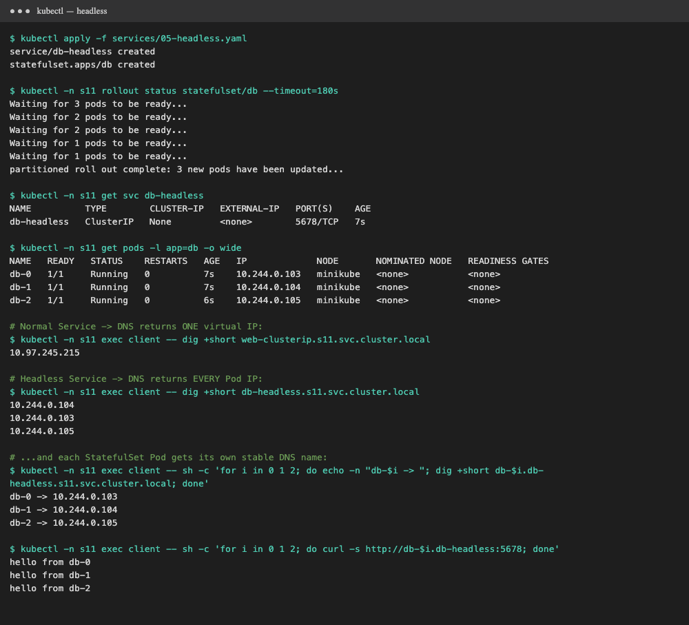

# Session 11: Kubernetes Networking & Services

Cluster: **minikube v1.37** (Docker driver). All demos run in namespace `s11` with [`demo.sh`](demo.sh)
(`./demo.sh` runs everything, or `./demo.sh clusterip`, `nodeport`, and so on). Raw logs are in `output-*.txt`.

| Deliverable | Where |
|---|---|
| Service YAML files | [`services/`](services) |
| Comparison documentation | [Task 2](#task-2-kubernetes-object-comparison) below |
| FQDN | [`fqdn/README.md`](fqdn/README.md) |
| CoreDNS | [`coredns/README.md`](coredns/README.md) |
| Screenshots / output | [`screenshots/`](screenshots), `output-*.txt` |

**Test app** ([`00-namespace-and-app.yaml`](services/00-namespace-and-app.yaml)): a Deployment `web` with
3 Pods (`hashicorp/http-echo`) that each reply `hello from <pod-name>`, so you can see which Pod answered.
There's also a `client` Pod (`netshoot`, which has curl and dig) for testing from inside the cluster.

---

# Task 1: Kubernetes Services

```text
                         ┌──────────────── LoadBalancer  (external IP from cloud LB / minikube tunnel)
                         │       ┌──────── NodePort      (NodeIP:30000-32767 on every node)
                         │       │     ┌── ClusterIP     (virtual IP, inside cluster only)
 client ──► [LB] ──► [Node:30080] ──► [10.97.x.x:80] ──► kube-proxy ──► Pod / Pod / Pod
                                                     (each type builds on the one below it)

 ExternalName: DNS CNAME only ──► external-api.s11 → httpbin.org      (no IP, no proxy)
 Headless:     clusterIP: None ──► DNS returns every Pod IP directly   (no load balancing)
```

## 1. ClusterIP

[`services/01-clusterip.yaml`](services/01-clusterip.yaml): `type: ClusterIP`, `port: 80 → targetPort: http (5678)`

```bash
kubectl apply -f services/01-clusterip.yaml
kubectl -n s11 get svc web-clusterip -o wide
kubectl -n s11 get endpointslices -l kubernetes.io/service-name=web-clusterip
kubectl -n s11 exec client -- curl -s http://web-clusterip
```



**Verified:** ClusterIP `10.97.245.215`, and the EndpointSlice lists all 3 Pod IPs. Nine requests from the `client` Pod
were **spread across all 3 Pods**. `curl` from the Mac to the ClusterIP **timed out**, because it's reachable only
from inside the cluster. **Use for:** internal service-to-service traffic (backend → database). It's the default type.

## 2. NodePort

[`services/02-nodeport.yaml`](services/02-nodeport.yaml): `type: NodePort`, `nodePort: 30080`

```bash
kubectl apply -f services/02-nodeport.yaml
kubectl -n s11 get svc web-nodeport          # PORT(S) 80:30080/TCP
curl http://<node-ip>:30080                  # from anything that can reach the node
minikube service web-nodeport -n s11 --url   # on macOS + Docker driver
```



**Verified:** `PORT(S) 80:30080/TCP`. `curl 192.168.49.2:30080` (node IP) worked from inside the node and from a Pod,
and the Service also kept a normal ClusterIP. From the Mac, `minikube service --url` forwarded it to `127.0.0.1:<port>` and returned `hello from …`.
**Use for:** simple external access, on-prem or dev setups, or as the backend for an external load balancer.
Downsides: you must know the node IPs, the port range is limited to 30000–32767, and there's one port per service.

## 3. LoadBalancer

[`services/03-loadbalancer.yaml`](services/03-loadbalancer.yaml): `type: LoadBalancer`, `port: 8088`

```bash
kubectl apply -f services/03-loadbalancer.yaml
kubectl -n s11 get svc web-loadbalancer      # EXTERNAL-IP <pending>
minikube tunnel                              # acts as the cloud load balancer
kubectl -n s11 get svc web-loadbalancer      # EXTERNAL-IP 127.0.0.1
curl http://127.0.0.1:8088
```



**Verified:** at first `EXTERNAL-IP <pending>`, because a local cluster has no cloud provider to create a load balancer.
After `minikube tunnel` started, it got `127.0.0.1`. Six requests were spread **2 / 2 / 2** across the Pods.
`describe` shows it is also a NodePort (`32673`) and a ClusterIP underneath.
**Use for:** production external access on a cloud (AWS ELB/NLB, GCP, Azure). One cloud LB per Service costs money,
which is why many services share one **Ingress** instead.

## 4. ExternalName

[`services/04-externalname.yaml`](services/04-externalname.yaml): `type: ExternalName`, `externalName: httpbin.org`

```bash
kubectl apply -f services/04-externalname.yaml
kubectl -n s11 get svc external-api               # CLUSTER-IP <none>, EXTERNAL-IP httpbin.org
kubectl -n s11 exec client -- nslookup external-api
kubectl -n s11 exec client -- curl -s -H 'Host: httpbin.org' http://external-api/get
```



**Verified:** there's no ClusterIP and **no EndpointSlice**. DNS answered
`external-api.s11.svc.cluster.local  canonical name = httpbin.org.` (a **CNAME**), and `curl http://external-api/get`
reached the real httpbin.org. **Use for:** giving an outside dependency (a managed DB, a third-party API) an in-cluster name, so apps
don't hard-code it and you can later move it into the cluster without changing app config.
Note: it's DNS only. HTTP servers that route by hostname need the right `Host` header, and TLS certificates must match the external name.

## 5. Headless

[`services/05-headless.yaml`](services/05-headless.yaml): `clusterIP: None` + a StatefulSet `db` (3 replicas) with `serviceName: db-headless`

```bash
kubectl apply -f services/05-headless.yaml
kubectl -n s11 get svc db-headless                                  # CLUSTER-IP None
kubectl -n s11 exec client -- dig +short db-headless.s11.svc.cluster.local
kubectl -n s11 exec client -- dig +short db-0.db-headless.s11.svc.cluster.local
kubectl -n s11 exec client -- curl -s http://db-1.db-headless:5678
```



**Verified:**
- A normal Service's DNS returned **one virtual IP** (`10.97.245.215`).
- The headless Service's DNS returned **all 3 Pod IPs** (`10.244.0.103/104/105`).
- Each StatefulSet Pod got its **own stable DNS name**: `db-0 → 10.244.0.103`, `db-1 → .104`, `db-2 → .105`.
  `curl db-1.db-headless` always reached exactly `db-1`.

**Use for:** StatefulSets (databases, Kafka, Zookeeper, Elasticsearch) where clients must reach a **specific** replica
(for example, writes go to the primary `db-0`), and for client-side load balancing or service discovery.

## Service types summary

| Type | ClusterIP? | Reachable from | How it's reached | Typical use |
|---|---|---|---|---|
| ClusterIP | ✅ | inside cluster | `svc.ns.svc.cluster.local` → VIP | internal microservices |
| NodePort | ✅ | outside, via any node | `NodeIP:30000-32767` | dev, on-prem, behind your own LB |
| LoadBalancer | ✅ (+NodePort) | internet | cloud LB external IP | production on cloud |
| ExternalName | ❌ | inside cluster | DNS CNAME → external host | alias for an external service |
| Headless | ❌ (`None`) | inside cluster | DNS returns Pod IPs, `pod.svc` names | StatefulSets, direct Pod access |

---

# Task 2: Kubernetes object comparison

## Deployment vs ReplicaSet

| | ReplicaSet | Deployment |
|---|---|---|
| **Purpose** | Keep **N identical Pods** running at all times | Manage **versions** of an app declaratively (it manages ReplicaSets) |
| **Pod management** | Creates or deletes Pods matching its selector, directly | Never touches Pods directly; it creates and scales **ReplicaSets**, and those manage the Pods |
| **Scaling** | `kubectl scale rs` works | `kubectl scale deploy` sets the replica count on the current ReplicaSet |
| **Rolling updates** | ❌ Changing the Pod template does **not** update existing Pods; you'd delete them by hand | ✅ Changing the template creates a **new ReplicaSet**, shifts Pods gradually (`maxSurge`/`maxUnavailable`), and keeps history for `rollout undo` |
| **Relationship** | Owned by a Deployment (`ownerReferences`), named `<deploy>-<pod-template-hash>` | Owns one ReplicaSet per revision; old ones are kept at 0 replicas (`revisionHistoryLimit`) |

Seen in Session 10: `kubectl get rs` after an update showed `web-rolling-57df964cdb  0` (old) and `web-rolling-9b7f7fc99  4` (new).
**Rule:** always create Deployments and never ReplicaSets directly. A ReplicaSet is an implementation detail.

```text
Deployment ──owns──► ReplicaSet (rev 2, 4 Pods) ──owns──► Pod Pod Pod Pod
           └─owns──► ReplicaSet (rev 1, 0 Pods)   (kept for rollback)
```

## Deployment vs DaemonSet vs StatefulSet

| | Deployment | DaemonSet | StatefulSet |
|---|---|---|---|
| **Use cases** | Stateless apps: web servers, APIs, workers | One agent **per node**: log collectors, monitoring agents, CNI, kube-proxy | Stateful apps needing identity: databases, Kafka, Zookeeper, Elasticsearch |
| **Pod creation** | Any order, all at once, random names (`web-78cc98ffd7-427kb`) | Exactly one Pod on every (matching) node, created automatically when a node joins | **Ordered**: `db-0`, then `db-1`, then `db-2`, each waiting for the previous to be Ready; deleted in reverse |
| **Pod identity** | Interchangeable; a replaced Pod gets a new name | Tied to its node | **Stable** name and ordinal that survive rescheduling |
| **Scaling** | `replicas: N`, any Pod may be removed | Not set by replicas; follows the **number of nodes** (control with nodeSelector/tolerations) | `replicas: N`, scales up in order and removes the **highest ordinal first** |
| **Networking** | Normal Service (ClusterIP); Pods load-balanced | Often `hostNetwork`/`hostPort`, accessed per node | **Headless Service** required; each Pod gets DNS `db-0.db-headless.ns.svc.cluster.local` |
| **Storage** | Shared PVC or none; all replicas share the same claim | Usually `hostPath` to read node files (`/var/log`) | **`volumeClaimTemplates`**: each Pod gets its **own PVC** (`data-db-0`), re-attached if the Pod moves |
| **Updates** | RollingUpdate / Recreate | RollingUpdate / OnDelete, node by node | RollingUpdate in reverse ordinal order (supports `partition`), or OnDelete |
| **Examples** | nginx, a React frontend, a Node API | Fluent Bit, Prometheus node-exporter, Calico, kube-proxy | MySQL, PostgreSQL, MongoDB, Redis cluster, Kafka |

Seen in this session: the StatefulSet created `db-0`, `db-1`, `db-2` (`Waiting for 3 pods … 2 … 1`), and each got its own DNS name.
`kubectl -n kube-system get ds` on minikube shows `kube-proxy`, a DaemonSet.

## ReplicaSet vs Service

| | ReplicaSet | Service |
|---|---|---|
| **Responsibility** | **Keep Pods alive**: make sure N Pods matching a selector exist, and replace crashed or deleted ones | **Give Pods a stable network identity**: one name and IP that load-balances to whichever Pods match its selector |
| **Layer** | Compute (workload controller) | Networking (discovery + load balancing) |
| **Knows about** | The Pod template and the replica count | Only labels (selector) and ports. It doesn't care who created the Pods |

**Why a Service is required:** Pods are temporary. Every time a ReplicaSet replaces a Pod, the new one has a **new IP**
(in Session 10, every update produced new Pod IPs). Clients can't track changing IPs. A Service gives a **fixed DNS
name and virtual IP**, keeps the list of healthy endpoints updated automatically, and spreads traffic across them.
Only **Ready** Pods (readiness probe passed) receive traffic.

**How traffic reaches Pods:**
```text
1. App calls  http://web-clusterip            (short name)
2. /etc/resolv.conf search list → web-clusterip.s11.svc.cluster.local
3. CoreDNS (10.96.0.10) answers the ClusterIP  10.97.245.215
4. Packet to 10.97.245.215:80 hits kube-proxy's iptables/IPVS rules on the node
5. kube-proxy rule picks one Ready endpoint from the EndpointSlice  → 10.244.0.101:5678 (DNAT)
6. Pod network (CNI) delivers it to the Pod; the reply goes back the same way
```
The EndpointSlice controller watches Pods that match the selector and updates the endpoint list. kube-proxy watches
EndpointSlices and rewrites node rules. So the ReplicaSet and the Service never talk to each other: **labels connect them.**
