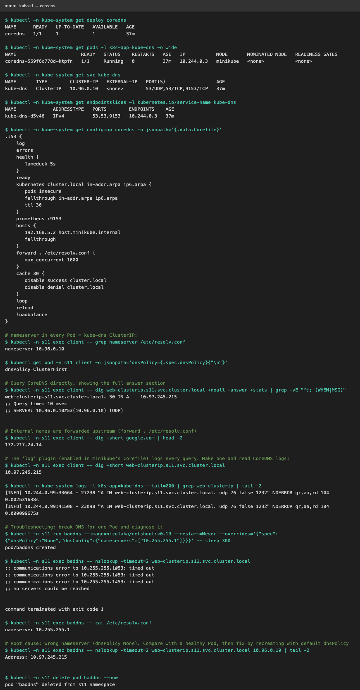

# CoreDNS

All outputs are real, from [`../output-coredns.txt`](../output-coredns.txt) (`../demo.sh coredns`) on minikube v1.37.



## What is CoreDNS?

CoreDNS is a fast, flexible **DNS server written in Go**, built as a chain of **plugins**. It's a CNCF graduated project,
and since Kubernetes 1.13 it has been the **default cluster DNS**, replacing `kube-dns`. In a cluster it runs as an ordinary Deployment in
`kube-system`, behind a Service that is still named `kube-dns` for backward compatibility:

```text
$ kubectl -n kube-system get deploy coredns
NAME      READY   UP-TO-DATE   AVAILABLE
coredns   1/1     1            1

$ kubectl -n kube-system get svc kube-dns
NAME       TYPE        CLUSTER-IP   PORT(S)
kube-dns   ClusterIP   10.96.0.10   53/UDP,53/TCP,9153/TCP     # 53 = DNS, 9153 = Prometheus metrics
```

## Why Kubernetes uses CoreDNS

- **Service discovery by name:** Pods and Service IPs change constantly, and DNS hides that behind stable names.
- **Kubernetes-aware:** the `kubernetes` plugin watches the API server and answers from memory, so there are no zone files to maintain.
- **Single binary, plugin-based:** caching, forwarding, metrics, logging and rewrites are all plugins. kube-dns needed 3 containers (kubedns + dnsmasq + sidecar).
- **Flexible:** custom upstream servers per domain, stub zones, `hosts` entries and rewrites, all in one config file.
- **Observable:** Prometheus metrics (`:9153`), health (`:8080/health`) and readiness (`:8181/ready`) endpoints.

## How service discovery works

1. You create a Service. The API server stores it, and the EndpointSlice controller records the Ready Pod IPs.
2. The CoreDNS `kubernetes` plugin **watches** Services and EndpointSlices through the API and keeps records in memory.
3. The kubelet starts every Pod with `dnsPolicy: ClusterFirst`, writing `/etc/resolv.conf`:
   ```text
   search s11.svc.cluster.local svc.cluster.local cluster.local
   nameserver 10.96.0.10
   options ndots:5
   ```
4. The app looks up a name, and the query goes to `10.96.0.10` (the kube-dns Service), which kube-proxy routes to a CoreDNS Pod.
5. CoreDNS answers with the ClusterIP (or Pod IPs for headless). The app connects, and kube-proxy load-balances to a Pod.

## How DNS queries are resolved

```text
Pod: curl http://web-clusterip
 │
 ├─ ndots:5 → "web-clusterip" has 0 dots → try search domains first
 │     web-clusterip.s11.svc.cluster.local  ──► CoreDNS
 │
CoreDNS plugin chain (Corefile order of execution):
 ├─ errors / log        → log the query
 ├─ kubernetes plugin   → name ends in cluster.local → look up in-memory Service records
 │     ✔ found → A 10.97.245.215  (TTL 30)   → reply
 │
 └─ (not cluster.local, e.g. google.com)
       hosts → no match → forward . /etc/resolv.conf → node's upstream DNS → cache 30s → reply
```

Real answers:
```text
$ dig web-clusterip.s11.svc.cluster.local +noall +answer +stats
web-clusterip.s11.svc.cluster.local. 30 IN A 10.97.245.215
;; Query time: 1 msec
;; SERVER: 10.96.0.10#53(10.96.0.10) (UDP)

$ dig +short google.com           # forwarded upstream
192.178.177.113
```

The `log` plugin recorded the query in the CoreDNS Pod's logs:
```text
[INFO] 10.244.0.99:56112 - 34221 "A IN web-clusterip.s11.svc.cluster.local. udp 76 false 1232" NOERROR qr,aa,rd 104 0.001190425s
        └ client Pod IP                    └ query                                       └ result  └ authoritative     └ latency
```

## CoreDNS configuration

The config lives in the ConfigMap **`coredns`** in `kube-system` (key `Corefile`). This is minikube's:

```text
.:53 {
    log                                   # log every query (minikube enables this)
    errors                                # log errors
    health { lameduck 5s }                # :8080/health, liveness probe
    ready                                 # :8181/ready, readiness probe
    kubernetes cluster.local in-addr.arpa ip6.arpa {
       pods insecure                      # answer <dashed-ip>.<ns>.pod.cluster.local
       fallthrough in-addr.arpa ip6.arpa  # unknown reverse lookups go to the next plugin
       ttl 30
    }
    prometheus :9153                      # metrics
    hosts {                               # static entries, like /etc/hosts
       192.168.5.2 host.minikube.internal
       fallthrough
    }
    forward . /etc/resolv.conf { max_concurrent 1000 }   # everything else goes upstream
    cache 30 { disable success cluster.local; disable denial cluster.local }
    loop                                  # detect forwarding loops and stop
    reload                                # pick up ConfigMap edits automatically (~30s)
    loadbalance                           # shuffle A records (round-robin)
}
```

**Common customisations:**
```text
# send a corporate domain to an internal DNS server (stub domain)
corp.example.com:53 {
    forward . 10.0.0.53
}
# rewrite a name
rewrite name old-db.prod.svc.cluster.local new-db.prod.svc.cluster.local
```
Edit with `kubectl -n kube-system edit configmap coredns`. The `reload` plugin applies changes without restarting the Pod.

## How to troubleshoot DNS issues

| Step | Command | What to look for |
|---|---|---|
| 1. Is CoreDNS running? | `kubectl -n kube-system get pods -l k8s-app=kube-dns` | `Running`, `1/1`, few restarts |
| 2. Does the Service have endpoints? | `kubectl -n kube-system get endpointslices -l kubernetes.io/service-name=kube-dns` | CoreDNS Pod IPs listed |
| 3. Check the Pod's resolver | `kubectl exec <pod> -- cat /etc/resolv.conf` | `nameserver` = kube-dns ClusterIP, correct `search` list |
| 4. Test resolution | `kubectl exec <pod> -- nslookup kubernetes.default` | answers `10.96.0.1` |
| 5. Test the FQDN vs the short name | `nslookup svc.ns.svc.cluster.local` | if only the FQDN works → wrong namespace or search list |
| 6. Query CoreDNS directly | `nslookup <name> 10.96.0.10` | works directly but not by default → Pod's resolv.conf is wrong |
| 7. Read CoreDNS logs | `kubectl -n kube-system logs -l k8s-app=kube-dns` | `SERVFAIL`, `i/o timeout` to upstream, `plugin/loop` errors |
| 8. Check the Corefile | `kubectl -n kube-system get cm coredns -o yaml` | typos, a wrong `forward` target |
| 9. Does the Service exist? | `kubectl get svc -n <ns>` | `NXDOMAIN` often just means a wrong name or namespace |
| 10. Network policy | `kubectl get networkpolicy -A` | egress to `kube-system` UDP/TCP 53 blocked? |

**Hands-on troubleshooting example (from the demo):**

*Problem:* Pod `baddns` can't resolve anything.
```text
$ kubectl -n s11 exec baddns -- nslookup web-clusterip.s11.svc.cluster.local
;; communications error to 10.255.255.1#53: timed out
;; no servers could be reached
```
*Investigate:* the query goes to `10.255.255.1`, not `10.96.0.10`.
```text
$ kubectl -n s11 exec baddns -- cat /etc/resolv.conf
nameserver 10.255.255.1
```
*Root cause:* the Pod was created with `dnsPolicy: None` and a wrong `dnsConfig.nameservers`, so it bypasses CoreDNS.
*Proof:* querying CoreDNS explicitly works:
```text
$ nslookup web-clusterip.s11.svc.cluster.local 10.96.0.10
Address: 10.97.245.215
```
*Fix:* remove the custom `dnsPolicy`/`dnsConfig` (go back to the default `ClusterFirst`) and recreate the Pod.
