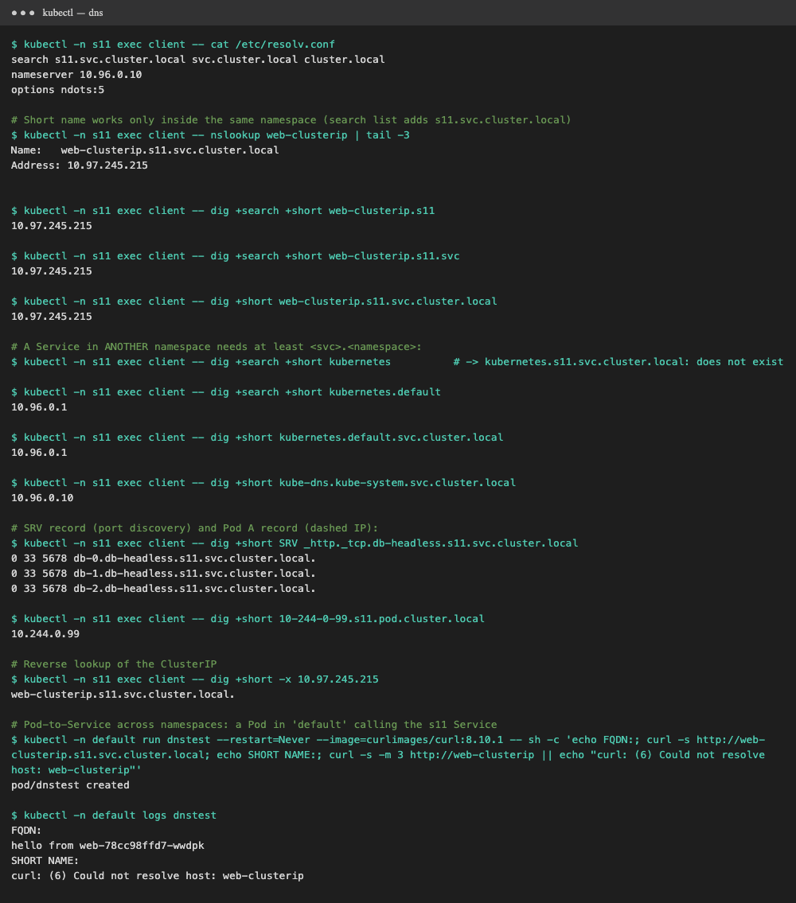

# FQDN in Kubernetes

All outputs below are real, from [`../output-dns.txt`](../output-dns.txt) (`../demo.sh dns`), run from the `client`
Pod in namespace `s11` on minikube.



## What is an FQDN?

A **Fully Qualified Domain Name** is the *complete* DNS name of a host, from the host label up to the root, with
nothing left for the resolver to guess. For example, `www.google.com.` (the final dot is the DNS root).

- **Relative / short name:** `web-clusterip`. The resolver appends the domains from its **search list** until one matches.
- **FQDN:** `web-clusterip.s11.svc.cluster.local.` It's unambiguous and resolves the same from **any** namespace.

## Kubernetes Service DNS

CoreDNS automatically creates DNS records for every Service and Pod. Nobody registers them by hand.

| Object | Record | Example (from this cluster) |
|---|---|---|
| Normal Service | **A** → ClusterIP | `web-clusterip.s11.svc.cluster.local → 10.97.245.215` |
| Headless Service | **A** → every Pod IP | `db-headless.s11.svc.cluster.local → 10.244.0.103, .104, .105` |
| StatefulSet Pod behind a headless Service | **A** → that Pod | `db-0.db-headless.s11.svc.cluster.local → 10.244.0.103` |
| ExternalName Service | **CNAME** | `external-api.s11.svc.cluster.local → httpbin.org.` |
| Named port | **SRV** | `_http._tcp.db-headless.s11.svc.cluster.local → 0 33 5678 db-0.db-headless…` |
| Any Pod | **A** (dashed IP) | `10-244-0-99.s11.pod.cluster.local → 10.244.0.99` |
| Reverse (PTR) | ClusterIP → name | `dig -x 10.97.245.215 → web-clusterip.s11.svc.cluster.local.` |

## Kubernetes DNS naming convention

```text
<service>.<namespace>.svc.<cluster-domain>
   │          │        │        └── cluster.local (default, set in kubelet & CoreDNS)
   │          │        └── "svc" = this is a Service (vs "pod")
   │          └── namespace the Service lives in
   └── Service name

<pod-name>.<headless-svc>.<namespace>.svc.cluster.local     (StatefulSet Pods)
<pod-ip-with-dashes>.<namespace>.pod.cluster.local           (any Pod)
_<port-name>._<protocol>.<service>.<namespace>.svc.cluster.local   (SRV)
```

## Namespace-based DNS

Every Pod's `/etc/resolv.conf` (set by the kubelet, `dnsPolicy: ClusterFirst`) is:

```text
search s11.svc.cluster.local svc.cluster.local cluster.local
nameserver 10.96.0.10          # the kube-dns Service = CoreDNS
options ndots:5
```

The **first search domain is the Pod's own namespace**. That's why short names only work within a namespace:

| Name typed in a Pod in `s11` | Expands to | Result |
|---|---|---|
| `web-clusterip` | `web-clusterip.s11.svc.cluster.local` | ✅ `10.97.245.215` |
| `web-clusterip.s11` | `web-clusterip.s11.svc.cluster.local` | ✅ |
| `web-clusterip.s11.svc` | `web-clusterip.s11.svc.cluster.local` | ✅ |
| `kubernetes` | `kubernetes.s11.svc.cluster.local` | ❌ no such Service in `s11` (it lives in `default`) |
| `kubernetes.default` | `kubernetes.default.svc.cluster.local` | ✅ `10.96.0.1` |
| `kube-dns.kube-system.svc.cluster.local` | (already FQDN) | ✅ `10.96.0.10` |

`ndots:5` means any name with fewer than 5 dots is tried against the search list first. Short in-cluster
names resolve fast, but external names like `api.github.com` cost a few extra lookups. Add a trailing dot (`api.github.com.`)
to skip the search list.

## Pod-to-Service communication

```text
Pod (s11) ── "web-clusterip" ──► resolv.conf search ──► CoreDNS 10.96.0.10
          ◄── 10.97.245.215 ───────────────────────────────┘
Pod ── TCP 10.97.245.215:80 ──► kube-proxy rules ──► 10.244.0.10x:5678 (a Ready Pod)
```

- **Same namespace:** the short name is enough: `curl http://web-clusterip`
- **Different namespace:** use at least `<svc>.<ns>`, or better the full FQDN. Tested from a Pod in `default`:

```text
$ kubectl -n default logs dnstest
FQDN:
hello from web-78cc98ffd7-wwdpk
SHORT NAME:
curl: (6) Could not resolve host: web-clusterip
```

**Best practice:** put the FQDN (`<svc>.<ns>.svc.cluster.local`) in config that crosses namespaces, such as DB hosts and API URLs,
so it doesn't depend on which namespace the client runs in.

## Examples of Kubernetes FQDNs

| FQDN | Points to |
|---|---|
| `kubernetes.default.svc.cluster.local` | the API server Service (`10.96.0.1`) |
| `kube-dns.kube-system.svc.cluster.local` | CoreDNS (`10.96.0.10`) |
| `web-clusterip.s11.svc.cluster.local` | our ClusterIP Service |
| `db-headless.s11.svc.cluster.local` | all 3 StatefulSet Pod IPs |
| `db-0.db-headless.s11.svc.cluster.local` | exactly Pod `db-0` |
| `external-api.s11.svc.cluster.local` | CNAME → `httpbin.org` |
| `10-244-0-99.s11.pod.cluster.local` | the Pod with IP `10.244.0.99` |
| `mysql.prod.svc.cluster.local` | (typical) a MySQL Service in namespace `prod` |
