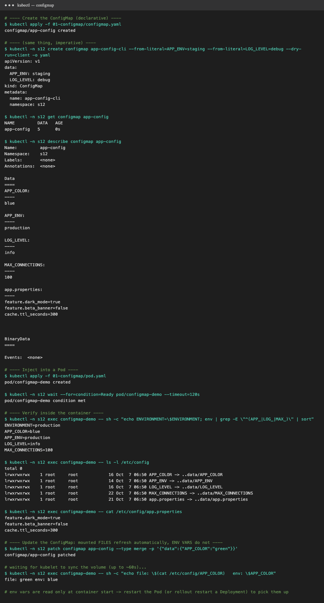
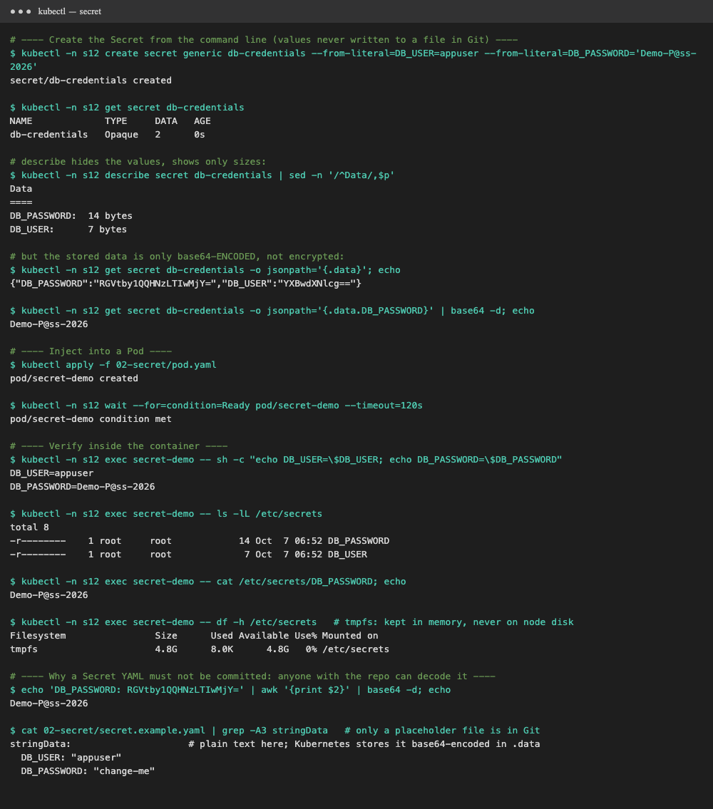
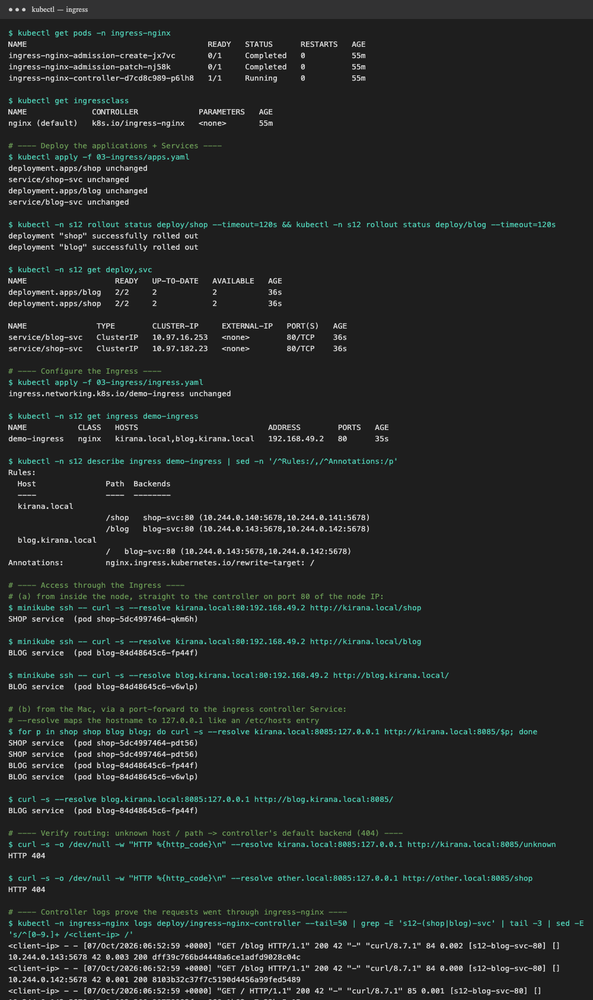

# Session 12: Kubernetes Ingress, ConfigMaps & Secrets

Cluster: **minikube v1.37** with the `ingress` addon (ingress-nginx). Namespace `s12`.
All output comes from [`demo.sh`](demo.sh) (`./demo.sh configmap|secret|ingress`). Raw logs are in `output-*.txt`.

| Deliverable | File |
|---|---|
| ConfigMap YAML | [`01-configmap/configmap.yaml`](01-configmap/configmap.yaml), [`01-configmap/pod.yaml`](01-configmap/pod.yaml) |
| Secret YAML | [`02-secret/secret.example.yaml`](02-secret/secret.example.yaml) (placeholder only), [`02-secret/pod.yaml`](02-secret/pod.yaml) |
| Ingress YAML | [`03-ingress/apps.yaml`](03-ingress/apps.yaml), [`03-ingress/ingress.yaml`](03-ingress/ingress.yaml) |
| Troubleshooting | [Task 5](#task-5-troubleshooting) |

---

## Task 1: ConfigMap

A **ConfigMap** stores **non-sensitive configuration** as key/value pairs or whole files, separate from the image.
The same image can then run in dev, staging and prod with different settings.

**Create:** [`configmap.yaml`](01-configmap/configmap.yaml) holds 4 simple keys (`APP_ENV`, `APP_COLOR`, `LOG_LEVEL`,
`MAX_CONNECTIONS`) and one file-style key (`app.properties`).
```bash
kubectl apply -f 01-configmap/configmap.yaml
# imperative equivalent:
kubectl create configmap app-config --from-literal=APP_ENV=production --from-file=app.properties
```

**Inject into a Pod** ([`pod.yaml`](01-configmap/pod.yaml)), three ways:

| Method | YAML | Result in container |
|---|---|---|
| One key → env var | `env[].valueFrom.configMapKeyRef` | `ENVIRONMENT=production` |
| All keys → env vars | `envFrom[].configMapRef` | `APP_COLOR=blue`, `LOG_LEVEL=info`, … |
| Keys → files | `volumes[].configMap` + `volumeMounts` | `/etc/config/APP_COLOR`, `/etc/config/app.properties` |

**Verify inside the container:**
```bash
kubectl -n s12 exec configmap-demo -- env | grep APP_
kubectl -n s12 exec configmap-demo -- cat /etc/config/app.properties
```



**What I observed**
- All env vars and all files were present with the right values.
- After `kubectl patch configmap app-config … APP_COLOR=green`, the **mounted file changed to `green` without restarting**
  (the kubelet syncs it, using symlinks to `..data/`), but the **env var still said `blue`**. Env vars are read only when the
  container starts, so use `kubectl rollout restart deployment/<name>` to pick up env changes.

## Task 2: Secret

A **Secret** stores **sensitive data** (passwords, tokens, keys). It works like a ConfigMap but Kubernetes treats it
more carefully: `describe` hides values, volumes are mounted on **tmpfs (RAM)**, RBAC can restrict access, and it can be encrypted at rest in etcd.

**Create (from the CLI, so the value never lives in a file):**
```bash
kubectl -n s12 create secret generic db-credentials \
  --from-literal=DB_USER=appuser --from-literal=DB_PASSWORD='Demo-P@ss-2026'
```

**Inject into a Pod** ([`pod.yaml`](02-secret/pod.yaml)) with `env[].valueFrom.secretKeyRef` and as files through
`volumes[].secret` (`defaultMode: 0400`).

**Verify:**
```bash
kubectl -n s12 exec secret-demo -- sh -c 'echo $DB_PASSWORD'
kubectl -n s12 exec secret-demo -- cat /etc/secrets/DB_PASSWORD
```



**What I observed**
- `describe secret` shows only `DB_PASSWORD: 14 bytes`, not the value.
- Inside the container: `DB_USER=appuser`, `DB_PASSWORD=Demo-P@ss-2026`. The files are `-r--------` (0400) on `tmpfs`.
- **But** `kubectl get secret -o jsonpath='{.data.DB_PASSWORD}' | base64 -d` printed the password straight back.

### Why Secrets must not be committed to Git

- **base64 is encoding, not encryption.** Anyone who sees `DB_PASSWORD: RGVtby1QQHNzLTIwMjY=` can run `base64 -d` in one second (shown above).
- **Git never forgets.** A deleted secret stays in the history, every clone and every fork. Public repos get scanned by bots within minutes.
- **Too many people get access:** everyone with repo access gets production credentials, with no audit trail and no rotation.

**What to do instead:** create Secrets from the CLI or CI with values from a secret store; use **Sealed Secrets** or **SOPS**
(encrypted in Git); use the **External Secrets Operator** with AWS Secrets Manager or Vault; enable **encryption at rest**; restrict with **RBAC**;
add the files to `.gitignore` and run secret scanning (gitleaks) in CI. This repo only has [`secret.example.yaml`](02-secret/secret.example.yaml) with a `change-me` placeholder.

> The demo password `Demo-P@ss-2026` is a throwaway value used only in this local minikube lab.

## Task 3: Ingress

**Deploy apps + Services:** [`apps.yaml`](03-ingress/apps.yaml) creates two Deployments (`shop`, `blog`, 2 Pods each)
with ClusterIP Services `shop-svc` and `blog-svc`.

**Configure Ingress:** [`ingress.yaml`](03-ingress/ingress.yaml) has `ingressClassName: nginx` and routes by **path** and **host**:

| Request | Routed to |
|---|---|
| `http://kirana.local/shop` | `shop-svc` |
| `http://kirana.local/blog` | `blog-svc` |
| `http://blog.kirana.local/` | `blog-svc` |
| anything else | controller default backend → **404** |

```bash
kubectl apply -f 03-ingress/apps.yaml -f 03-ingress/ingress.yaml
kubectl -n s12 get ingress demo-ingress            # ADDRESS 192.168.49.2
kubectl -n ingress-nginx port-forward svc/ingress-nginx-controller 8085:80 &
curl --resolve kirana.local:8085:127.0.0.1 http://kirana.local:8085/shop
```



**What I observed (routing verified)**
- `/shop` → `SHOP service (pod shop-…)`, `/blog` → `BLOG service (pod blog-…)`, and host `blog.kirana.local` → BLOG. It worked from inside
  the node (node IP, port 80) and from the Mac (port-forward). Requests were also **load-balanced** across both Pods of each app.
- `/unknown` and the unknown host `other.local` → **HTTP 404** from the controller's default backend.
- The ingress-nginx access log shows each request with its upstream: `[s12-shop-svc-80]` / `[s12-blog-svc-80]` and the Pod IP that served it.
- `--resolve` stands in for a DNS / `/etc/hosts` entry, because the controller routes on the `Host` header.

## Task 4: Ingress vs Ingress Controller

### What is Ingress?
An **Ingress** is a Kubernetes **API object (YAML)** that *declares* HTTP/HTTPS routing rules: "requests for host X and path Y
go to Service Z", plus TLS certificates. It's only configuration. **On its own, it does nothing.**

### What is an Ingress Controller?
An **Ingress Controller** is a **running program** (Pods + a Service, usually type LoadBalancer or NodePort) that **watches** Ingress
objects through the API and **configures a real reverse proxy / load balancer** to implement them. Here it's `ingress-nginx-controller` in namespace
`ingress-nginx`, which turns our Ingress into nginx config.

### Differences

| | Ingress | Ingress Controller |
|---|---|---|
| Kind | API resource (`networking.k8s.io/v1`, `kind: Ingress`) | Deployment/DaemonSet + Service (software) |
| Role | **What** to route: rules, hosts, paths, TLS | **How** to route: actually receives and proxies traffic |
| Created by | App developer, per app (`kubectl apply -f ingress.yaml`) | Cluster admin, once per cluster (Helm chart / addon) |
| Built in? | Yes, part of Kubernetes | **No**, must be installed (minikube: `minikube addons enable ingress`) |
| Count | Many Ingress objects | Usually one or a few controllers, selected by `ingressClassName` |
| Without the other | Ingress stays inert (no ADDRESS, nothing listens) | Controller runs but routes nothing (all 404) |

### Why both are required
Kubernetes separates **intent** from **implementation**. The Ingress gives a portable, vendor-neutral way to describe
routing, and the controller is the pluggable engine that does it. You can swap NGINX for Traefik, or for an AWS ALB, without rewriting app manifests.
One controller (one external IP or cloud load balancer) serves **many** apps through many Ingress objects, which is much cheaper than one
`LoadBalancer` Service per app.

```text
Internet ─► Cloud LB / NodePort ─► [ Ingress Controller Pod (nginx) ] ─► shop-svc ─► shop Pods
                                     ▲ watches + reloads config      └─► blog-svc ─► blog Pods
                                     │
                         Ingress objects (rules) in the API server
```

### Examples
- **Ingress controllers:** ingress-nginx (used here), Traefik, HAProxy, Contour/Envoy, Kong, Istio gateway, **AWS Load Balancer Controller** (ALB), GKE Ingress, Azure Application Gateway.
- **Ingress objects:** [`ingress.yaml`](03-ingress/ingress.yaml) (path- and host-based routing); a TLS Ingress with `spec.tls: [{hosts: [kirana.local], secretName: kirana-tls}]`;
  canary routing with `nginx.ingress.kubernetes.io/canary-weight: "10"`.
- **Next generation:** the **Gateway API** (`Gateway`, `HTTPRoute`) is the successor to Ingress, with the same intent/implementation split and more features.

## Task 5: Troubleshooting

> ⏳ **Pending:** this task uses the **troubleshooting folder from the course repo**, which I don't have yet.
> When it's available, each scenario will get: problem → troubleshooting commands → root cause → fix → before/after output → screenshots.
