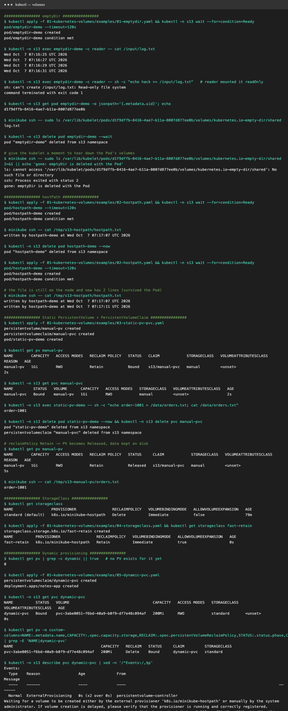

# Kubernetes Volumes

A container's filesystem is **ephemeral**: when the container restarts, everything written inside it is gone.
**Volumes** give Pods storage that outlives a container (emptyDir), outlives the Pod (hostPath, PV), or is provisioned on demand from a storage backend.

Every example below was **run on minikube** with [`../demo.sh volumes`](../demo.sh). The YAMLs are in [`examples/`](examples)
and the full output is in [`../output-volumes.txt`](../output-volumes.txt).



```text
                 Pod spec                              Cluster                       Backend
  volumes: [ persistentVolumeClaim ] ──► PVC (request: 200Mi, RWO, class) ──bind──► PV ──► disk (EBS, NFS, hostPath…)
                                                │                                    ▲
                                                └── StorageClass ── provisioner ─────┘  (dynamic provisioning)
```

---

## emptyDir

- An **empty directory created when the Pod starts**, shared by **all containers in that Pod**, and **deleted when the Pod is removed**.
  It survives container restarts, but not Pod deletion or rescheduling.
- Stored on the node's disk, or in **RAM** with `emptyDir: { medium: Memory }` (tmpfs, which counts against the memory limit). `sizeLimit` caps it.
- **Use for:** scratch space, caches, sharing files between a main container and a sidecar, handing data from init containers to app containers (Session 10, `06-init-container.yaml`).

**Example:** [`01-emptydir.yaml`](examples/01-emptydir.yaml). A `writer` container appends `date` to `/data/log.txt` every 2s,
and a `reader` container mounts the **same** volume at `/input` (read-only).

**What I observed:** `reader` saw the lines written by `writer`. Writing from `reader` failed with `Read-only file system`.
On the node, the data lived in `/var/lib/kubelet/pods/<pod-uid>/volumes/kubernetes.io~empty-dir/shared`. After deleting the Pod,
that directory was **gone**.

## hostPath

- Mounts a **file or directory from the node's own filesystem** into the Pod.
- Data **survives Pod deletion**, but it's **tied to that one node**. If the Pod is scheduled elsewhere, it sees a different (empty) directory.
- ⚠️ A **security risk**: mounting `/`, `/var/run/docker.sock` or `/etc` gives a container control of the node. Many clusters block it with Pod Security Admission.
- **Use for:** node-level agents (DaemonSets) reading `/var/log` or `/sys`, single-node dev clusters, and minikube's own provisioner.
- `type:` `DirectoryOrCreate`, `Directory`, `FileOrCreate`, `Socket`, …

**Example:** [`02-hostpath.yaml`](examples/02-hostpath.yaml) mounts the node's `/tmp/s13-hostpath` and appends one line per Pod start.

**What I observed:** after deleting and recreating the Pod, `minikube ssh -- cat /tmp/s13-hostpath/hostpath.txt` showed **2 lines**, so the
file survived on the node.

## PersistentVolume (PV)

- A **cluster-wide** piece of storage (not namespaced) with its own lifecycle, **independent of any Pod**.
- Describes capacity, **access modes**, **reclaim policy**, StorageClass, and the backend (AWS EBS / EFS, GCE PD, NFS, Ceph, CSI drivers, hostPath…).
- Created **statically** by an admin (as here) or **dynamically** by a provisioner.

| Access mode | Meaning |
|---|---|
| `ReadWriteOnce` (RWO) | read-write by one **node** (e.g. AWS EBS) |
| `ReadOnlyMany` (ROX) | read-only by many nodes |
| `ReadWriteMany` (RWX) | read-write by many nodes (NFS, EFS, CephFS) |
| `ReadWriteOncePod` | read-write by exactly one Pod |

| Reclaim policy | After the PVC is deleted |
|---|---|
| `Delete` | PV **and** the underlying disk are deleted (the default for dynamic provisioning) |
| `Retain` | PV becomes `Released` and **data is kept** for manual recovery |

## PersistentVolumeClaim (PVC)

- A **namespaced request for storage** by a user or app: "I need 500Mi, RWO, class `manual`". The control plane **binds** it to a matching PV (1:1).
- The Pod refers only to the **claim** (`persistentVolumeClaim.claimName`), never to the disk. The app manifest stays portable across clouds.
- Lifecycle: `Pending` → `Bound` → (claim deleted) → PV `Released`.

**Example (static PV + PVC):** [`03-static-pv-pvc.yaml`](examples/03-static-pv-pvc.yaml). An admin-made PV `manual-pv` (1Gi, `Retain`,
class `manual`), a claim `manual-pvc` (500Mi), and a Pod writing `/data/orders.txt`.

**What I observed:**
- `manual-pv  1Gi  RWO  Retain  Bound  s13/manual-pvc  manual`. The 500Mi claim got the whole 1Gi PV (binding is all-or-nothing).
- After deleting the Pod **and** the PVC: `manual-pv ... Retain  Released`, and `orders.txt` (`order-1001`) was **still on disk**.

## StorageClass

- A **"type" of storage** an admin offers (`fast-ssd`, `standard`, `cheap-hdd`), naming the **provisioner** and its **parameters**.
- Fields: `provisioner`, `parameters` (e.g. `type: gp3, iops: "3000"` on AWS), `reclaimPolicy`, `volumeBindingMode`
  (`Immediate` or `WaitForFirstConsumer`, which creates the disk in the AZ where the Pod lands), and `allowVolumeExpansion`.
- One class can be marked **default**. PVCs with no `storageClassName` use it.

**What I observed:** `kubectl get storageclass` → `standard (default)   k8s.io/minikube-hostpath   Delete   Immediate`.
I created [`04-storageclass.yaml`](examples/04-storageclass.yaml), `fast-retain`, which uses the same provisioner with `reclaimPolicy: Retain` and expansion enabled.

```yaml
# The same idea on AWS EKS:
apiVersion: storage.k8s.io/v1
kind: StorageClass
metadata: { name: gp3 }
provisioner: ebs.csi.aws.com
parameters: { type: gp3, encrypted: "true" }
volumeBindingMode: WaitForFirstConsumer
reclaimPolicy: Delete
allowVolumeExpansion: true
```

## Dynamic provisioning

- No admin pre-creates PVs. A PVC names a StorageClass, the class's **provisioner creates a disk and a PV automatically**, and binds them.
- This is how almost all cloud clusters work: a PVC creates an EBS volume on the spot.

**Example:** [`05-dynamic-pvc.yaml`](examples/05-dynamic-pvc.yaml). The PVC `dynamic-pvc` (200Mi, class `standard`) plus a Deployment that appends a
line to `/data/notes.txt` each time its Pod starts.

**What I observed:**
- **Before** applying, there was no PV for it. **One second after** applying: `dynamic-pvc  Bound  pvc-3abe0051-…  200Mi  RWO  standard`.
  A PV named `pvc-<uid>` with `Delete` policy was **created automatically**. The PVC events show `ProvisioningSucceeded`.
- I deleted the Pod. The Deployment created a new one, which mounted the **same claim**, and `notes.txt` then had **2 lines from 2 different Pods**.
  The data outlived the Pod.

## Summary

| | Lifetime | Shared by | Survives Pod delete? | Survives node change? | Typical use |
|---|---|---|---|---|---|
| **emptyDir** | Pod | containers in one Pod | ❌ | ❌ | scratch, cache, sidecar exchange |
| **hostPath** | node | Pods on that node | ✅ | ❌ | node agents, dev |
| **PV + PVC (static)** | independent | per access mode | ✅ | ✅ (network storage) | pre-provisioned disks, NFS |
| **StorageClass + PVC (dynamic)** | independent | per access mode | ✅ | ✅ | databases, StatefulSets on the cloud |
| ConfigMap / Secret volume | object | read-only config | n/a | n/a | config files, credentials (Session 12) |

For StatefulSets, `volumeClaimTemplates` give **each replica its own PVC** (`data-db-0`, `data-db-1`, …) through dynamic provisioning.
