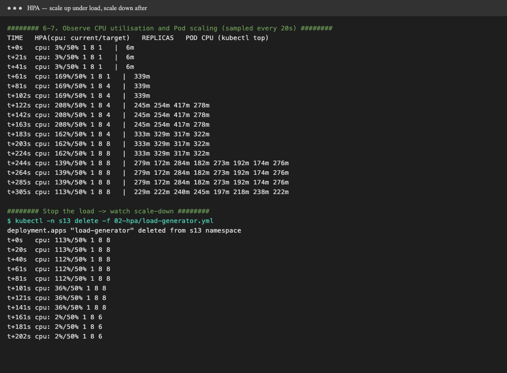
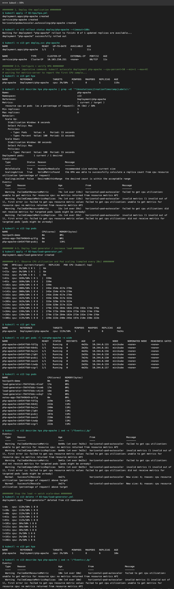

# Session 13: Kubernetes Storage, HPA & Probes

Cluster: **minikube v1.37** with `metrics-server`. Namespace `s13`. Everything was run with [`demo.sh`](demo.sh)
(`./demo.sh volumes|hpa`). Raw logs are in `output-*.txt`.

| Deliverable | Where |
|---|---|
| Volume documentation | [`01-kubernetes-volumes/README.md`](01-kubernetes-volumes/README.md) (+ runnable [`examples/`](01-kubernetes-volumes/examples)) |
| HPA YAML | [`02-hpa/hpa.yml`](02-hpa/hpa.yml) |
| Load generator | [`02-hpa/load-generator.yml`](02-hpa/load-generator.yml) |
| HPA output / screenshots | [below](#task-2-hpa-hands-on), [`output-hpa.txt`](output-hpa.txt) |
| Mini project | [Task 3](#task-3-mini-project) |

---

## Task 1: Kubernetes volumes → [`01-kubernetes-volumes/README.md`](01-kubernetes-volumes/README.md)

Covers emptyDir, hostPath, PersistentVolume, PersistentVolumeClaim, StorageClass and dynamic provisioning, each with a working example and the observed output.

## Task 2: HPA hands-on

**[`02-hpa/hpa.yml`](02-hpa/hpa.yml)** contains:
- **Deployment `php-apache`**: a CPU-heavy web app (each request computes 1M square roots, then returns `OK!`), with `requests.cpu: 200m` and `limits.cpu: 500m`.
  An HPA percentage is measured **against the CPU request**, so a request is mandatory.
- **Service `php-apache`** (ClusterIP :80).
- **HorizontalPodAutoscaler** (`autoscaling/v2`): `minReplicas: 1`, `maxReplicas: 8`, target **50% average CPU**, and `scaleDown.stabilizationWindowSeconds: 60`
  (the default is 300s; shortened for the demo).

> The app follows the official [HPA walkthrough](https://kubernetes.io/docs/tasks/run-application/horizontal-pod-autoscale-walkthrough/).
> Its `registry.k8s.io/hpa-example` image is Intel-only, so I rebuilt an equivalent for this Apple Silicon Mac in [`02-hpa/hpa-app/`](02-hpa/hpa-app)
> (`docker build -t hpa-example:local 02-hpa/hpa-app && minikube image load hpa-example:local`).

**[`02-hpa/load-generator.yml`](02-hpa/load-generator.yml)**: 4 busybox Pods running `while sleep 0.01; do wget -q -O- http://php-apache; done`.

### Steps and commands

| # | Step | Command |
|---|---|---|
| 1 | Deploy the application | `kubectl apply -f 02-hpa/hpa.yml` |
| 2 | Configure HPA | in `hpa.yml` (imperative equivalent: `kubectl autoscale deployment php-apache --cpu-percent=50 --min=1 --max=8`) |
| 3 | Verify HPA | `kubectl get hpa`, `kubectl describe hpa php-apache` |
| 4 | Deploy a load generator | `kubectl apply -f 02-hpa/load-generator.yml` |
| 5 | Increase load | 4 generator Pods, ~100 req/s each |
| 6 | Observe CPU utilisation | `kubectl get hpa` (TARGETS), `kubectl top pods` |
| 7 | Observe Pod scaling | `kubectl get hpa` (REPLICAS), `kubectl get pods -l run=php-apache` |
| 8–9 | Capture output, add screenshots | below |

### What happened (real samples, every 20s)



```text
TIME    HPA cpu: current/target   MIN MAX REPLICAS  | per-Pod CPU (kubectl top)
t+0s    cpu: 3%/50%    1 8 1    |  6m                                   ← idle
t+61s   cpu: 169%/50%  1 8 1    |  339m                                 ← load arrives
t+81s   cpu: 169%/50%  1 8 4    |                                       ← scaled 1 → 4
t+122s  cpu: 208%/50%  1 8 4    |  245m 254m 417m 278m
t+203s  cpu: 162%/50%  1 8 8    |                                       ← scaled 4 → 8 (max)
t+244s  cpu: 139%/50%  1 8 8    |  279m 172m 284m 182m 273m 192m 174m 276m
--- load generator deleted ---
t+101s  cpu: 36%/50%   1 8 8                                            ← below target
t+161s  cpu: 2%/50%    1 8 6                                            ← scale down 8 → 6
        events: "New size: 1; reason: All metrics below target"          ← 6 → 1
```

HPA events (`kubectl describe hpa php-apache`):
```text
Normal  SuccessfulRescale  New size: 4; reason: cpu resource utilization (percentage of request) above target
Normal  SuccessfulRescale  New size: 8; reason: cpu resource utilization (percentage of request) above target
Normal  SuccessfulRescale  New size: 6; reason: All metrics below target
Normal  SuccessfulRescale  New size: 1; reason: All metrics below target
```

### Observations
- **Formula:** `desiredReplicas = ceil(currentReplicas × currentUtilisation / target)`. At 169% with 1 replica, that's `ceil(1 × 169/50) = 4`.
  At 162% with 4 replicas, that's `ceil(4 × 162/50) = 13`, **capped at `maxReplicas: 8`**.
- With 8 Pods, CPU stayed **above** target (139%). Each Pod is limited to 500m, and all 8 share minikube's **4 CPUs**
  (`8 × 200m request`, but the node is saturated). In a real cluster, the **Cluster Autoscaler / Karpenter** would add nodes at this point.
- **Scale-up is fast** (within one 15s HPA sync after metrics arrive). **Scale-down is deliberately slow** (the stabilisation window) to avoid flapping.
- The first `FailedGetResourceMetric … no metrics returned` warnings are normal. **metrics-server** needs about a minute to collect CPU for a new Pod.
- `kubectl top` lags `kubectl get hpa` a little, because both read metrics-server at different moments.



## Probes (session topic)

Demonstrated hands-on in Session 10, [`08-probes-and-hooks.yaml`](../session-10-k8s-deployments/05-pod-lifecycle/08-probes-and-hooks.yaml):
the **readiness** probe held `READY 0/1` for about 10s before traffic was allowed, the **liveness** probe restarts a hung container,
and a **startup** probe (`startupProbe`) delays both for slow-booting apps. `hpa.yml` also uses a readiness probe, so new HPA replicas only receive traffic once they're ready.

## Task 3: Mini project

> ⏳ **Pending:** the Session 13 mini project from the course material hasn't been provided to me yet. It will be added here once available.
