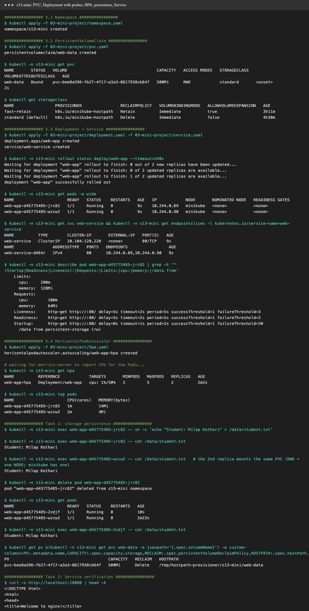
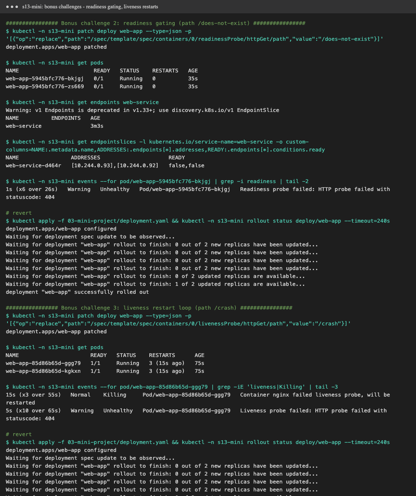
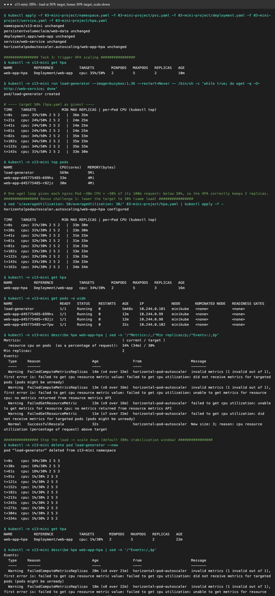
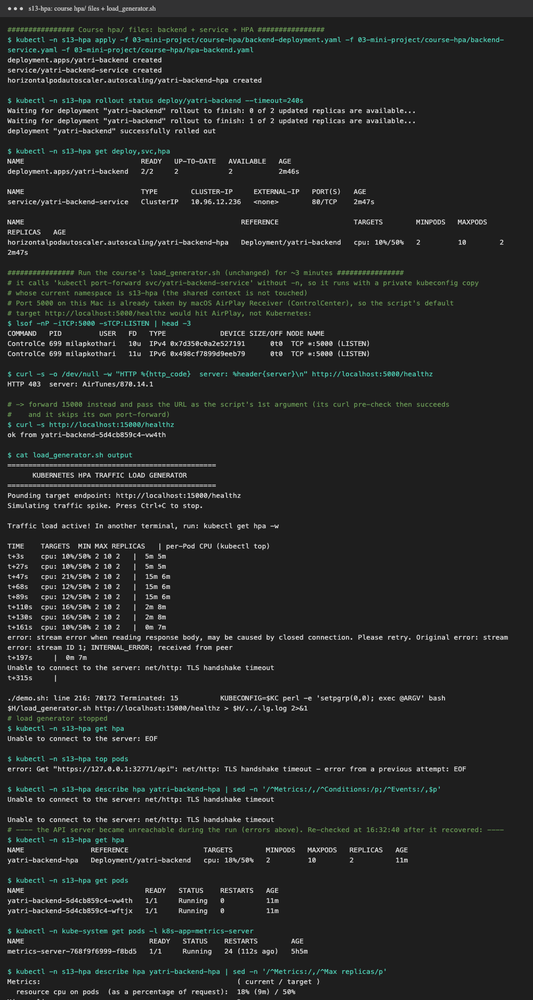

# Session 13: Kubernetes Storage, HPA & Probes

Cluster: **minikube v1.37** with `metrics-server`. Namespace `s13`. Everything was run with [`demo.sh`](demo.sh)
(`./demo.sh volumes|hpa|mini|minihpa|coursehpa`). Raw logs are in `output-*.txt`.

| Deliverable | Where |
|---|---|
| Volume documentation | [`01-kubernetes-volumes/README.md`](01-kubernetes-volumes/README.md) (+ runnable [`examples/`](01-kubernetes-volumes/examples)) |
| HPA YAML | [`02-hpa/hpa.yml`](02-hpa/hpa.yml) |
| Load generator | [`02-hpa/load-generator.yml`](02-hpa/load-generator.yml) |
| HPA output / screenshots | [below](#task-2-hpa-hands-on), [`output-hpa.txt`](output-hpa.txt) |
| Mini project | [Task 3](#task-3-mini-project) |

---

## Task 1: Kubernetes volumes → [`01-kubernetes-volumes/README.md`](01-kubernetes-volumes/README.md)

Covers emptyDir, hostPath, PersistentVolume, PersistentVolumeClaim, StorageClass and dynamic provisioning, each with a working example and the observed output.

## Task 2: HPA hands-on

**[`02-hpa/hpa.yml`](02-hpa/hpa.yml)** contains:
- **Deployment `php-apache`**: a CPU-heavy web app (each request computes 1M square roots, then returns `OK!`), with `requests.cpu: 200m` and `limits.cpu: 500m`.
  An HPA percentage is measured **against the CPU request**, so a request is mandatory.
- **Service `php-apache`** (ClusterIP :80).
- **HorizontalPodAutoscaler** (`autoscaling/v2`): `minReplicas: 1`, `maxReplicas: 8`, target **50% average CPU**, and `scaleDown.stabilizationWindowSeconds: 60`
  (the default is 300s; shortened for the demo).

> The app follows the official [HPA walkthrough](https://kubernetes.io/docs/tasks/run-application/horizontal-pod-autoscale-walkthrough/).
> Its `registry.k8s.io/hpa-example` image is Intel-only, so I rebuilt an equivalent for this Apple Silicon Mac in [`02-hpa/hpa-app/`](02-hpa/hpa-app)
> (`docker build -t hpa-example:local 02-hpa/hpa-app && minikube image load hpa-example:local`).

**[`02-hpa/load-generator.yml`](02-hpa/load-generator.yml)**: 4 busybox Pods running `while sleep 0.01; do wget -q -O- http://php-apache; done`.

### Steps and commands

| # | Step | Command |
|---|---|---|
| 1 | Deploy the application | `kubectl apply -f 02-hpa/hpa.yml` |
| 2 | Configure HPA | in `hpa.yml` (imperative equivalent: `kubectl autoscale deployment php-apache --cpu-percent=50 --min=1 --max=8`) |
| 3 | Verify HPA | `kubectl get hpa`, `kubectl describe hpa php-apache` |
| 4 | Deploy a load generator | `kubectl apply -f 02-hpa/load-generator.yml` |
| 5 | Increase load | 4 generator Pods, ~100 req/s each |
| 6 | Observe CPU utilisation | `kubectl get hpa` (TARGETS), `kubectl top pods` |
| 7 | Observe Pod scaling | `kubectl get hpa` (REPLICAS), `kubectl get pods -l run=php-apache` |
| 8–9 | Capture output, add screenshots | below |

### What happened (real samples, every 20s)


```text
TIME    HPA cpu: current/target   MIN MAX REPLICAS  | per-Pod CPU (kubectl top)
t+0s    cpu: 3%/50%    1 8 1    |  6m                                   ← idle
t+61s   cpu: 169%/50%  1 8 1    |  339m                                 ← load arrives
t+81s   cpu: 169%/50%  1 8 4    |                                       ← scaled 1 → 4
t+122s  cpu: 208%/50%  1 8 4    |  245m 254m 417m 278m
t+203s  cpu: 162%/50%  1 8 8    |                                       ← scaled 4 → 8 (max)
t+244s  cpu: 139%/50%  1 8 8    |  279m 172m 284m 182m 273m 192m 174m 276m
--- load generator deleted ---
t+101s  cpu: 36%/50%   1 8 8                                            ← below target
t+161s  cpu: 2%/50%    1 8 6                                            ← scale down 8 → 6
        events: "New size: 1; reason: All metrics below target"          ← 6 → 1
```

HPA events (`kubectl describe hpa php-apache`):
```text
Normal  SuccessfulRescale  New size: 4; reason: cpu resource utilization (percentage of request) above target
Normal  SuccessfulRescale  New size: 8; reason: cpu resource utilization (percentage of request) above target
Normal  SuccessfulRescale  New size: 6; reason: All metrics below target
Normal  SuccessfulRescale  New size: 1; reason: All metrics below target
```

### Observations
- **Formula:** `desiredReplicas = ceil(currentReplicas × currentUtilisation / target)`. At 169% with 1 replica, that's `ceil(1 × 169/50) = 4`.
  At 162% with 4 replicas, that's `ceil(4 × 162/50) = 13`, **capped at `maxReplicas: 8`**.
- With 8 Pods, CPU stayed **above** target (139%). Each Pod is limited to 500m, and all 8 share minikube's **4 CPUs**
  (`8 × 200m request`, but the node is saturated). In a real cluster, the **Cluster Autoscaler / Karpenter** would add nodes at this point.
- **Scale-up is fast** (within one 15s HPA sync after metrics arrive). **Scale-down is deliberately slow** (the stabilisation window) to avoid flapping.
- The first `FailedGetResourceMetric … no metrics returned` warnings are normal. **metrics-server** needs about a minute to collect CPU for a new Pod.
- `kubectl top` lags `kubectl get hpa` a little, because both read metrics-server at different moments.


## Probes (session topic)

Demonstrated hands-on in Session 10, [`08-probes-and-hooks.yaml`](../session-10-k8s-deployments/05-pod-lifecycle/08-probes-and-hooks.yaml):
the **readiness** probe held `READY 0/1` for about 10s before traffic was allowed, the **liveness** probe restarts a hung container,
and a **startup** probe (`startupProbe`) delays both for slow-booting apps. `hpa.yml` also uses a readiness probe, so new HPA replicas only receive traffic once they're ready.

## Task 3: Mini project

Course mini project: **"Production-Ready Kubernetes Web App"**. It combines a **PVC** (data in `/data` survives Pod deletion), an **HPA** (2-5 replicas at 50% CPU)
and **startup / readiness / liveness probes** on an nginx Deployment. The files are in [`03-mini-project/`](03-mini-project). They're the course YAMLs unchanged, except
for the namespace: `production-webapp` → **`s13-mini`** (this cluster is shared, so all my work stays in `s13-*` namespaces).

| File | Content |
|---|---|
| [`namespace.yaml`](03-mini-project/namespace.yaml) | namespace `s13-mini` |
| [`pvc.yaml`](03-mini-project/pvc.yaml) | `web-data`, 500Mi, `ReadWriteOnce`, default StorageClass `standard` |
| [`deployment.yaml`](03-mini-project/deployment.yaml) | `web-app`: 2 × `nginx:1.27`, `strategy: Recreate`, requests `100m/64Mi`, limits `200m/128Mi`, `/data` from the PVC, three HTTP probes on `/` |
| [`service.yaml`](03-mini-project/service.yaml) | `web-service`, ClusterIP :80 |
| [`hpa.yaml`](03-mini-project/hpa.yaml) | `web-app-hpa`: `autoscaling/v2`, min 2, max 5, 50% average CPU |

Run: `./demo.sh mini` (deploy, storage, Service, probe challenges) then `./demo.sh minihpa` (HPA load test). The namespace is deleted at the end.
Logs: [`output-mini.txt`](output-mini.txt), [`output-minihpa.txt`](output-minihpa.txt).

### Steps 5.1-5.4: deploy



- PVC `web-data` → **`Bound`** within 2s to a dynamically provisioned PV (`pvc-bee8a596…`, 500Mi, RWO, `standard`, reclaim `Delete`), stored on the node at
  `/tmp/hostpath-provisioner/s13-mini/web-data` (provisioner `k8s.io/minikube-hostpath`).
- 2 Pods `1/1 Running`, and the EndpointSlice lists both Pod IPs. `describe pod` shows all three probes:
  `Startup: http-get :80/ period=2s failureThreshold=30` (up to 60s to boot), `Readiness: … period=5s failureThreshold=2`, `Liveness: … period=5s failureThreshold=3`.
- HPA → `cpu: 1%/50%  MINPODS 2  MAXPODS 5  REPLICAS 2` once metrics-server has reported the new Pods (about a minute).

### Task 1: storage persistence

```text
$ kubectl exec web-app-…-jrc82 -- sh -c 'echo "Student: Milap Kothari" > /data/student.txt'
$ kubectl exec web-app-…-wzcw2 -- cat /data/student.txt      # the OTHER replica sees it too
Student: Milap Kothari
$ kubectl delete pod web-app-…-jrc82                          # Deployment creates web-app-…-2zdjf
$ kubectl exec web-app-…-2zdjf -- cat /data/student.txt
Student: Milap Kothari
```
The data outlived the Pod. Both replicas can mount a **ReadWriteOnce** volume because RWO means "one **node**", and minikube has only one node.
On a multi-node cluster, the second replica would get stuck in `ContainerCreating` (Multi-Attach error) on another node. That's also why the course uses `strategy: Recreate`:
the old Pod releases the volume before the new one starts.

### Task 2: Service verification

`kubectl port-forward svc/web-service 18080:80`, then `curl http://localhost:18080` → `<title>Welcome to nginx!</title>`, `HTTP 200`.
(I used local port 18080 instead of 8080 so it can't collide with anything else running on this shared machine.)

### Bonus challenges 2 and 3: probes



| Challenge | Change | What happened |
|---|---|---|
| **2. Readiness gating** | `readinessProbe.httpGet.path: /does-not-exist` | Both Pods `0/1 Running`, with **0 restarts**. `kubectl get endpoints web-service` → **empty**. The EndpointSlice still lists both IPs, but with `ready: false,false`. Events: `Readiness probe failed: HTTP probe failed with statuscode: 404`. A failing readiness probe only **removes the Pod from the Service**; it never restarts it. With `Recreate`, the old healthy Pods were already gone, so the app had **no** endpoints, a full outage. |
| **3. Liveness restart loop** | `livenessProbe.httpGet.path: /crash` | After 75s, both Pods showed **`RESTARTS 3 (15s ago)`**. Events: `Liveness probe failed: … statuscode: 404` (x10) → `Container nginx failed liveness probe, will be restarted` (x3). That's 3 failures × 5s, plus the restart, so about one restart every 20s. Left alone, this turns into `CrashLoopBackOff`. |

After each challenge, I re-applied the original `deployment.yaml` and the rollout returned to 2 healthy Pods.

### Task 3: HPA elastic scaling



Load generator from the course README: `kubectl run load-generator --image=busybox:1.36 -- /bin/sh -c "while true; do wget -q -O- http://web-service; done"`.

**At the course's 50% target, it did not scale, and that's the correct behaviour:**
```text
TIME    TARGETS        MIN MAX REPLICAS | per-Pod CPU
t+21s   cpu: 24%/50%   2   5   2        |  24m 25m
t+82s   cpu: 34%/50%   2   5   2        |  35m 33m
t+143s  cpu: 31%/50%   2   5   2        |  33m 30m

$ kubectl top pods
load-generator            569m   ← the single busybox client is the bottleneck
web-app-…-699hs           33m
web-app-…-r82jz           30m
```
Serving the default nginx page is very cheap. One `wget` loop can only produce about 30m of CPU per Pod, which is ~30% of the 100m request, so it never reaches 50%.
The course's expected output (`110%/50%` → 5 replicas) needs much more traffic. On this shared 8 GB laptop, I didn't want to add more load generators.

**Bonus challenge 1 (lower the target to 30%) with the same load:** `sed 's/averageUtilization: 50/averageUtilization: 30/' hpa.yaml | kubectl apply -f -`
```text
t+0s    cpu: 31%/30%  2 5 2
t+102s  cpu: 33%/30%  2 5 2      ← above target, but still no scaling...
t+163s  cpu: 34%/30%  2 5 2
$ kubectl get hpa
web-app-hpa   Deployment/web-app   cpu: 34%/30%   2   5   3      ← scaled 2 → 3
Normal  SuccessfulRescale  New size: 3; reason: cpu resource utilization (percentage of request) above target
```
- **Why it waited at 31-33%:** the HPA has a default **tolerance of 10%**. It only acts when `current/target` is outside 0.9-1.1. 33/30 = 1.10 is still inside, and 34/30 = 1.13 is outside.
  Then `desired = ceil(2 × 34/30) = ceil(2.27) = 3`.
- **Scale-down:** after the load generator was deleted, CPU dropped to 1% within ~90s, but the replicas stayed at **3 for ~5 minutes**. That's the default
  `scaleDown.stabilizationWindowSeconds: 300`. Then: `New size: 2; reason: All metrics below target` (2 = `minReplicas`, so it never goes lower).
- The older `FailedGetResourceMetric … no metrics returned from resource metrics API` warnings in the events come from an earlier attempt, when this overloaded machine's
  metrics-server and API server were restarting. They show what the HPA does without metrics: **nothing**, it just keeps the current replica count.

### Course `hpa/` files (`backend-service.yaml`, `hpa-backend.yaml`, `load_generator.sh`)



Files: [`03-mini-project/course-hpa/`](03-mini-project/course-hpa). Run: `./demo.sh coursehpa` (namespace `s13-hpa`). Log: [`output-coursehpa.txt`](output-coursehpa.txt).

- The course folder targets a Deployment **`yatri-backend`** (port 5000, `/healthz`) that isn't in it (it's the Session 12 backend). I added a minimal
  [`backend-deployment.yaml`](03-mini-project/course-hpa/backend-deployment.yaml): a Python HTTP server, 2 replicas, `requests.cpu: 50m` (needed for a % target), and a readiness probe on `/healthz`.
- Applied unchanged: `yatri-backend-hpa` → **`cpu: 10%/50%  MINPODS 2  MAXPODS 10  REPLICAS 2`**. The configuration and the metrics pipeline work.
- `load_generator.sh` (unchanged) runs `kubectl port-forward svc/yatri-backend-service` **without `-n`**. I ran it with a private copy of the kubeconfig whose namespace is `s13-hpa`,
  so the shared kubectl context wasn't changed.
- **Port 5000 problem on macOS:** `localhost:5000` is taken by the **AirPlay Receiver** (`lsof` → `ControlCe … *:5000`, `curl` → `HTTP 403 server: AirTunes`). The script's
  `curl -f` pre-check would fail, and its port-forward on 5000 would collide with AirPlay. I forwarded **15000** instead and passed `http://localhost:15000/healthz` as the script's first argument.
  The pre-check then succeeds, and the script skips its own port-forward.
- **Result: no scaling.** CPU only reached `21%/50%` (`15m` on one Pod, `6m` on the other), and then the **API server became unreachable** (`TLS handshake timeout`) in the middle of the run.
  After it recovered: `cpu: 18%/50% … REPLICAS 2`, 2 Pods Running.
  **Why:** `kubectl port-forward` tunnels every request through the **kube-apiserver → kubelet** (it's a debugging tool, not a load balancer). It also always sends traffic to **one** Pod
  behind the Service. So the 10 curl workers mostly loaded the control plane of an already overloaded VM, instead of the backend. I didn't repeat it, so I wouldn't destabilise the shared cluster.
  To load-test this backend for real, run the load **inside** the cluster (a busybox `wget` loop against `http://yatri-backend-service`, as in the mini project) or through an Ingress/NodePort.
  The scaling behaviour itself is shown by the mini project above and by [Task 2](#task-2-hpa-hands-on).
