# Session 14: Kubernetes Troubleshooting

Cluster: **minikube v1.37**, namespace `s14`. Every scenario has a [`broken.yaml`](scenarios) that reproduces a real failure
and a `fixed.yaml`. [`demo.sh`](demo.sh) applies the broken version, investigates, fixes and verifies
(`./demo.sh commands`, `./demo.sh 01` … `09`, or `./demo.sh mini` for the mini project). Each run's full output is in `output-<n>.txt`.

**The method used for every issue:** 1) Identify → 2) Investigate → 3) Root cause → 4) Fix → 5) Verify → 6) Document.

```text
kubectl get pods            → what STATUS / READY / RESTARTS?
kubectl describe pod <p>    → State, Last State, Exit Code, Conditions, *Events*
kubectl logs <p> [--previous]  → what did the app say before dying?
kubectl events --for pod/<p>   → scheduler / kubelet messages
kubectl exec / debug        → look from inside (DNS, ports, files)
kubectl get svc,endpointslices → is traffic wired to the Pods?
```

---

## Task 1: Kubernetes troubleshooting commands

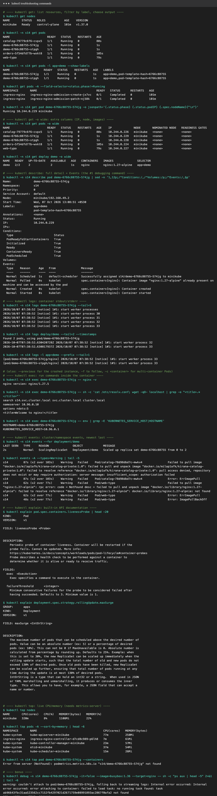

| Command | Purpose | Example used |
|---|---|---|
| **`kubectl get`** | list resources, filter by label or field, choose output | `kubectl get pods -A --field-selector=status.phase!=Running`, `-o jsonpath='{.status.podIP}'` |
| **`kubectl get -o wide`** | extra columns: Pod IP, node, images, selector | `kubectl -n s14 get pods -o wide` |
| **`kubectl describe`** | full object detail + **Events**, the first stop for any problem | `kubectl describe pod <p>` (State, Conditions, Events) |
| **`kubectl logs`** | container stdout/stderr | `logs <p> --tail=5`, `logs deploy/demo --timestamps`, `logs -l app=demo --prefix`, `--previous`, `-f`, `-c` |
| **`kubectl exec`** | run a command inside a container | `exec <p> -- nginx -v`, `exec <p> -- cat /etc/resolv.conf` |
| **`kubectl events`** | events, newest last, filterable | `kubectl events --for deployment/demo`, `kubectl events -A --types=Warning` |
| **`kubectl explain`** | API field documentation from the cluster | `kubectl explain pod.spec.containers.livenessProbe` |
| **`kubectl top`** | live CPU/memory (metrics-server) | `kubectl top nodes`, `top pods -A --sort-by=memory`, `top pod <p> --containers` |
| `kubectl debug` (bonus) | attach an **ephemeral debug container** with tools to a running Pod | `kubectl debug <p> --image=nicolaka/netshoot --target=<container> -- ss -ltnp` |

Full output: [`output-commands.txt`](output-commands.txt)

---

## Task 2: Troubleshoot common issues

| # | Issue | Symptom | Root cause | Fix |
|---|---|---|---|---|
| 1 | CrashLoopBackOff | `Error`, restarts climbing | required env `DB_HOST` missing, app exits 1 | add the env var |
| 2 | ImagePullBackOff | `ImagePullBackOff` | image repo doesn't exist / is private | correct image (or `imagePullSecrets`) |
| 3 | ErrImagePull | `ErrImagePull` | typo in tag `1.27-alpnie` | fix the tag |
| 4 | Pending | `Pending`, no node, no IP | `nodeSelector disktype=ssd` matches no node + 32Gi memory request | label the node, realistic request |
| 5 | ContainerCreating | stuck in `ContainerCreating` | mounted ConfigMap doesn't exist (`FailedMount`) | create the ConfigMap |
| 6 | Service connectivity | `curl http://cart` fails | Service selector typo (`carts`) → no endpoints; wrong `targetPort` | fix selector + targetPort |
| 7 | DNS | `ERROR calling http://inventory` | Service in another namespace, short name → `NXDOMAIN` | use the FQDN |
| 8 | Pod networking | Pod Running, but connections refused | app bound to `127.0.0.1`, not `0.0.0.0` | listen on all interfaces |
| 9 | Configuration | `CreateContainerConfigError` | `secretKeyRef` key `smtp_password` not in Secret | reference the correct key |

### 1. CrashLoopBackOff: [`scenarios/01-crashloopbackoff`](scenarios/01-crashloopbackoff)
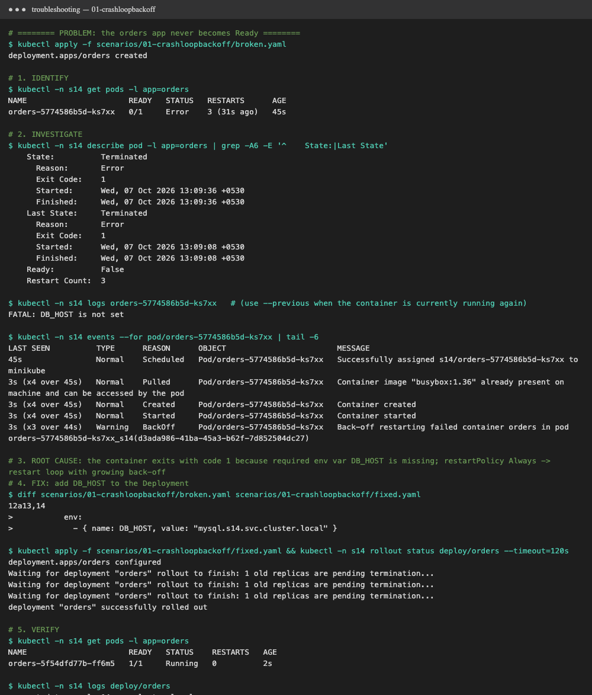

- **Problem statement:** the `orders` Deployment never becomes Ready.
- **Investigation:**
  `kubectl get pods` → `0/1 Error  3 (31s ago)` (restarts keep climbing).
  `kubectl describe pod` → `State: Terminated  Reason: Error  Exit Code: 1`, and `Last State` shows the same.
  `kubectl logs <pod>` → **`FATAL: DB_HOST is not set`**. Events → `Warning BackOff  Back-off restarting failed container`.
- **Root cause:** the app needs env var `DB_HOST`, exits with code 1 without it, and `restartPolicy: Always` makes the kubelet restart it with growing back-off (10s, 20s, 40s … up to 5 min).
- **Solution:** add `env: DB_HOST=mysql.s14.svc.cluster.local` ([`fixed.yaml`](scenarios/01-crashloopbackoff/fixed.yaml)).
- **Before → after:** `0/1 Error 3 restarts` → `1/1 Running 0`; log `connected to mysql.s14.svc.cluster.local`.
- Tip: when the container is running again between crashes, `kubectl logs --previous` shows the crashed instance's output.

### 2. ImagePullBackOff: [`scenarios/02-imagepullbackoff`](scenarios/02-imagepullbackoff)
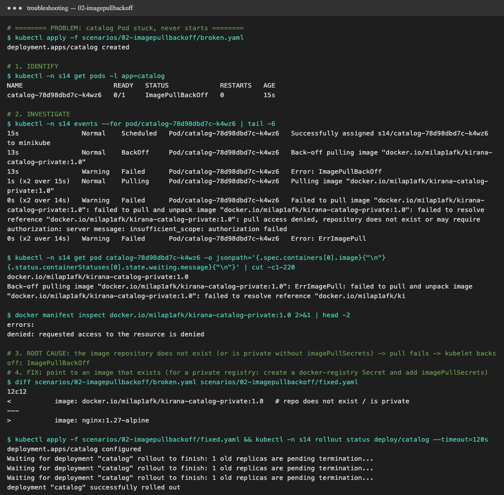

- **Problem:** the `catalog` Pod never starts.
- **Investigation:** `get pods` → `ImagePullBackOff`. `kubectl events --for pod/<p>` →
  `Failed to pull image "docker.io/milap1afk/kirana-catalog-private:1.0" … pull access denied / repository does not exist` → `Error: ErrImagePull` → `Back-off pulling image` → `Error: ImagePullBackOff`.
  `docker manifest inspect` of that image also fails.
- **Root cause:** the image repository doesn't exist, or is private and the Pod has no `imagePullSecrets`.
- **Solution:** use an image that exists ([`fixed.yaml`](scenarios/02-imagepullbackoff/fixed.yaml)). For a real private registry:
  `kubectl create secret docker-registry regcred --docker-server=… --docker-username=… --docker-password=…`, then add `imagePullSecrets: [{name: regcred}]`.
- **Before → after:** `0/1 ImagePullBackOff` → `1/1 Running`.

### 3. ErrImagePull: [`scenarios/03-errimagepull`](scenarios/03-errimagepull)
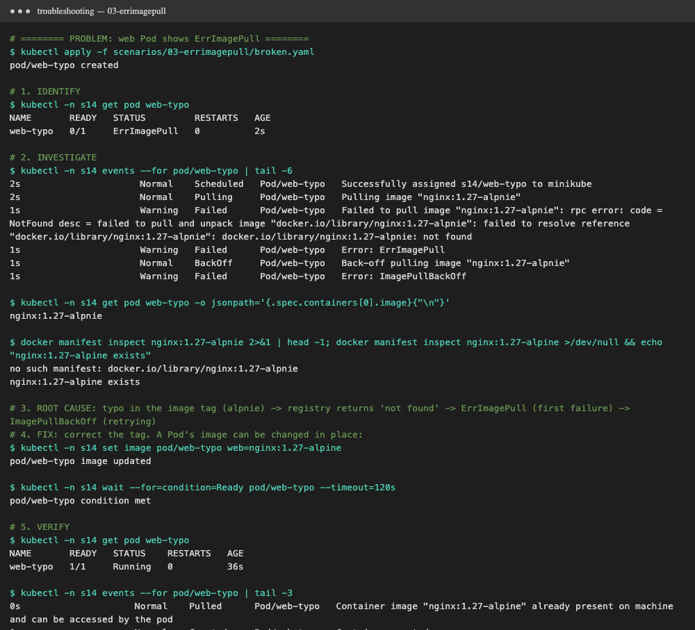

- **Problem:** the `web-typo` Pod shows `ErrImagePull`.
- **Investigation:** events → `Failed to pull image "nginx:1.27-alpnie": rpc error: code = NotFound … failed to resolve reference`.
  The image field shows the typo, while `docker manifest inspect nginx:1.27-alpine` exists.
- **Root cause:** a typo in the tag (`alpnie`). **ErrImagePull** is the first failed pull. After repeated failures, the kubelet waits longer between tries and the status becomes **ImagePullBackOff**.
- **Solution:** `kubectl set image pod/web-typo web=nginx:1.27-alpine` (a Pod's image is one of the few fields editable in place).
- **Before → after:** `ErrImagePull` → `1/1 Running`, with events `Pulled` / `Started`.

### 4. Pending: [`scenarios/04-pending`](scenarios/04-pending)
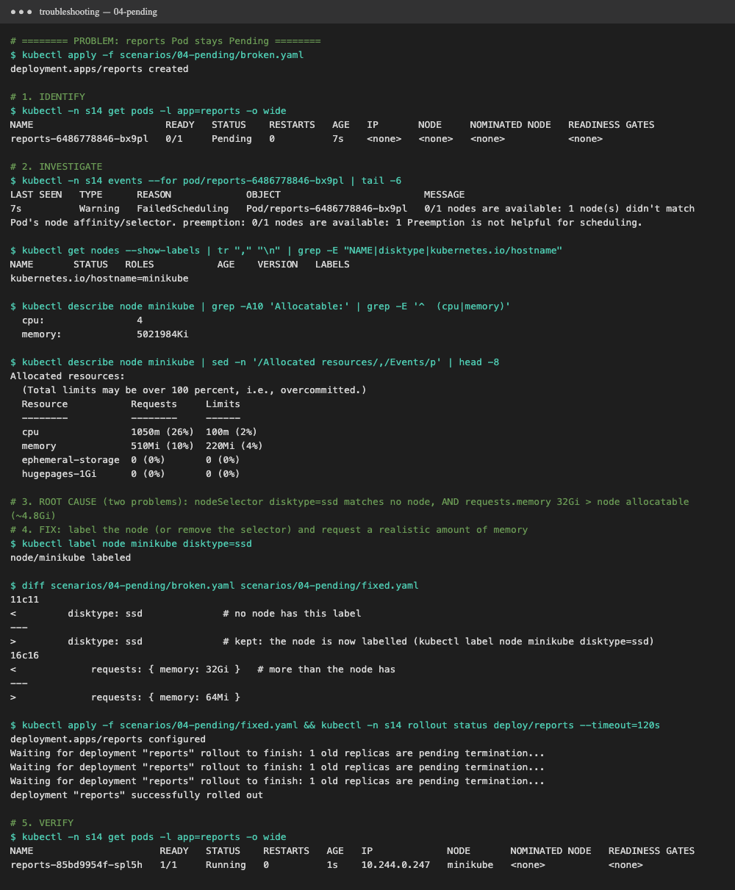

- **Problem:** the `reports` Pod stays `Pending`, with `NODE <none>` and `IP <none>`.
- **Investigation:** events → `FailedScheduling  0/1 nodes are available: 1 node(s) didn't match Pod's node affinity/selector`.
  `kubectl get nodes --show-labels` shows no `disktype` label. `describe node` → Allocatable memory ≈ 4.8Gi, but the Pod requests **32Gi**.
- **Root cause (two):** `nodeSelector: disktype=ssd` matches no node, **and** the memory request is larger than any node. The scheduler only reports the first
  filter that fails, so fixing one problem would reveal the next one.
- **Solution:** `kubectl label node minikube disktype=ssd` and request `64Mi` ([`fixed.yaml`](scenarios/04-pending/fixed.yaml)).
- **Before → after:** `Pending  <none>` → `1/1 Running` on node `minikube` with an IP.

### 5. ContainerCreating: [`scenarios/05-containercreating`](scenarios/05-containercreating)
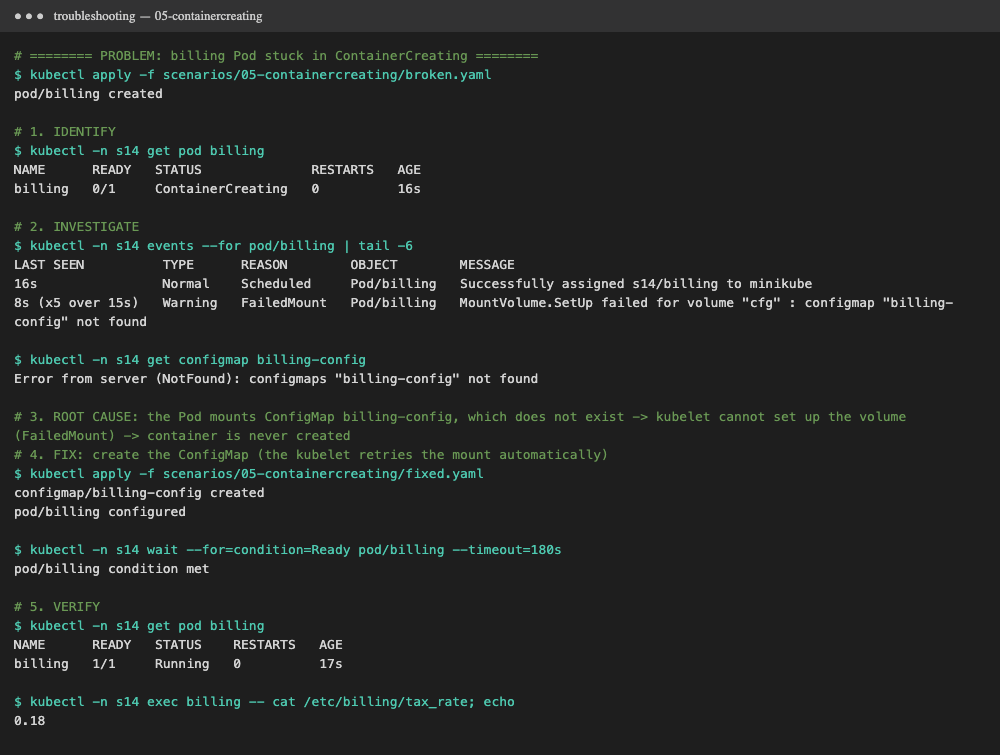

- **Problem:** the `billing` Pod is stuck in `ContainerCreating`.
- **Investigation:** events → `FailedMount  MountVolume.SetUp failed for volume "cfg" : configmap "billing-config" not found` (repeating).
  `kubectl get configmap billing-config` → `NotFound`.
- **Root cause:** the Pod mounts a ConfigMap that was never created. The kubelet can't prepare the volume, so the container is never created.
  (Other causes of a stuck `ContainerCreating`: missing Secrets, PVCs that can't attach, CNI errors, slow image pulls.)
- **Solution:** create the ConfigMap ([`fixed.yaml`](scenarios/05-containercreating/fixed.yaml)). The kubelet retries the mount automatically, so there's no need to recreate the Pod.
- **Before → after:** `ContainerCreating` → `1/1 Running`, and `cat /etc/billing/tax_rate` → `0.18`.

### 6. Service connectivity: [`scenarios/06-service-connectivity`](scenarios/06-service-connectivity)
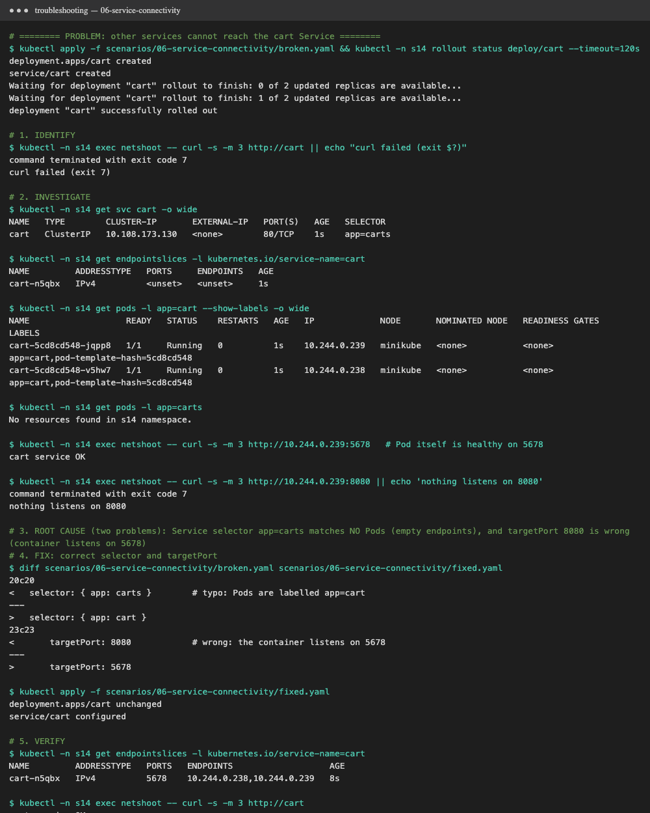

- **Problem:** other Pods can't reach `http://cart` (`curl` exit 7: connection failed).
- **Investigation:**
  `kubectl get endpointslices -l kubernetes.io/service-name=cart` → **`ENDPOINTS <unset>`** (no Pods behind the Service).
  `kubectl get svc cart -o wide` → `SELECTOR app=carts`, but the Pods are labelled `app=cart` (`get pods -l app=carts` → no resources).
  `curl <podIP>:5678` → `cart service OK` (the Pod is healthy), and `curl <podIP>:8080` → refused.
- **Root cause (two):** a selector typo means no endpoints, **and** `targetPort: 8080` while the container listens on `5678`.
- **Solution:** `selector: {app: cart}` and `targetPort: 5678` ([`fixed.yaml`](scenarios/06-service-connectivity/fixed.yaml)).
- **Before → after:** endpoints `<unset>` → `10.244.0.238, 10.244.0.239` (port 5678), and `curl http://cart` → `cart service OK`.

### 7. DNS issues: [`scenarios/07-dns`](scenarios/07-dns)
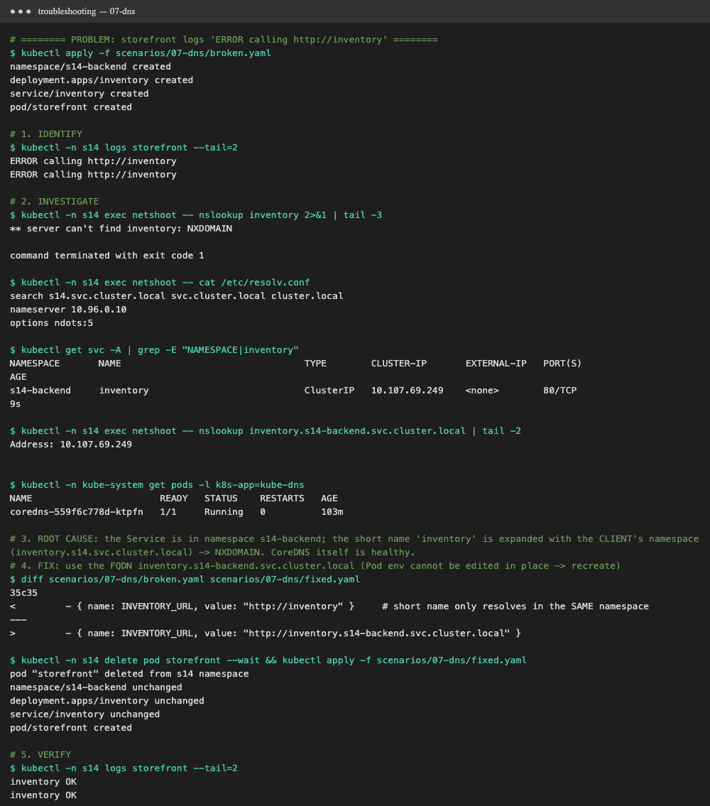

- **Problem:** `storefront` logs `ERROR calling http://inventory`.
- **Investigation:** `nslookup inventory` → `** server can't find inventory: NXDOMAIN`. `/etc/resolv.conf` → `search s14.svc.cluster.local …`.
  `kubectl get svc -A` shows `inventory` lives in **`s14-backend`**. `nslookup inventory.s14-backend.svc.cluster.local` → resolves. The CoreDNS Pods are `Running`.
- **Root cause:** a short name is expanded with the **client's** namespace (`inventory.s14.svc.cluster.local`), which doesn't exist. CoreDNS is fine; the name is wrong.
- **Solution:** `INVENTORY_URL=http://inventory.s14-backend.svc.cluster.local` ([`fixed.yaml`](scenarios/07-dns/fixed.yaml)). Pod env can't be edited in place, so the Pod is recreated.
- **Before → after:** `ERROR calling http://inventory` → `inventory OK`.
- More DNS checks: [Session 11 CoreDNS troubleshooting](../session-11-k8s-services/coredns/README.md#how-to-troubleshoot-dns-issues).

### 8. Pod networking issues: [`scenarios/08-pod-networking`](scenarios/08-pod-networking)
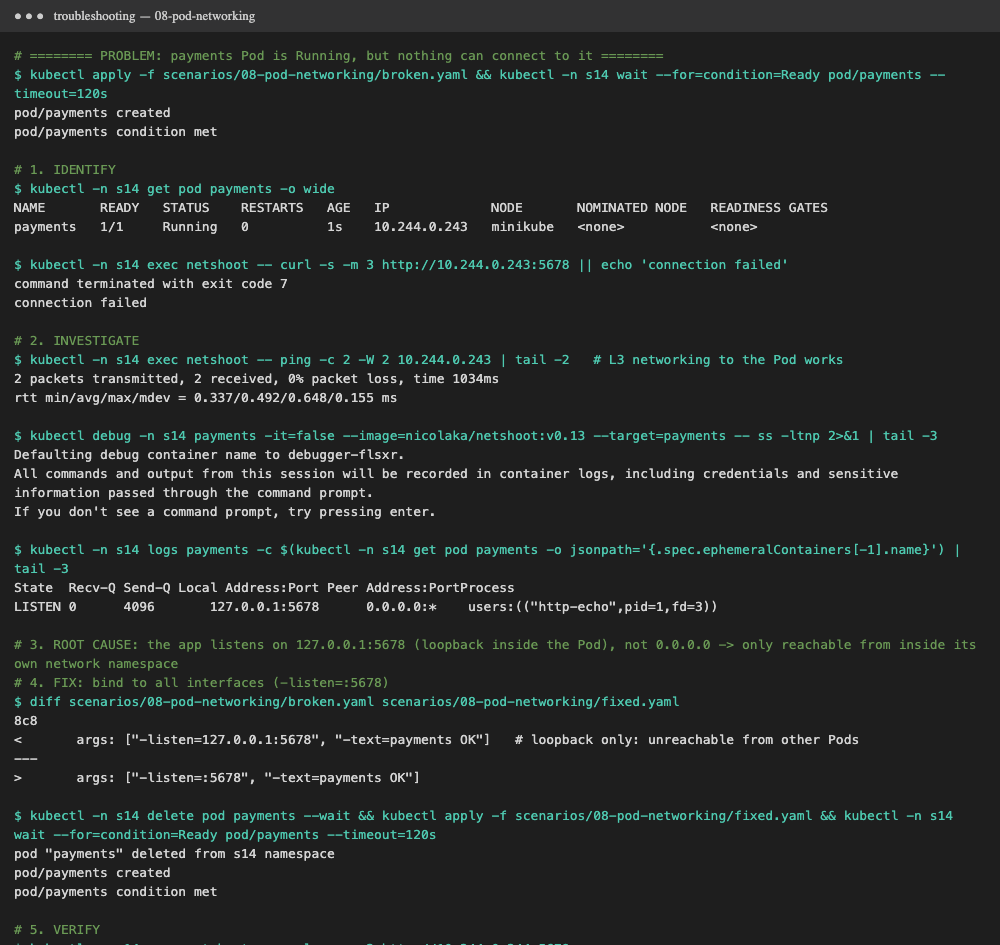

- **Problem:** the `payments` Pod is `1/1 Running`, but `curl <podIP>:5678` from another Pod fails.
- **Investigation:** `ping <podIP>` → `0% packet loss`, so Pod-to-Pod routing (CNI) works.
  An ephemeral debug container: `kubectl debug payments --image=nicolaka/netshoot --target=payments -- ss -ltnp` →
  **`LISTEN 127.0.0.1:5678 users:(("http-echo",pid=1))`**.
- **Root cause:** the app listens on the **loopback** address inside the Pod's network namespace, so only processes in that Pod can connect.
  It's a classic "works in `exec`, fails from outside" bug, and the same thing happens with Flask/Node apps bound to `localhost`.
- **Solution:** bind to all interfaces (`-listen=:5678`, i.e. `0.0.0.0`) ([`fixed.yaml`](scenarios/08-pod-networking/fixed.yaml)).
- **Before → after:** `connection failed` → `payments OK`.
- Other Pod-networking checks: NetworkPolicies (`kubectl get networkpolicy -A`), CNI Pods healthy (`kubectl -n kube-system get pods`), Pod CIDR conflicts.

### 9. Configuration issues: [`scenarios/09-configuration`](scenarios/09-configuration)
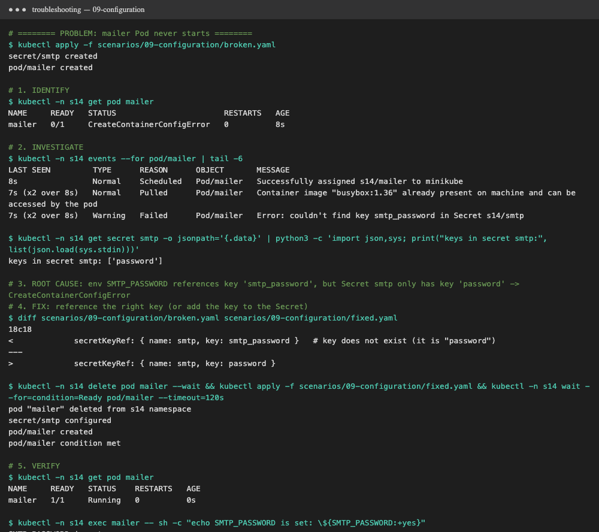

- **Problem:** the `mailer` Pod never starts: `CreateContainerConfigError`.
- **Investigation:** events → **`Error: couldn't find key smtp_password in Secret s14/smtp`**. The Secret's keys are `['password']`.
- **Root cause:** `env.valueFrom.secretKeyRef.key` points to a key that doesn't exist. (The same error happens for a missing ConfigMap key, or a missing Secret/ConfigMap used in `env`.)
- **Solution:** `secretKeyRef: {name: smtp, key: password}` ([`fixed.yaml`](scenarios/09-configuration/fixed.yaml)), or add the key to the Secret. Mark optional references with `optional: true`.
- **Before → after:** `0/1 CreateContainerConfigError` → `1/1 Running`, with `SMTP_PASSWORD is set: yes` (value not printed).

---

## Quick reference: STATUS → where to look

| STATUS | Look at | Usual causes |
|---|---|---|
| `Pending` | `describe` Events (`FailedScheduling`) | resources, nodeSelector/affinity, taints, unbound PVC |
| `ContainerCreating` | Events (`FailedMount`, CNI) | missing ConfigMap/Secret/PVC, volume attach, network plugin |
| `ErrImagePull` / `ImagePullBackOff` | Events (`Failed to pull`) | wrong name/tag, private registry, rate limits |
| `CreateContainerConfigError` | Events | missing ConfigMap/Secret or key |
| `CrashLoopBackOff` / `Error` | `logs` / `logs --previous`, Exit Code | app error, bad config, missing env, failing liveness probe |
| `OOMKilled` | `describe` Last State | memory limit too low / leak |
| `Running` but `0/1` | readiness probe in `describe` | probe path/port wrong, app not ready |
| `Running` but unreachable | endpoints, `targetPort`, `ss -ltnp`, NetworkPolicy, DNS | selector mismatch, loopback bind, policy, wrong name |

## Task 3: Mini project

Course mini project: **"Kubernetes Troubleshooting Challenge"**, an nginx Deployment (2 replicas) + ClusterIP Service, then a broken Pod
and a broken Service selector. Files in [`mini-project/`](mini-project):

| File | Source |
|---|---|
| [`deployment.yaml`](mini-project/deployment.yaml), [`service.yaml`](mini-project/service.yaml), [`broken-pod.yaml`](mini-project/broken-pod.yaml) | course files, unchanged |
| [`broken-service.yaml`](mini-project/broken-service.yaml) | step 8 of the course README: selector `app: wrong-app` |
| [`fixed-pod.yaml`](mini-project/fixed-pod.yaml) | my fix for the broken Pod |

Run: `./demo.sh mini` (namespace `s14-mini`, deleted at the end). Full log: [`output-mini.txt`](output-mini.txt).
A long-running busybox Pod `tester` acts as the in-cluster client for `wget` and `nslookup`.

### Steps 1-4: deploy and check the healthy application

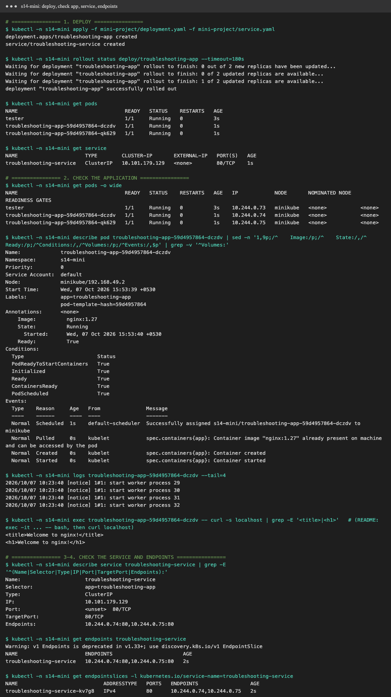

- `kubectl get pods -o wide` → 2 Pods `1/1 Running` with IPs `10.244.0.74/75`. `describe pod` → `State: Running`, all Conditions `True`, events `Scheduled → Pulled → Created → Started`.
- `kubectl logs` → the nginx entrypoint messages. `kubectl exec <pod> -- curl -s localhost` → `<title>Welcome to nginx!</title>` (the README uses `exec -it … -- bash`; I ran it non-interactively so the output could be captured).
- `describe service troubleshooting-service` → **Selector** `app=troubleshooting-app`, **TargetPort** `80/TCP`, **Endpoints** `10.244.0.74:80,10.244.0.75:80`.
  `get endpoints` returns the same two Pod IPs (with the Kubernetes 1.33+ warning that `v1 Endpoints` is deprecated in favour of **EndpointSlices**, also shown).
- From the tester Pod, `wget http://troubleshooting-service` → `Welcome to nginx!`.

### Steps 5-7: the broken Pod

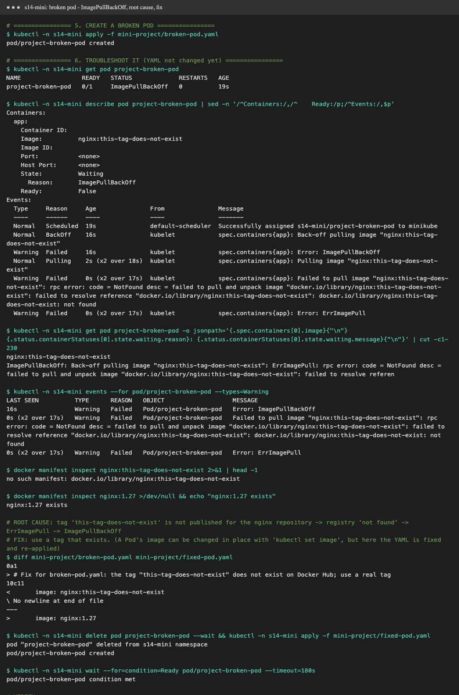

Investigation, without touching the YAML first:
```text
$ kubectl -n s14-mini get pod project-broken-pod
NAME                 READY   STATUS             RESTARTS   AGE
project-broken-pod   0/1     ImagePullBackOff   0          19s

$ kubectl -n s14-mini describe pod project-broken-pod      (Events)
  Normal   Pulling  Pulling image "nginx:this-tag-does-not-exist"
  Warning  Failed   Failed to pull image "nginx:this-tag-does-not-exist": rpc error: code = NotFound desc = failed to pull and unpack image
                    "docker.io/library/nginx:this-tag-does-not-exist": failed to resolve reference …: not found
  Warning  Failed   Error: ErrImagePull
  Normal   BackOff  Back-off pulling image "nginx:this-tag-does-not-exist"
  Warning  Failed   Error: ImagePullBackOff

$ docker manifest inspect nginx:this-tag-does-not-exist
no such manifest: docker.io/library/nginx:this-tag-does-not-exist
```

**Answers to the course questions:**

1. **What is the Pod status?** `0/1 ImagePullBackOff` (the very first attempts show `ErrImagePull`). The container is `Waiting`; it never started, so there are no logs.
2. **What is the actual error?** `Failed to pull image "nginx:this-tag-does-not-exist": rpc error: code = NotFound … failed to resolve reference "docker.io/library/nginx:this-tag-does-not-exist": not found`.
3. **Which command helped find the reason?** `kubectl describe pod project-broken-pod`, specifically its **Events** section (`kubectl events --for pod/project-broken-pod --types=Warning` shows the same lines). `kubectl logs` doesn't help, because no container ever ran.
4. **What is wrong with the image?** The repository `nginx` exists, but the **tag** `this-tag-does-not-exist` was never published. The registry returns `NotFound`, while `docker manifest inspect nginx:1.27` succeeds.
5. **How would you fix it?** Use a tag that exists. I changed it to `nginx:1.27` in [`fixed-pod.yaml`](mini-project/fixed-pod.yaml) and recreated the Pod
   (`kubectl delete pod … && kubectl apply -f fixed-pod.yaml`). A quicker in-place fix is `kubectl set image pod/project-broken-pod app=nginx:1.27`. The image is one of the few Pod fields you can change in place.
   **Result:** `1/1 Running`, with events `Pulled → Created → Started`.

### Steps 8-9: Service selector challenge

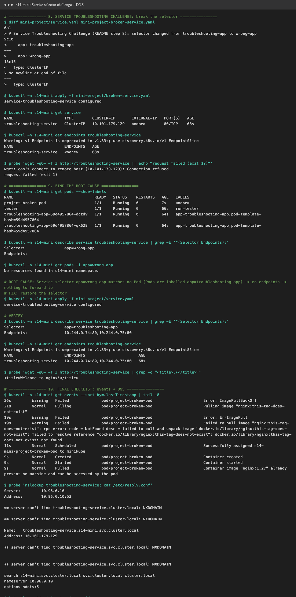

- **Break:** apply [`broken-service.yaml`](mini-project/broken-service.yaml) (`selector: app: wrong-app`). `kubectl get service` still looks perfectly normal (ClusterIP, port 80),
  but `kubectl get endpoints troubleshooting-service` → **`<none>`**, and `wget http://troubleshooting-service` → `can't connect to remote host (10.101.179.129): Connection refused`.
- **Root cause:** `kubectl get pods --show-labels` shows the Pods are labelled `app=troubleshooting-app`. `describe service` shows `Selector: app=wrong-app`
  and an empty `Endpoints:` field, and `kubectl get pods -l app=wrong-app` → `No resources found`. The selector matches no Pod, so the EndpointSlice is empty and kube-proxy
  has nothing to forward to. With no endpoints, the ClusterIP actively **rejects** connections, which is why the error is "refused" and not a timeout.
- **Fix:** re-apply the original [`service.yaml`](mini-project/service.yaml). **Verify:** `Endpoints: 10.244.0.74:80,10.244.0.75:80`, and `wget` → `Welcome to nginx!`.

### Step 10: checklist (events + DNS)

`kubectl get events --sort-by=.lastTimestamp` shows the whole broken-Pod story in order (`ErrImagePull` → `ImagePullBackOff` → after the fix: `Scheduled`, `Pulled nginx:1.27`, `Started`).
`nslookup troubleshooting-service` from the tester Pod resolves `troubleshooting-service.s14-mini.svc.cluster.local → 10.101.179.129` (the ClusterIP).
The extra `NXDOMAIN` lines are normal: busybox's nslookup tries every search domain from `/etc/resolv.conf` (`s14-mini.svc.cluster.local svc.cluster.local cluster.local`, `ndots:5`), and only the first one exists.

### Troubleshooting table

| Problem | What I saw | Command I used | Root cause | Fix |
| :--- | :--- | :--- | :--- | :--- |
| **Broken Pod** | `project-broken-pod 0/1 ImagePullBackOff`, container `Waiting`, no logs | `kubectl get pod`, `kubectl describe pod` (Events), `kubectl events --for pod/… --types=Warning` | the kubelet can't pull the container image, so the container is never created | fix the image in the YAML and recreate the Pod (or `kubectl set image`) → `1/1 Running` |
| **Service Problem** | `get service` looks fine, but `get endpoints` → `<none>` and `wget` → connection refused | `kubectl get endpoints`, `kubectl describe service`, `kubectl get pods --show-labels`, `get pods -l app=wrong-app` | selector `app=wrong-app` ≠ Pod label `app=troubleshooting-app` → no endpoints | restore `selector: app: troubleshooting-app` → 2 endpoints, `wget` works |
| **Image Problem** | `Failed to pull image "nginx:this-tag-does-not-exist" … NotFound … not found` | `kubectl describe pod`, `kubectl get pod -o jsonpath='{.spec.containers[0].image}'`, `docker manifest inspect` | the tag `this-tag-does-not-exist` doesn't exist in `docker.io/library/nginx` | use a published tag (`nginx:1.27`) |

### README questions (in my own words)

1. **What does `kubectl get` tell us?** A one-line summary per object: for Pods, that's READY containers, STATUS, RESTARTS, AGE (and IP/node with `-o wide`). It's the quick "what state is everything in" check, and it's filterable by label (`-l`), field and output format.
2. **`get` vs `describe`?** `get` is a short table (or raw YAML/JSON with `-o`). `describe` is a human-readable deep dive into one object: container state and last state, exit codes, probes, mounts, conditions and, most importantly, the **Events** related to it.
3. **Why `kubectl logs`?** To read what the application printed to stdout/stderr: crashes, stack traces, "can't connect to DB". `--previous` shows the last crashed instance, and `-f` follows the log live.
4. **When `kubectl exec`?** When the Pod runs but behaves wrongly and you need to look from inside: curl `localhost`, check env vars, config files, DNS (`/etc/resolv.conf`), or listening ports. (If the image has no shell or tools, use `kubectl debug` with an ephemeral container.)
5. **`CrashLoopBackOff`?** The container starts and then exits (or is killed by a failing liveness probe) again and again. The kubelet keeps restarting it, waiting longer each time (10s, 20s, 40s … 5 min). Check `logs --previous` and the exit code.
6. **`ImagePullBackOff`?** The image can't be pulled (wrong name or tag, private registry without `imagePullSecrets`, rate limit, no network). After the first failure (`ErrImagePull`), the kubelet retries with a growing back-off, and that waiting state is `ImagePullBackOff`.
7. **Why can a Pod remain `Pending`?** The scheduler can't place it: not enough CPU/memory for its requests, a nodeSelector/affinity that matches no node, taints without tolerations, or an unbound PVC. `describe pod` → `FailedScheduling` gives the reason.
8. **Why can a Service have no endpoints?** Its selector matches no Pods (a label typo, as in step 8), or the matching Pods aren't **Ready** (failing readiness probe), or they're in another namespace (a Service only selects Pods in its own namespace).
9. **Service selector ↔ Pod labels?** A Service doesn't point to Pods by name. It continuously selects **every Ready Pod whose labels match its selector**, and the EndpointSlice controller keeps that list of IPs up to date. The labels in the Deployment's Pod template must match the Service selector exactly.
10. **What is Kubernetes DNS?** CoreDNS (the `kube-dns` Service, `10.96.0.10` here) gives every Service a name, `<service>.<namespace>.svc.cluster.local`, that resolves to its ClusterIP. Pods get a `resolv.conf` with search domains, so inside the same namespace the short name `troubleshooting-service` is enough.
