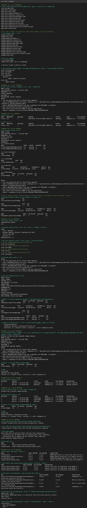
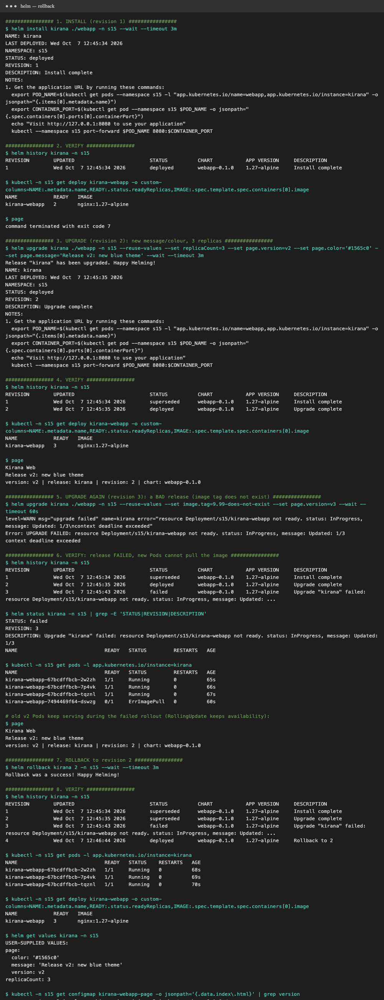
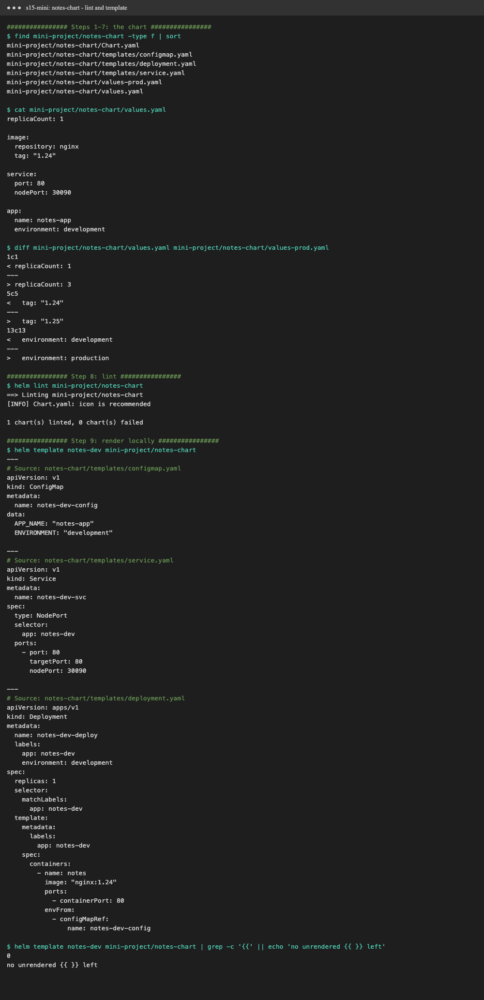
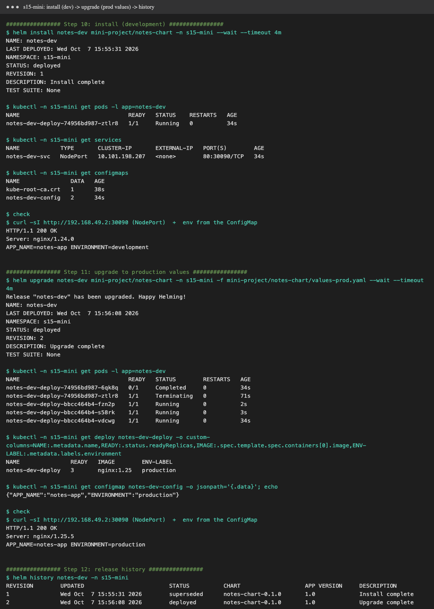
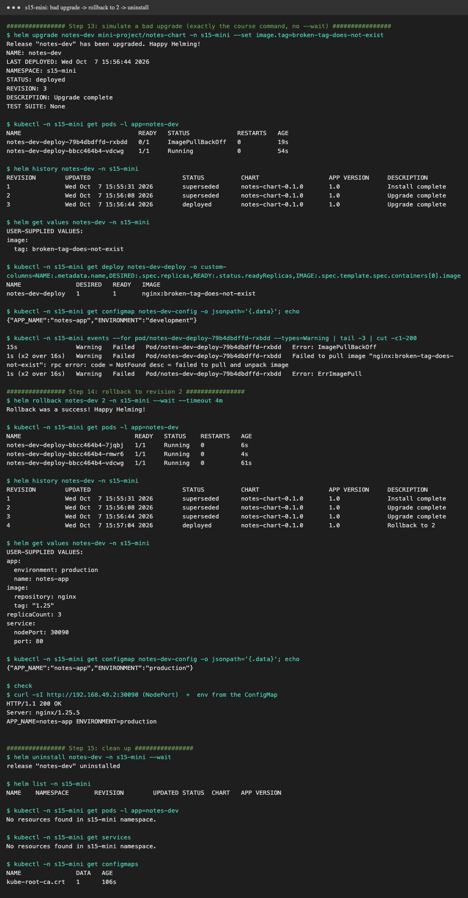

# Session 15: Helm

**Helm** is the package manager for Kubernetes. A **chart** is a package of templated manifests plus default
`values.yaml`. Installing a chart creates a **release**, and every install, upgrade or rollback creates a numbered **revision**, stored as a Secret in the namespace.

Tools: **Helm v4.3.0** on minikube v1.37. Everything below was run with [`demo.sh`](demo.sh)
(`./demo.sh commands|rollback|mini`). Raw logs: [`output-commands.txt`](output-commands.txt), [`output-rollback.txt`](output-rollback.txt).

| Deliverable | Where |
|---|---|
| Helm chart | [`webapp/`](webapp) |
| values.yaml | [`webapp/values.yaml`](webapp/values.yaml) |
| Templates | [`webapp/templates/`](webapp/templates) |
| Installation / Upgrade / Rollback | [Task 1](#task-1-helm-commands), [Task 2](#task-2-helm-rollback) |
| Screenshots | [`screenshots/`](screenshots) |
| Mini project | [Task 3](#task-3-mini-project) |

## The chart: `webapp/`

Created with `helm create webapp`, then customised. It's nginx serving an HTML page **rendered from Helm values**, so every upgrade is visible.

```text
webapp/
├── Chart.yaml               # name, chart version 0.1.0, appVersion 1.27-alpine
├── values.yaml              # defaults: replicaCount 2, image nginx:1.27-alpine, page.{title,message,color,version}
├── charts/                  # sub-chart dependencies (none)
└── templates/
    ├── _helpers.tpl         # named templates: webapp.fullname, webapp.labels, ...
    ├── configmap.yaml       # ★ added: index.html built from .Values.page + .Release.Revision
    ├── deployment.yaml      # ★ edited: mounts the page ConfigMap; checksum/page annotation
    ├── service.yaml
    ├── serviceaccount.yaml
    ├── ingress.yaml / httproute.yaml / hpa.yaml   # off by default (enabled via values)
    ├── NOTES.txt            # printed after install/upgrade
    └── tests/test-connection.yaml   # `helm test`
```

Key template tricks:
```yaml
# configmap.yaml
<p>version: {{ .Values.page.version }} | release: {{ .Release.Name }} | revision: {{ .Release.Revision }}</p>
# deployment.yaml: roll Pods whenever the page content changes
checksum/page: {{ include (print $.Template.BasePath "/configmap.yaml") . | sha256sum }}
```

---

## Task 1: Helm commands



| Command | What it does | What I saw |
|---|---|---|
| `helm create demo-chart` | scaffolds a chart (Chart.yaml, values.yaml, templates/, helpers, tests) | the standard file layout |
| `helm lint webapp` | checks the chart for errors and best practices | `1 chart(s) linted, 0 chart(s) failed` (info: icon recommended) |
| `helm template kirana webapp` | renders the manifests locally, without installing | ServiceAccount, ConfigMap, Service, Deployment, test Pod |
| **`helm install kirana ./webapp -n s15 --wait`** | installs the chart as release `kirana` and waits for readiness | `STATUS: deployed  REVISION: 1` + NOTES |
| **`helm list -n s15`** / `-A` | lists releases (all namespaces with `-A`) | `kirana  s15  1  deployed  webapp-0.1.0  1.27-alpine` |
| **`helm status kirana`** | release status, last deploy time, notes | `STATUS: deployed` |
| `helm get manifest kirana \| kubectl get -f -` | the release's live objects (Helm 4 removed `status --show-resources`) | Deployment 2/2, Service, ConfigMap, ServiceAccount |
| **`helm get values kirana`** (`--all`) | values supplied by the user (or all computed values) | `null` at first (defaults only) |
| `helm get manifest` / `notes` / `metadata` | the rendered YAML / NOTES / chart, version, status | — |
| **`helm upgrade kirana ./webapp --set replicaCount=3 --set page.version=v2 …`** | applies new values or chart version, giving a new revision | `REVISION: 2`, Deployment `3/3`, page shows `version: v2` |
| **`helm history kirana`** | all revisions with status and description | `1 superseded Install complete`, `2 deployed Upgrade complete` |
| **`helm rollback kirana 1`** | redeploys an old revision **as a new revision** | `Rollback was a success!`, revision 3 = "Rollback to 1", back to 2 replicas and the v1 page |
| **`helm repo add bitnami …`**, `add ingress-nginx …`, `update`, `list` | manage chart repositories | both added and indexed |
| **`helm search repo nginx`** | search added repos | `bitnami/nginx 25.2.1`, `ingress-nginx/ingress-nginx 4.15.1`, … |
| `helm search repo … --versions` | all versions of a chart | 4.15.1, 4.15.0, 4.14.5 … |
| **`helm search hub prometheus`** | search Artifact Hub (public catalogue) | prometheus-community/prometheus 29.35.0 … |
| `helm show chart` / `show values bitnami/nginx` | inspect a chart before installing | `appVersion: 1.31.6`, default `replicaCount: 1` |
| **`helm uninstall kirana --wait`** | deletes every resource of the release and its history | `release "kirana" uninstalled`, `kubectl get all` → none |

Install output:
```text
$ helm install kirana ./webapp -n s15 --wait --timeout 3m
NAME: kirana
NAMESPACE: s15
STATUS: deployed
REVISION: 1
DESCRIPTION: Install complete
```

## Task 2: Helm rollback

Workflow: **Install → Upgrade → Verify → Upgrade again → Verify → Rollback → Verify**. The second upgrade is a
deliberately **bad release** (an image tag that doesn't exist), the realistic reason you'd roll back.



| Step | Command | Result |
|---|---|---|
| 1. **Install** | `helm install kirana ./webapp -n s15 --wait` | revision 1: 2 Pods, green page *"Namaste! Release v1 deployed with Helm."* |
| 2. Verify | `helm history`, `kubectl get deploy`, curl | `1 deployed`, `nginx:1.27-alpine`, page `version: v1 \| revision: 1` |
| 3. **Upgrade** | `helm upgrade … --reuse-values --set replicaCount=3 --set page.version=v2 --set page.color='#1565c0' --set page.message='Release v2: new blue theme' --wait` | revision 2 |
| 4. Verify | same | `2 deployed`, `3/3` ready, page *"Release v2: new blue theme"* |
| 5. **Upgrade again** | `helm upgrade … --reuse-values --set image.tag=9.99-does-not-exist --set page.version=v3 --wait --timeout 60s` | **`Error: UPGRADE FAILED: resource Deployment/s15/kirana-webapp not ready … Updated: 1/3`** |
| 6. Verify | `helm history`, `kubectl get pods` | `3 failed`; the new Pod is in `ErrImagePull`, while the **3 old v2 Pods keep `Running` and keep serving** (RollingUpdate protects availability) |
| 7. **Rollback** | `helm rollback kirana 2 -n s15 --wait` | `Rollback was a success! Happy Helming!` |
| 8. Verify | `helm history`, pods, `helm get values`, curl | `4 deployed "Rollback to 2"`, 3 Pods Running on `nginx:1.27-alpine`, values back to v2, page *"Release v2: new blue theme \| version: v2"* |

Final history:
```text
REVISION  STATUS      DESCRIPTION
1         superseded  Install complete
2         superseded  Upgrade complete
3         failed      Upgrade "kirana" failed: resource Deployment/s15/kirana-webapp not ready ...
4         deployed    Rollback to 2
```

**What I learned**
- **Rollback never rewrites history.** It creates a new revision (4) that's a copy of the target (2). You can even roll back a rollback.
- `--wait` (with `--timeout`) makes Helm **fail the release** when resources don't become ready. Without it, the bad upgrade would have been marked `deployed`.
  In Helm 4, `--rollback-on-failure` (formerly `--atomic`) would have rolled back automatically.
- `--reuse-values` keeps earlier `--set` values on upgrade. Without it, an upgrade starts again from the chart defaults.
- **ConfigMap-volume caveat:** after the rollback, the ConfigMap went back to revision 2 at once. But the running Pods weren't restarted (their template already matched revision 2),
  so their mounted `index.html` followed only after the kubelet's next volume sync. In one run it still served the v3 page for a few seconds. The demo waits for the sync.
  The `checksum/page` annotation makes sure any **forward** change of page content does restart the Pods.

## Task 3: Mini project

Course mini project: **"Package and Deploy the Notes App with Helm"**. The chart [`mini-project/notes-chart/`](mini-project/notes-chart) is the course chart, unchanged:

```text
notes-chart/
├── Chart.yaml            # notes-chart 0.1.0, appVersion "1.0"
├── values.yaml           # dev:  replicaCount 1, nginx:1.24, environment development, NodePort 30090
├── values-prod.yaml      # prod: replicaCount 3, nginx:1.25, environment production
└── templates/
    ├── configmap.yaml    # <release>-config: APP_NAME, ENVIRONMENT
    ├── deployment.yaml   # <release>-deploy: envFrom the ConfigMap, label environment=<env>
    └── service.yaml      # <release>-svc: NodePort 30090
```

Run: `./demo.sh mini`. It uses namespace `s15-mini` (instead of `default`) and a `curl` Pod that calls the NodePort on the node IP. The namespace is deleted at the end.
Full log: [`output-mini.txt`](output-mini.txt).

### Steps 8-9: lint and render



`helm lint` → `1 chart(s) linted, 0 chart(s) failed` (only `[INFO] icon is recommended`). `helm template notes-dev notes-chart` renders the ConfigMap, the NodePort Service and the
Deployment with `image: "nginx:1.24"`, `replicas: 1` and `environment: development`. `grep -c '{{'` → `0`, so every placeholder was replaced.

### Steps 10-12: install, upgrade to production, history



| Step | Command | Verified |
|---|---|---|
| 10. Install | `helm install notes-dev notes-chart -n s15-mini --wait` | `STATUS: deployed, REVISION: 1`. 1 Pod `Running`, Service `NodePort 80:30090/TCP`, ConfigMap `notes-dev-config` (2 keys). `curl -sI http://192.168.49.2:30090` → `200 OK, Server: nginx/1.24.0`. In the container: `APP_NAME=notes-app ENVIRONMENT=development` |
| 11. Upgrade | `helm upgrade notes-dev notes-chart -n s15-mini -f notes-chart/values-prod.yaml --wait` | `REVISION: 2`. Deployment `READY 3`, image `nginx:1.25`, label `environment=production`. ConfigMap `{"APP_NAME":"notes-app","ENVIRONMENT":"production"}`. NodePort → `Server: nginx/1.25.5`, env `ENVIRONMENT=production` |
| 12. History | `helm history notes-dev` | `1 superseded Install complete` / `2 deployed Upgrade complete` |

Right after the upgrade, `get pods` caught the rolling update in progress: three new `bbcc464b4` Pods `Running`, and the old `74956bd987` Pod `Terminating`.

### Steps 13-15: bad upgrade, rollback, clean up



**13. Bad upgrade** (the exact course command, no `--wait`): `helm upgrade notes-dev notes-chart --set image.tag=broken-tag-does-not-exist`
```text
STATUS: deployed            <- Helm reports success, because without --wait it doesn't check that Pods become ready
REVISION: 3

NAME                                READY   STATUS             RESTARTS   AGE
notes-dev-deploy-79b4dbdffd-rxbdd   0/1     ImagePullBackOff   0          19s
notes-dev-deploy-bbcc464b4-vdcwg    1/1     Running            0          54s
```
Events: `Failed to pull image "nginx:broken-tag-does-not-exist": rpc error: code = NotFound` → `ErrImagePull` → `ImagePullBackOff`.

**What I noticed (it's different from the course's expected output):**
- **Revision 3 also dropped the production values.** `helm get values` shows only `image.tag: broken-tag-does-not-exist`. Because neither `-f values-prod.yaml` nor `--reuse-values` was given,
  Helm started again from the chart defaults in `values.yaml`. So `replicaCount` went from 3 back to **1**, and the ConfigMap was rewritten to **`ENVIRONMENT: development`**.
  In a real prod upgrade, that would be a second outage hidden behind the image error. The correct command would be `helm upgrade … -f values-prod.yaml --set image.tag=…` (or `--reuse-values`).
- **The app stayed up:** the RollingUpdate keeps one old `nginx:1.25` Pod `Running` until a new Pod is Ready, and a new Pod never becomes Ready.
  (With `replicas: 1`, the default `maxUnavailable: 25%` rounds down to 0.) The course's expected output only shows the broken Pod.
- `STATUS: deployed` for a broken release is why `--wait` (or `--rollback-on-failure` in Helm 4) should be used. With it, Helm marks the release `failed`, as in [Task 2](#task-2-helm-rollback).

**14. Rollback:** `helm rollback notes-dev 2 --wait` → `Rollback was a success! Happy Helming!`
- 3 Pods `Running` again (`bbcc464b4`, the same ReplicaSet as revision 2, so the surviving Pod was reused and 2 more were added).
- `helm history` → `3 superseded Upgrade complete`, **`4 deployed Rollback to 2`**. As in Task 2, a rollback creates a new revision instead of rewriting history.
- `helm get values` → the full `values-prod.yaml` set again. ConfigMap → `ENVIRONMENT: production`. NodePort → `Server: nginx/1.25.5`, env `ENVIRONMENT=production`.

**15. Clean up:** `helm uninstall notes-dev --wait` → `release "notes-dev" uninstalled`. `helm list` is empty, and `get pods -l app=notes-dev` and `get services` → `No resources found`.
Only `kube-root-ca.crt` remains, which Kubernetes adds to every namespace automatically.

### What I practiced
```text
[PASS] Used the notes-chart (Chart.yaml, values.yaml, values-prod.yaml, 3 templates); lint + template clean
[PASS] helm install (dev values)                  -> nginx/1.24.0, 1 replica, ENVIRONMENT=development
[PASS] helm upgrade -f values-prod.yaml           -> nginx/1.25.5, 3 replicas, ENVIRONMENT=production
[PASS] Simulated a bad upgrade                    -> ImagePullBackOff (and saw it silently reset values to the dev defaults)
[PASS] helm rollback notes-dev 2                  -> revision 4, healthy prod again
[PASS] helm uninstall                             -> everything removed
```
