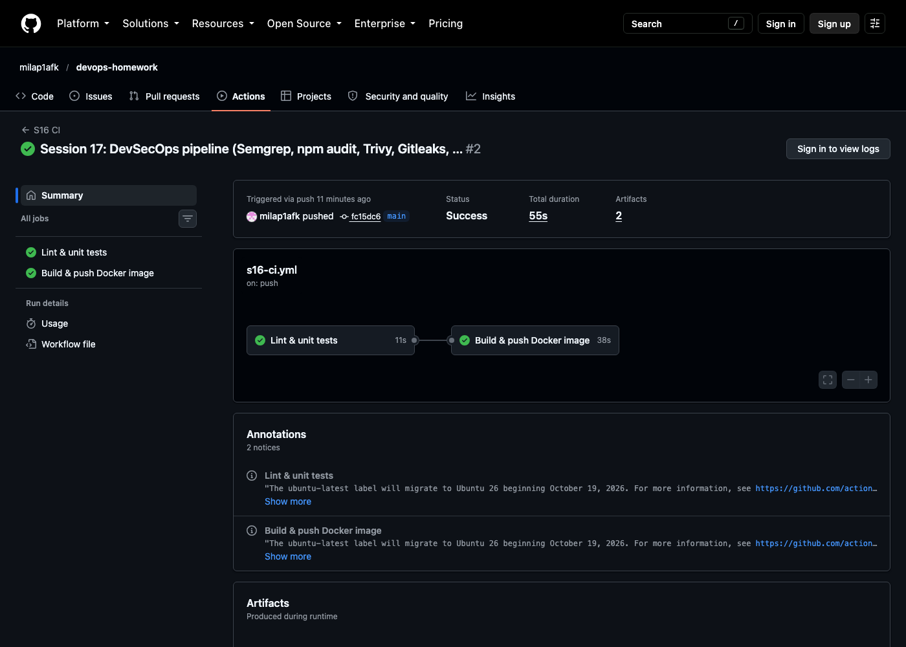
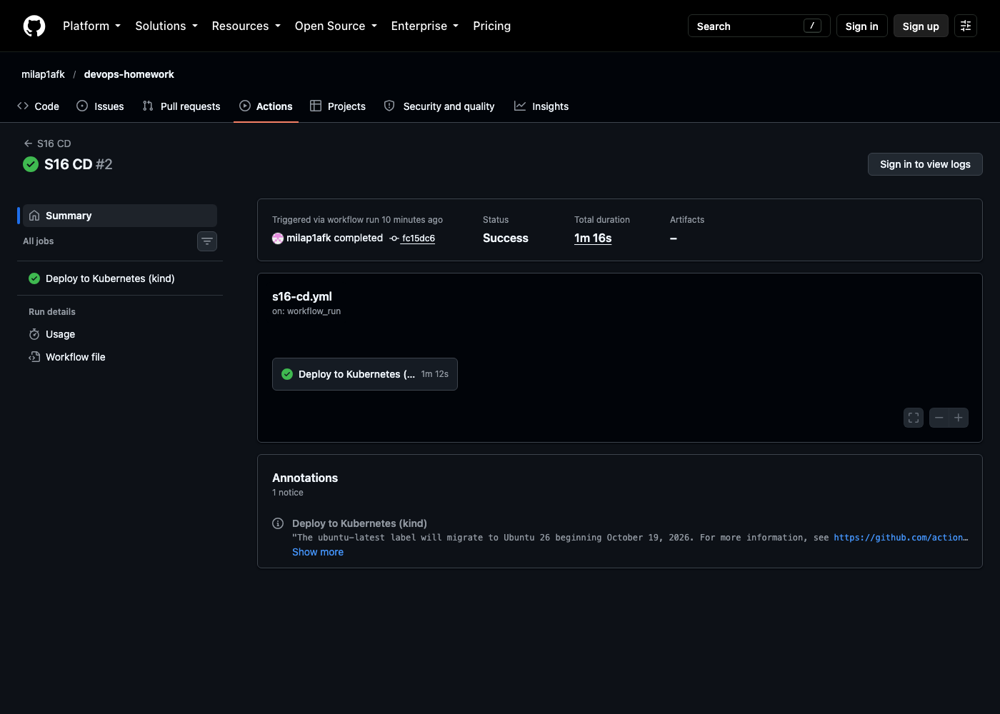

# Session 16: CI/CD & GitHub Actions

A complete CI/CD demo: a small **Kirana ledger API** (Python/Flask) that GitHub Actions lints, tests, packages
as a Docker image, pushes to **GitHub Container Registry**, then **deploys to Kubernetes** and smoke-tests automatically.

| Deliverable | Where |
|---|---|
| Application source code | [`app/app.py`](app/app.py), tests in [`app/tests/`](app/tests) |
| Dockerfile | [`Dockerfile`](Dockerfile) |
| GitHub Actions workflows | [`.github/workflows/s16-ci.yml`](../.github/workflows/s16-ci.yml), [`.github/workflows/s16-cd.yml`](../.github/workflows/s16-cd.yml) |
| Kubernetes manifests | [`k8s/`](k8s) |
| Successful pipeline runs | [CI run](https://github.com/milap1afk/devops-homework/actions/workflows/s16-ci.yml) · [CD run](https://github.com/milap1afk/devops-homework/actions/workflows/s16-cd.yml) · screenshots below |

## The application

`POST /entries` records `udhar` (credit), `payment` or `sale` (protected by an `X-API-Key` header).
`GET /balance/<customer>` returns the balance and a WhatsApp-style reminder. Names are normalised, so
`Ramesh bhai`, `Rameshbhai` and `Shri Ramesh ji` are all **Ramesh**. Also `GET /health` and `GET /entries`.

```bash
curl -X POST localhost:8000/entries -H 'Content-Type: application/json' -H 'X-API-Key: …' \
     -d '{"customer":"Ramesh bhai","amount":500,"type":"udhar"}'
curl localhost:8000/balance/Rameshbhai
# {"balance":500,"customer":"Ramesh","reminder":"Ramesh ji, ₹500 बाकी हैं."}
```

---

## CI vs CD

| | **CI: Continuous Integration** | **CD: Continuous Delivery / Deployment** |
|---|---|---|
| Goal | Every change is automatically **built and tested**, so problems show up minutes after a push | Every change that passes CI is automatically **released** to an environment |
| Answers | "Is this commit correct?" | "Is this commit running where users can use it?" |
| Steps here | lint → unit tests → build image → smoke test image → push to registry | pull image → deploy to Kubernetes → verify |
| Output | a tested, versioned **artifact** (`ghcr.io/milap1afk/kirana-api:<git-sha>`) | that exact artifact **running** in the `dev` cluster |
| Trigger | `push` / `pull_request` | CI finished successfully on `main` (`workflow_run`) |

*Continuous Delivery* = always deployable, with a human approving production. *Continuous Deployment* = deploys automatically, which is what this demo does for `dev`.

## The CI/CD pipeline

```text
 git push ──► S16 CI ─────────────────────────────────────────────┐        S16 CD (workflow_run: CI succeeded)
              job: test                     job: build (needs test)│        job: deploy  (environment: dev)
              ├─ checkout                   ├─ checkout            │        ├─ checkout same commit
              ├─ setup Python 3.12 (cache)  ├─ setup buildx        └──────► ├─ create kind cluster
              ├─ pip install                ├─ login to GHCR                ├─ pull ghcr.io/…/kirana-api:<sha>
              ├─ flake8 (lint)              ├─ build + push :<sha> :latest  ├─ K8s Secret from GitHub secret
              ├─ pytest + coverage          ├─ smoke test the image         ├─ kubectl apply + rollout status
              └─ upload artifact            └─ job summary                  └─ smoke test via the Service
                 (test-results.xml, coverage.xml)
```

## GitHub Actions concepts (where each one is used)

| Concept | Meaning | In this project |
|---|---|---|
| **Workflow** | a YAML file in `.github/workflows/` describing automation | `s16-ci.yml`, `s16-cd.yml` |
| **Event / trigger** | what starts a workflow | `push` + `paths` filter, `pull_request`, `workflow_dispatch` (manual), `workflow_run` (chain CD after CI) |
| **Jobs** | groups of steps; run **in parallel** unless linked by `needs` | `test`, `build` (`needs: test`), `deploy` |
| **Steps** | the commands or actions in a job, run in order on the same runner | `run: pytest …`, `uses: docker/build-push-action@v7` |
| **Actions** | reusable steps from the marketplace | `actions/checkout@v7`, `actions/setup-python@v7`, `docker/*`, `helm/kind-action@v1` |
| **Runners** | the VM that executes a job | `runs-on: ubuntu-latest` (GitHub-hosted, fresh VM per job). Self-hosted runners are also possible |
| **Secrets** | encrypted values, masked in logs | `GITHUB_TOKEN` (automatic: GHCR login), **`KIRANA_API_KEY`** (repo secret → Kubernetes Secret → app env) |
| **Artifacts** | files kept after a run | `test-reports` (JUnit XML + coverage XML), plus the Docker build record |
| **Environments** | deployment targets with optional protection rules | `environment: dev` on the deploy job |
| **Permissions** | least-privilege `GITHUB_TOKEN` scopes | `contents: read` by default, `packages: write` only on the build job |
| **Caching** | reuse downloads between runs | pip cache (`setup-python cache: pip`), Docker layer cache (`cache-from: type=gha`) |
| **Outputs / summary** | data shown or passed between jobs | `$GITHUB_STEP_SUMMARY` with the image tag and deployed Pods |

## Build, test and pipeline execution (real runs)

### CI: lint, test, build, push


From the run log ([`ci-log-excerpt.txt`](ci-log-excerpt.txt)):
```text
tests/test_app.py::test_clean_name_strips_honorifics[Ramesh bhai] PASSED
tests/test_app.py::test_add_and_balance PASSED
tests/test_app.py::test_api_key_required_when_set PASSED
...
TOTAL       48      2    96%
============================== 11 passed in 0.37s ==============================
pushing manifest for ghcr.io/milap1afk/kirana-api:fc15dc61d673…@sha256:509c6af2a120… done
```
Result: **✓ Lint & unit tests (14s) → ✓ Build & push Docker image (34s)**. Artifact `test-reports` was uploaded.

### CD: deploy to Kubernetes and verify


From the run log ([`cd-log-excerpt.txt`](cd-log-excerpt.txt)):
```text
secret/kirana-api-secret created
deployment.apps/kirana-api created
service/kirana-api created
deployment "kirana-api" successfully rolled out
pod/kirana-api-7ff96cdf99-62kdv   1/1  Running   …  dev-control-plane
pod/kirana-api-7ff96cdf99-d7chr   1/1  Running   …  dev-control-plane
{"status":"ok","version":"fc15dc61d673da83b65c4841f3a23ddcda6b9644"}
{"balance":500,"customer":"Ramesh","reminder":"Ramesh ji, ₹500 बाकी हैं."}
request without API key -> HTTP 401
```
Result: **✓ Deploy to Kubernetes (kind) (1m13s)**, triggered automatically by the successful CI run.
The deployed `version` is the **same commit SHA** CI built: one immutable artifact goes from build to deploy.

## Run it locally

```bash
cd app && pip install -r requirements-dev.txt && flake8 . && pytest -v     # 11 passed
cd .. && docker build -t kirana-api . && docker run -p 8000:8000 -e API_KEY=dev kirana-api
```

## Notes
- **Secrets never live in the repo.** `KIRANA_API_KEY` was created as a random value straight into GitHub
  (`openssl rand -hex 24 | gh secret set KIRANA_API_KEY`). The CD job turns it into a Kubernetes Secret, and the logs mask it.
- **Path filters** keep this monorepo efficient: the S16 workflows only run when `session-16-cicd-github-actions/**` or their own files change.
- **kind** gives every CD run a fresh, throwaway Kubernetes cluster inside the runner. For a real environment, the same
  `kubectl apply` would target EKS/GKE using a kubeconfig or OIDC credentials stored as a secret.
- The complete DevSecOps version of this pipeline (SAST, SCA, secret scanning, image scanning, security gate) is in [Session 17](../session-17-devsecops/README.md).
