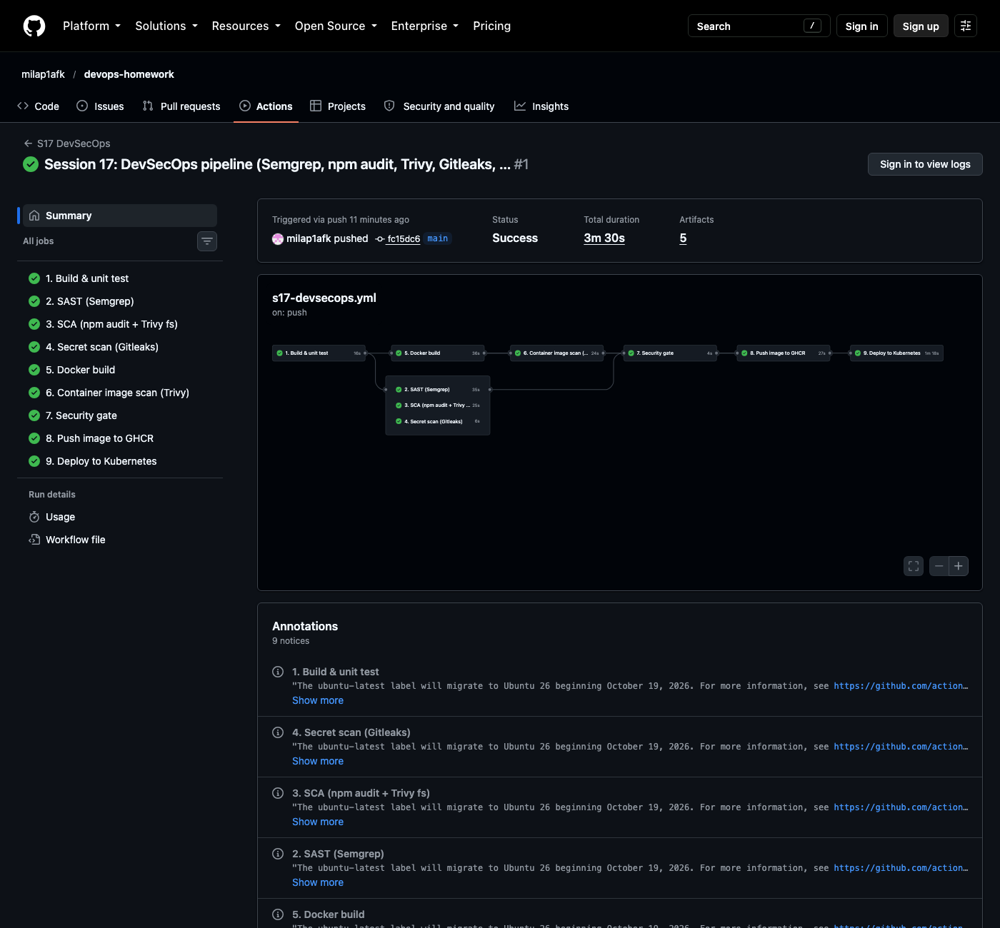
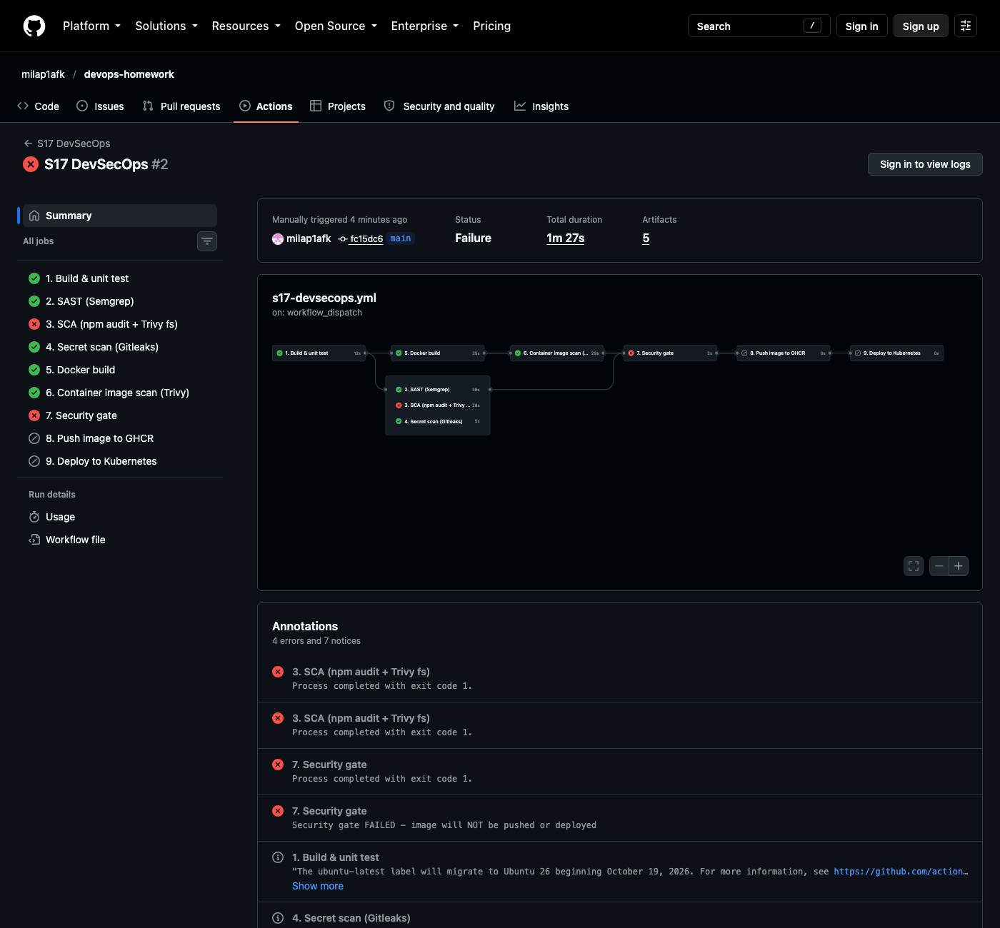

# Session 17: Complete CI/CD & DevSecOps

A complete **CI/CD + DevSecOps** pipeline on GitHub Actions for a small Node.js API (**kirana-catalog**).
Every security check must pass a **security gate** before the image is pushed and deployed to Kubernetes.

| Deliverable | Where |
|---|---|
| Application | [`app/`](app): Express API ([`src/app.js`](app/src/app.js)) + Jest tests ([`test/`](app/test)) |
| Dockerfile | [`Dockerfile`](Dockerfile): multi-stage, patched Alpine runtime without npm, non-root |
| GitHub Actions workflow | [`.github/workflows/s17-devsecops.yml`](../.github/workflows/s17-devsecops.yml) |
| Security tools configuration | [`security/trivy.yaml`](security/trivy.yaml), [`security/.gitleaks.toml`](security/.gitleaks.toml), [`security/.semgrepignore`](security/.semgrepignore) |
| Kubernetes manifests | [`k8s/`](k8s): namespace (Pod Security `restricted`), hardened Deployment, Service, NetworkPolicies |
| Successful pipeline output | [run #1 ✅](https://github.com/milap1afk/devops-homework/actions/runs/37587895277), [`pipeline-log-excerpt.txt`](pipeline-log-excerpt.txt) |
| Gate blocking a bad release | [run #2 ❌ (on purpose)](https://github.com/milap1afk/devops-homework/actions/runs/37588597469), [`blocked-log-excerpt.txt`](blocked-log-excerpt.txt) |

---

## Expected flow → implemented jobs

```text
Code ─► Build ─► Unit Test ─► SAST ─► SCA ─► Secret Scan ─► Docker Build ─► Container Image Scan ─► Security Gate ─► Push Image ─► Deploy to Kubernetes
        └──── job 1 ────┘     job 2   job 3      job 4          job 5               job 6                job 7          job 8           job 9
```

```text
                       ┌─► 2. SAST (Semgrep) ─────────────────────┐
1. Build & unit test ──┼─► 3. SCA (npm audit + Trivy fs) ─────────┤
                       ├─► 4. Secret scan (Gitleaks) ─────────────┼─► 7. Security gate ─► 8. Push to GHCR ─► 9. Deploy (kind)
                       └─► 5. Docker build ─► 6. Image scan (Trivy)┘
```
Jobs 2–5 run **in parallel** after the build. The gate (`needs: [sast, sca, secret-scan, image-scan]`, `if: always()`)
evaluates every result and fails if any check failed. Push and deploy `need` the gate, so **they never run after a failed check**.

| # | Stage | Tool | What it checks | Fails the pipeline when |
|---|---|---|---|---|
| 1 | Build + unit test | `npm ci`, **Jest** + supertest | 6 API tests, coverage ≥ 80% | a test fails or coverage drops |
| 2 | **SAST** | **Semgrep** 1.179 (rulesets `p/javascript`, `p/nodejs`, `p/expressjs`, `p/dockerfile`, `p/secrets`) | insecure code patterns in *our* source (injection, XSS, weak crypto, Dockerfile mistakes) | any finding (`--error`); SARIF uploaded to the **Security** tab |
| 3 | **SCA** | **npm audit** + **Trivy fs** | known CVEs in *third-party* dependencies (`package-lock.json`) | any HIGH/CRITICAL with a fix available |
| 4 | **Secret scanning** | **Gitleaks** 8.30 | API keys, tokens, private keys, in the **full git history** and the current files | any leak |
| 5 | Docker build | Buildx | multi-stage image saved as an artifact (**not pushed yet**) | build error |
| 6 | **Container image scan** | **Trivy** image + **SBOM** (CycloneDX) | CVEs in OS packages and node_modules **inside the image** | any fixable HIGH/CRITICAL |
| 7 | **Security gate** | bash on `needs.*.result` | all of 2, 3, 4, 6 succeeded | any check not `success` |
| 8 | Push image | GHCR | pushes **the exact tarball that was scanned** (`docker load` → push) | — |
| 9 | Deploy | **kind** + kubectl | rollout, smoke test, security-context check | rollout or smoke test fails |

## Run 1: everything passes → deployed ✅



From the run log ([`pipeline-log-excerpt.txt`](pipeline-log-excerpt.txt)):
```text
[1. Build & unit test]   Tests:       6 passed, 6 total
[2. SAST (Semgrep)]       • Findings: 0 (0 blocking)
[3. SCA / npm audit]     found 0 vulnerabilities
[4. Secret scan]         INF no leaks found          (git history)
[4. Secret scan]         INF no leaks found          (current files)
[7. Security gate]       Security gate PASSED
[8. Push image]          fc15dc61d673…: digest: sha256:95d0a378ebde3dc1… size: 1992
[9. Deploy]              networkpolicy.networking.k8s.io/default-deny-ingress created
[9. Deploy]              deployment "kirana-catalog" successfully rolled out
[9. Deploy]              pod/kirana-catalog-5d648946c8-d8pbm   1/1   Running
[9. Deploy]              {"status":"ok","version":"fc15dc61d673da83b65c4841f3a23ddcda6b9644"}
[9. Deploy]              readOnlyRootFilesystem=true allowPrivilegeEscalation=false drop=["ALL"]
[9. Deploy]              uid 1000
```
All **9 jobs green in 3m30s**. The smoke test also asserts `GET /products/1/total?qty=2` → `"total":490` (the step fails otherwise).

## Run 2: vulnerable dependency → gate blocks the release ❌

To prove the gate works, the workflow has a manual input, `inject_vulnerability`, which adds **lodash 4.17.4** (known critical CVEs) in the SCA job:
```bash
gh workflow run "S17 DevSecOps" -f inject_vulnerability=true
```



| Job | Result |
|---|---|
| 1. Build & unit test | ✅ |
| 2. SAST (Semgrep) | ✅ |
| **3. SCA (npm audit + Trivy fs)** | ❌ `lodash <=4.17.23  Severity: critical`: Prototype Pollution (GHSA-fvqr-27wr-82fm), Command Injection (GHSA-35jh-r3h4-6jhm), ReDoS, … `1 critical severity vulnerability` |
| 4. Secret scan | ✅ |
| 5. Docker build / 6. Image scan | ✅ |
| **7. Security gate** | ❌ `Security gate FAILED - image will NOT be pushed or deployed` |
| 8. Push image | ⏭ **skipped** |
| 9. Deploy | ⏭ **skipped** |

Nothing vulnerable reached the registry or the cluster.

## Security measures beyond the scanners

**Dockerfile** (multi-stage):
- stage 1 `npm ci --omit=dev --ignore-scripts`: production dependencies only, and no install scripts run.
- runtime `node:22-alpine` + `apk upgrade` (patched OS packages), with **npm/npx/corepack removed** (not needed at runtime, and their bundled dependencies carry CVEs).
- `USER node` (non-root), only the app code is copied, and tests are excluded by `.dockerignore`.
- Lesson learned: my first runtime choice, `distroless/nodejs22-debian12`, had **fixable HIGH OpenSSL CVEs** at build time, and a local Trivy scan would have failed the gate. Patched Alpine got to **0** fixable HIGH/CRITICAL.

**Kubernetes** ([`k8s/`](k8s)):
- Namespace label `pod-security.kubernetes.io/enforce: restricted` makes the API server **reject** non-compliant Pods.
- `runAsNonRoot`, `runAsUser: 1000`, `seccompProfile: RuntimeDefault`, `allowPrivilegeEscalation: false`, `readOnlyRootFilesystem: true`, `capabilities.drop: [ALL]`, `automountServiceAccountToken: false`.
- NetworkPolicies: **default-deny ingress** for the namespace, then allow only TCP 3000 to the API.
- Resource requests/limits, plus liveness and readiness probes.

**Pipeline:**
- Least-privilege `GITHUB_TOKEN` (`contents: read` by default; `packages: write` only for push; `security-events: write` only for SARIF).
- Actions pinned to versions, scanner images pinned (`semgrep/semgrep:1.179.0`, `zricethezav/gitleaks:v8.30.1`).
- The image that's deployed is **byte-for-byte the one that was scanned** (artifact tarball → `docker load` → push).
- An SBOM (CycloneDX) is produced for every build as an artifact.

## SAST vs SCA vs secret scanning vs image scanning

| | Looks at | Finds | Example |
|---|---|---|---|
| **SAST** (static application security testing) | **your** source code, without running it | insecure coding patterns | SQL built from `req.query`, `eval()`, missing helmet |
| **SCA** (software composition analysis) | your **dependencies** (lock files) | known CVEs in open-source libraries | lodash 4.17.4 prototype pollution |
| **Secret scanning** | code **and git history** | committed credentials | `AKIA…` AWS keys, GitHub tokens, private keys |
| **Image scanning** | the final **container image** | CVEs in OS packages and runtime libraries | OpenSSL CVE in a base image |
| (DAST, not in scope) | the running app over HTTP | runtime issues | OWASP ZAP baseline scan |

## Run locally

```bash
cd app && npm ci && npm test                                     # 6 passed, 100% coverage
docker build -t kirana-catalog .
trivy image --config security/trivy.yaml kirana-catalog           # 0 fixable HIGH/CRITICAL
docker run --rm -v "$PWD:/src" semgrep/semgrep:1.179.0 semgrep scan --config p/javascript /src
docker run --rm -v "$PWD:/repo" zricethezav/gitleaks:v8.30.1 dir /repo --config /repo/security/.gitleaks.toml
```
