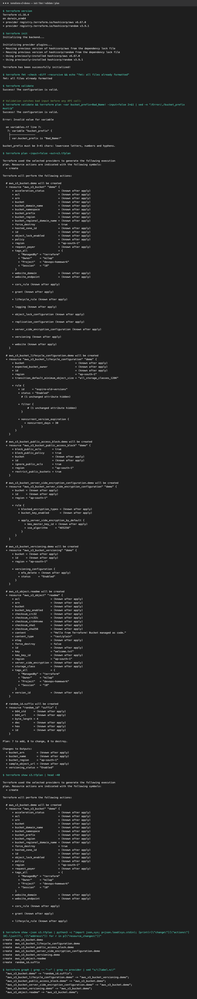

# terraform-s3-demo

Creates a **secure, versioned, encrypted AWS S3 bucket** with Terraform.

```text
terraform-s3-demo/
├── provider.tf        # terraform + provider versions, AWS region, default tags
├── variables.tf       # inputs (with a validation rule on bucket_prefix)
├── main.tf            # bucket + public-access block + versioning + encryption + lifecycle + sample object
├── outputs.tf         # bucket name, ARN, region, versioning status, object URI
├── terraform.tfvars   # values for this environment
├── run.sh             # runs the offline steps and writes output.txt
└── README.md
```

> **Run mode for this submission:** I have no AWS account configured, so **no real resources were created**.
> `init`, `fmt`, `validate` and `plan` were run for real (output below). `plan` works offline because
> `offline_plan = true` gives the provider dummy credentials and skips its AWS identity checks, and planning new resources needs no API calls.
> `apply`, `show`, `output` and `destroy` need a real account. Their commands and expected results are documented in step 5 onwards.



## What gets created (7 resources)

| Resource | Purpose |
|---|---|
| `random_id.suffix` | 8-hex-character suffix, because bucket names are globally unique |
| `aws_s3_bucket.demo` | the bucket `milap-devops-s3-demo-<hex>`, `force_destroy = true` |
| `aws_s3_bucket_public_access_block.demo` | blocks all public ACLs and policies |
| `aws_s3_bucket_versioning.demo` | versioning `Enabled` |
| `aws_s3_bucket_server_side_encryption_configuration.demo` | SSE-S3 (`AES256`) encryption at rest |
| `aws_s3_bucket_lifecycle_configuration.demo` | expire old object versions after 30 days |
| `aws_s3_object.readme` | sample object `welcome.txt` |

Dependency graph (from `terraform graph`): Terraform works out the creation order from references. The bucket waits for the
random suffix, and every bucket setting waits for the bucket. Lifecycle has an explicit `depends_on` on versioning.

## Workflow

### 1. `terraform init`
Downloads providers (`hashicorp/aws v6.67.0`, `hashicorp/random v3.9.1`) into `.terraform/`, sets up the backend (local
state here), and writes `.terraform.lock.hcl`, which pins the exact provider versions. **Commit the lock file.**
```text
Terraform has been successfully initialized!
```

### 2. `terraform fmt`
Rewrites `.tf` files into the canonical style. `-check -diff` only reports, which is how CI runs it.
```text
fmt: all files already formatted
```

### 3. `terraform validate`
Checks syntax, types and references, without touching AWS.
```text
Success! The configuration is valid.
```
Custom `validation` blocks reject bad input early:
```text
$ terraform plan -var bucket_prefix=Bad_Name!
Error: Invalid value for variable
bucket_prefix must be 3-41 chars: lowercase letters, numbers and hyphens.
```

### 4. `terraform plan -out=s3.tfplan`
Compares the desired config with the current state and shows what would change. `-out` saves the plan, so `apply` runs **exactly** that.
```text
  # aws_s3_bucket.demo will be created
  + resource "aws_s3_bucket" "demo" {
      + force_destroy = true
      + region        = "ap-south-1"
      + tags_all      = { "ManagedBy" = "terraform", "Owner" = "milap", "Project" = "devops-homework", "Session" = "18" }
  ...
Plan: 7 to add, 0 to change, 0 to destroy.
```

### 5. `terraform apply` *(needs an AWS account; not run)*
```bash
aws configure                      # an IAM user with S3 permissions
sed -i '' 's/offline_plan.*/offline_plan = false/' terraform.tfvars
terraform apply                    # review the plan, type "yes"
```
Expected result: `Apply complete! Resources: 7 added, 0 changed, 0 destroyed.` and a `terraform.tfstate` file (gitignored) recording the real IDs.

### 6. `terraform show`
Prints the current **state**, meaning every attribute of every managed resource (the bucket ARN, versioning status, encryption rule).
Here it was used on the saved plan instead: `terraform show s3.tfplan`.

### 7. `terraform output`
```text
bucket_arn        = "arn:aws:s3:::milap-devops-s3-demo-<hex>"
bucket_name       = "milap-devops-s3-demo-<hex>"
bucket_region     = "ap-south-1"
sample_object_url = "s3://milap-devops-s3-demo-<hex>/welcome.txt"
versioning_status = "Enabled"
```
`terraform output -raw bucket_name` gives a script-friendly value.

### 8. `terraform destroy`
Deletes everything in the state, in reverse dependency order. `force_destroy = true` empties the bucket first.
Expected: `Destroy complete! Resources: 7 destroyed.`

## Key concepts

| Concept | In this project |
|---|---|
| **Provider** | `hashicorp/aws` talks to the AWS API, `hashicorp/random` generates the suffix |
| **Resource** | each `resource` block = one real object |
| **Variable** | `variables.tf` declares them, `terraform.tfvars` sets them, `-var` overrides them |
| **Output** | values exported after apply (used by humans, scripts, or other modules) |
| **State** | `terraform.tfstate` maps config to real IDs. In a team, keep it in a remote backend (S3 + DynamoDB lock), never in Git |
| **Plan / apply** | preview, then execute. Idempotent: a second apply shows `No changes` |
| **Default tags** | set once in the provider, applied to every resource (`tags_all` in the plan) |

All raw output: [`output.txt`](output.txt)
