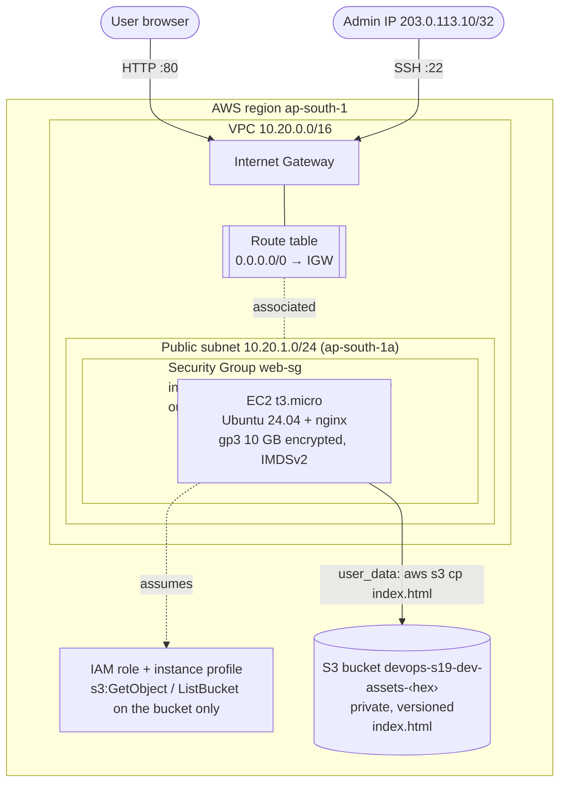
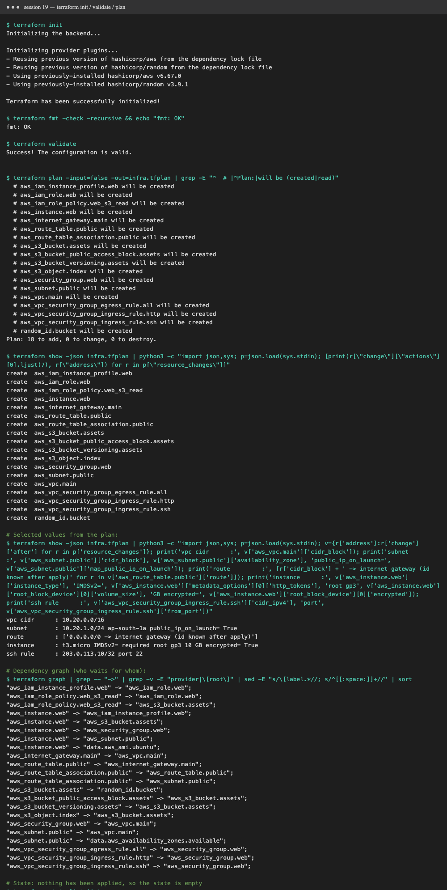

# Session 19: Cloud & Terraform in Action

An end-to-end AWS infrastructure project in Terraform: **VPC → public subnet → Internet Gateway + route table →
Security Group → EC2 web server (with an IAM role) → S3 bucket**. The EC2 instance pulls its web page from S3 on boot and serves it with nginx.

> **Run mode:** no AWS account is configured on this machine (my choice for this homework), so **no AWS resources were created**.
> `terraform init`, `fmt`, `validate` and `plan` were run for real against the AWS provider (output and screenshot below). `plan` works offline because
> `offline_plan = true` gives the provider dummy credentials and skips its AWS lookups (the AZ and AMI data sources).
> `apply` / `destroy` are documented with exact commands and expected results.

## Project structure

```text
terraform/
├── versions.tf          # required providers + versions, AWS provider, default tags, (commented) S3 remote backend
├── variables.tf         # inputs, with a CIDR validation rule
├── network.tf           # VPC, Internet Gateway, public subnet, route table + association, Security Group + rules
├── compute.tf           # AMI lookup, IAM role/policy/instance profile, EC2 instance with user_data
├── storage.tf           # S3 bucket (private, versioned) + index.html object
├── outputs.tf           # IDs, public IP, website URL, bucket name
├── user_data.sh.tftpl   # first-boot script: install nginx, copy index.html from S3
├── terraform.tfvars     # values for the dev environment
├── run.sh               # runs the offline workflow -> output.txt
└── .terraform.lock.hcl  # pinned provider versions
```

## Architecture diagram



```text
Terraform ──► VPC 10.20.0.0/16
               ├── Internet Gateway
               ├── Route table (0.0.0.0/0 → IGW) ──associated──► Subnet
               ├── Subnet 10.20.1.0/24 (public, auto-assign public IP)
               ├── Security Group (80 world, 22 my-IP, egress all)
               ├── EC2 t3.micro  ── IAM role ──read──► S3
               └── S3 bucket (private, versioned) + index.html
```

## What the project demonstrates

| Concept | Where |
|---|---|
| **Providers** | `versions.tf`: `hashicorp/aws ~> 6.0` (installed v6.67.0) and `hashicorp/random ~> 3.6`, version-pinned by the lock file |
| **Variables** | `variables.tf` (types, defaults, a `validation` block on `ssh_allowed_cidr`), set in `terraform.tfvars` |
| **Resources** | 18 resources across network, compute and storage |
| **Data sources** | `aws_availability_zones`, `aws_ami` (latest Canonical Ubuntu 24.04). Both use `count` so they can be skipped offline |
| **Outputs** | `outputs.tf`: `vpc_id`, `instance_public_ip`, `website_url`, `assets_bucket`, … |
| **Dependencies** | **implicit** through references (subnet → `aws_vpc.main.id`, instance → subnet, SG, profile, bucket). Graph below |
| **Functions / templates** | `templatefile()` renders user_data, `jsonencode()` builds IAM policies, `cidrhost()` validates input |
| **AWS infrastructure** | VPC, IGW, subnet, route table, SG + rules, EC2, IAM role/policy/profile, S3 + object |
| **Security** | SSH from one IP only, IMDSv2 required, encrypted root disk, private S3 bucket, least-privilege instance role (no access keys on the server) |
| **State** | local `terraform.tfstate` (gitignored); a team **S3 backend** with native locking is ready in `versions.tf` |

### Dependency graph (`terraform graph`, real output)

```text
aws_subnet.public               -> aws_vpc.main
aws_internet_gateway.main       -> aws_vpc.main
aws_security_group.web          -> aws_vpc.main
aws_route_table.public          -> aws_internet_gateway.main
aws_route_table_association     -> aws_route_table.public, aws_subnet.public
aws_vpc_security_group_*_rule   -> aws_security_group.web
aws_s3_bucket.assets            -> random_id.bucket
aws_iam_role_policy.web_s3_read -> aws_iam_role.web, aws_s3_bucket.assets
aws_iam_instance_profile.web    -> aws_iam_role.web
aws_instance.web                -> aws_subnet.public, aws_security_group.web,
                                   aws_iam_instance_profile.web, aws_s3_bucket.assets, data.aws_ami.ubuntu
```
Terraform creates independent resources **in parallel** (VPC, `random_id` and the IAM role all start at once) and follows the
arrows for everything else. `destroy` runs in reverse order.

## Terraform commands

```bash
cd terraform
terraform init                       # download providers, set up backend, write the lock file
terraform fmt -recursive             # canonical formatting
terraform validate                   # syntax / type / reference check
terraform plan -out=infra.tfplan     # preview: what will be created / changed / destroyed
terraform apply infra.tfplan         # execute exactly that plan
terraform output                     # show outputs (website_url, public IP, ...)
terraform state list                 # list resources Terraform manages
terraform show                       # full state with real attribute values
terraform destroy                    # delete everything
```

### Real output (offline)



```text
$ terraform validate
Success! The configuration is valid.

$ terraform plan -out=infra.tfplan
  # aws_vpc.main will be created
  # aws_subnet.public will be created
  # aws_internet_gateway.main will be created
  # aws_route_table.public will be created
  # aws_security_group.web will be created
  # aws_instance.web will be created
  # aws_s3_bucket.assets will be created
  ... (18 total)
Plan: 18 to add, 0 to change, 0 to destroy.

vpc cidr      : 10.20.0.0/16
subnet        : 10.20.1.0/24 ap-south-1a public_ip_on_launch= True
route         : ['0.0.0.0/0 -> internet gateway (id known after apply)']
instance      : t3.micro IMDSv2= required root gp3 10 GB encrypted= True
ssh rule      : 203.0.113.10/32 port 22

$ terraform state list
No state file was found!          # correct: nothing has been applied
```
Full log: [`terraform/output.txt`](terraform/output.txt)

### Deploying for real (with an AWS account)

```bash
aws configure                                      # IAM user/role with EC2, VPC, IAM, S3 permissions
# in terraform.tfvars: delete the offline_plan and ami_id lines, set ssh_allowed_cidr to "$(curl -s ifconfig.me)/32"
terraform plan -out=infra.tfplan && terraform apply infra.tfplan
# expected: Apply complete! Resources: 18 added, 0 changed, 0 destroyed.
curl "$(terraform output -raw website_url)"        # -> <h1>Hello from Terraform! Served by EC2, stored in S3.</h1>
terraform destroy                                  # expected: Destroy complete! Resources: 18 destroyed.
```
Cost: t3.micro and S3 fit inside the AWS free tier. The public IPv4 address is billed hourly (cents per day), so **destroy when done**.

## Terraform state

- `terraform.tfstate` is Terraform's **record of the real world**: resource IDs and attributes, mapped to the config. `plan` diffs
  config against state (refreshed from AWS).
- It can contain **secrets**, so it's in [`.gitignore`](../.gitignore) and never committed.
- Teams use a **remote backend** (S3 with `use_lockfile = true`, or Terraform Cloud) so everyone shares one state and two
  `apply` runs can't collide. The block is ready, commented out, in `versions.tf`.
- Useful commands: `terraform state list`, `state show <addr>`, `state mv` (renames), `import` (adopt existing resources), `apply -refresh-only` (detect drift).

## Lessons learned
- **Plan is the safety net:** review it (or save it with `-out`) before every apply.
- `count` on data sources lets the same code work in an offline/CI validation mode and a real deploy.
- References give you dependency ordering for free. `depends_on` is only needed for hidden dependencies.
- Security belongs in the code from day one: least-privilege IAM, IMDSv2, encryption, restricted SSH.
