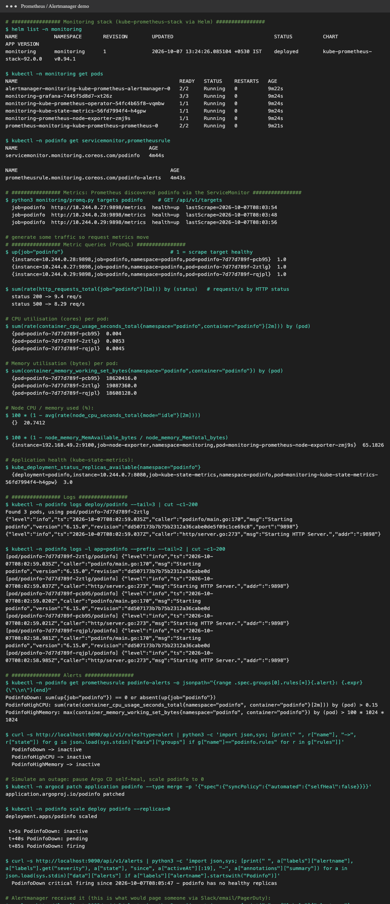
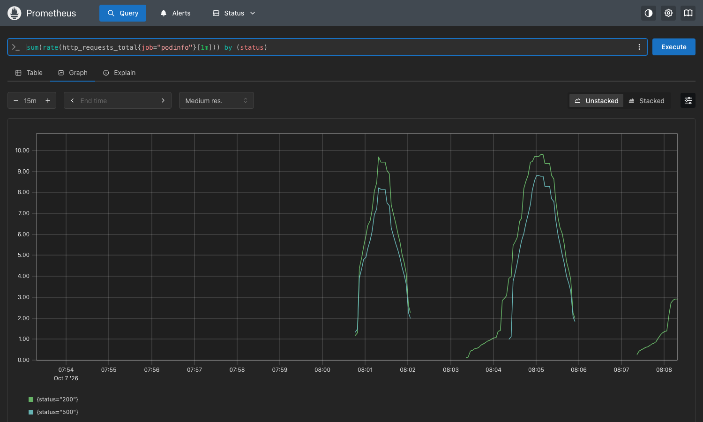
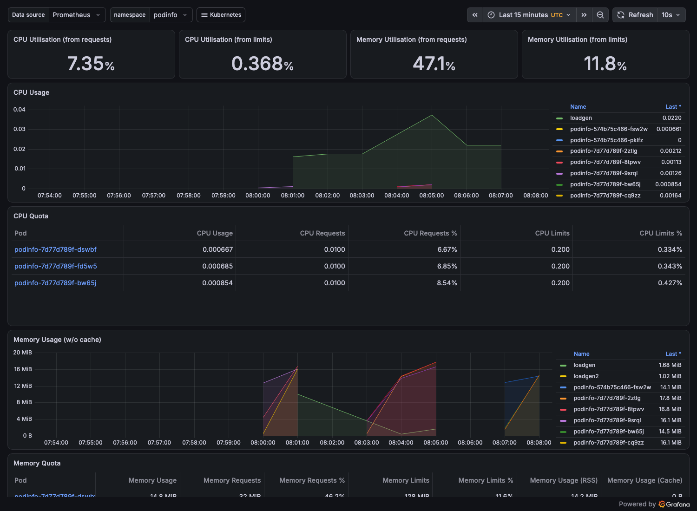
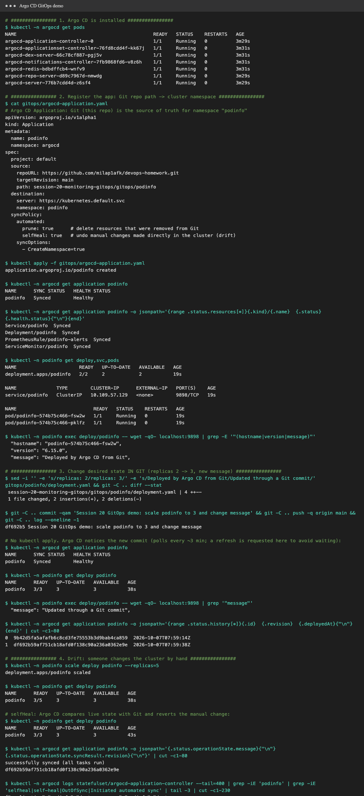

# Session 20: Monitoring, Observability & GitOps

Everything was run on **minikube v1.37** with [`demo.sh`](demo.sh) (`./demo.sh gitops|monitoring`).
Raw logs: [`output-gitops.txt`](output-gitops.txt), [`output-monitoring.txt`](output-monitoring.txt).

| Deliverable | Where |
|---|---|
| Monitoring demo | [Task 1](#task-1-monitoring): kube-prometheus-stack, PromQL queries, Grafana, a real alert firing |
| Observability documentation | [Task 2](#task-2-observability) |
| GitOps demo | [Task 3](#task-3-gitops): Argo CD syncing [`gitops/podinfo/`](gitops/podinfo) from this repo |
| Screenshots | [`screenshots/`](screenshots) |

**Stack**
- **kube-prometheus-stack** (Helm chart 92.0.0): Prometheus, Alertmanager, Grafana, kube-state-metrics, node-exporter and the Prometheus Operator, trimmed for an 8 GB laptop in [`monitoring/kube-prometheus-stack-values.yaml`](monitoring/kube-prometheus-stack-values.yaml).
- **Argo CD v3.5.4** (official install manifest).
- **podinfo 6.15.0**, a small Go web app that exposes Prometheus metrics and health endpoints, deployed **only through Git**.

```bash
helm repo add prometheus-community https://prometheus-community.github.io/helm-charts
helm install monitoring prometheus-community/kube-prometheus-stack --version 92.0.0 \
  -n monitoring --create-namespace -f monitoring/kube-prometheus-stack-values.yaml --wait
kubectl create ns argocd
kubectl apply -n argocd --server-side -f https://raw.githubusercontent.com/argoproj/argo-cd/v3.5.4/manifests/install.yaml
kubectl apply -f gitops/argocd-application.yaml
```

---

## Task 1: Monitoring

```text
 podinfo Pods ──/metrics──┐                     ┌──► Grafana (dashboards)
 kubelet/cAdvisor ────────┤  scrape every 15s   │
 node-exporter ───────────┼───────────────► Prometheus ──► rules ──► Alertmanager ──► Slack / email / PagerDuty
 kube-state-metrics ──────┘  (ServiceMonitors)  │
                                                └──► PromQL / HTTP API
```

The app is wired in declaratively: [`servicemonitor.yaml`](gitops/podinfo/servicemonitor.yaml) tells the Prometheus Operator to scrape
`podinfo:9898/metrics`, and [`prometheusrule.yaml`](gitops/podinfo/prometheusrule.yaml) adds the alert rules.



### Metrics
Prometheus found all 3 podinfo Pods through the ServiceMonitor:
```text
$ python3 monitoring/promq.py targets podinfo
  job=podinfo  http://10.244.0.27:9898/metrics  health=up
  job=podinfo  http://10.244.0.28:9898/metrics  health=up
  job=podinfo  http://10.244.0.29:9898/metrics  health=up
```
With a load generator calling `/` and `/status/500`:
```text
$ sum(rate(http_requests_total{job="podinfo"}[1m])) by (status)
  status 200 -> 9.4 req/s
  status 500 -> 8.29 req/s
```


### CPU and memory utilisation

| PromQL | Result |
|---|---|
| `sum(rate(container_cpu_usage_seconds_total{namespace="podinfo",container="podinfo"}[2m])) by (pod)` | 0.004–0.005 cores per Pod |
| `sum(container_memory_working_set_bytes{namespace="podinfo",container="podinfo"}) by (pod)` | ≈ 18.6–19.1 MB per Pod |
| `100 * (1 - avg(rate(node_cpu_seconds_total{mode="idle"}[2m])))` | node CPU **20.7%** |
| `100 * (1 - node_memory_MemAvailable_bytes / node_memory_MemTotal_bytes)` | node memory **65.2%** |

Grafana's built-in *Kubernetes / Compute Resources / Namespace (Pods)* dashboard for `podinfo`. The CPU and memory panels are compared with
the Pods' requests and limits (CPU 7.35% of requests, memory 47.1% of requests):



### Application health
- **Probes:** podinfo has `readinessProbe /readyz` and `livenessProbe /healthz` ([`deployment.yaml`](gitops/podinfo/deployment.yaml)).
- **Scrape health:** `up{job="podinfo"}` = `1` for each Pod.
- **Replica health:** `kube_deployment_status_replicas_available{namespace="podinfo"}` = `3` (from kube-state-metrics).

### Logs
`kubectl logs` reads each container's stdout. podinfo logs structured JSON:
```text
{"level":"info","ts":"2026-10-07T07:59:39.628Z","caller":"podinfo/main.go:170","msg":"Starting podinfo","version":"6.15.0",...}
{"level":"info","ts":"2026-10-07T07:59:39.629Z","caller":"http/server.go:273","msg":"Starting HTTP Server.","addr":":9898"}
```
In production, logs are shipped centrally (**Loki** + Promtail/Alloy, or **EFK**: Elasticsearch + Fluent Bit + Kibana), because `kubectl logs` loses everything when a Pod is deleted.
I left that out here to save memory on this 8 GB laptop.

### Alerts
Rules in [`prometheusrule.yaml`](gitops/podinfo/prometheusrule.yaml):

| Alert | Expression | For | Severity |
|---|---|---|---|
| `PodinfoDown` | `sum(up{job="podinfo"}) == 0 or absent(up{job="podinfo"})` | 30s | critical |
| `PodinfoHighCPU` | per-Pod CPU > 150m | 1m | warning |
| `PodinfoHighMemory` | per-Pod working set > 100Mi | 1m | warning |

**Live test:** I paused Argo CD self-heal and scaled podinfo to 0 to simulate an outage:
```text
 t+5s   PodinfoDown: inactive
 t+45s  PodinfoDown: pending      ← condition true, waiting out "for: 30s"
 t+75s  PodinfoDown: firing
 PodinfoDown critical firing since 2026-10-07T08:01:47 - podinfo has no healthy replicas
 Alertmanager: PodinfoDown critical active 2026-10-07T08:02:17   ← would notify the on-call person
```
Then I turned self-heal back on. Argo CD restored the 3 replicas **from Git**, and the alert went back to `inactive`.
The `for:` clause stops one failed scrape from paging anyone. Alertmanager then **groups, deduplicates, silences and routes** alerts to receivers.

---

## Task 2: Observability

**Monitoring** tells you *whether* something is wrong (known questions, dashboards, alerts).
**Observability** is being able to work out *why*, including for problems you didn't predict, from the data the system emits.

### The three pillars

| Pillar | What it is | Answers | Example | Common tools |
|---|---|---|---|---|
| **Metrics** | numeric time series: cheap, aggregated, good for trends and alerts | "Is error rate up? How busy is it?" | `http_requests_total{status="500"}` rate = 8.3/s | Prometheus, Grafana, Thanos/Mimir, CloudWatch, Datadog |
| **Logs** | timestamped records of discrete events, rich in detail | "What exactly happened in this request?" | `{"level":"error","msg":"db timeout","order":1001}` | Loki, ELK/EFK, Fluent Bit, CloudWatch Logs, Splunk |
| **Traces** | the path of **one request** across services, as spans with timings | "Which service made this request slow?" | checkout 1.2s = api 40ms → payments 1.1s → db | OpenTelemetry, Jaeger, Tempo, Zipkin, X-Ray |

They connect: an alert on a **metric** → find the slow **trace** → read the **logs** for that trace ID.
**OpenTelemetry** is the vendor-neutral standard for producing all three.

### Why observability is required
- Microservices and Kubernetes are **distributed and short-lived**: Pods move, scale and die, so you can't SSH in and look around.
- Failures are **new and partial** (one dependency slow, one AZ degraded), and predefined dashboards can't anticipate all of them.
- It cuts **MTTR** (mean time to recovery), makes **SLOs** and error budgets measurable, and is the evidence for capacity planning, cost and post-mortems.
- It turns "it's slow" into "p99 latency of `/checkout` rose from 200ms to 1.1s after release `df692b5`, caused by the payments DB pool".

### Kubernetes observability

| Layer | Signal | Source in this cluster |
|---|---|---|
| Cluster objects | Deployment replicas, Pod phase, restarts | **kube-state-metrics** (`kube_deployment_status_replicas_available`) |
| Containers | CPU, memory, throttling | **kubelet / cAdvisor** (`container_cpu_usage_seconds_total`) |
| Nodes | CPU, memory, disk, network | **node-exporter** (`node_cpu_seconds_total`) |
| Applications | business and HTTP metrics | app `/metrics` + **ServiceMonitor** (`http_requests_total`) |
| Control plane | API server latency, etcd | apiserver metrics (scraped by the stack) |
| Events | scheduling, OOMKilled, BackOff | `kubectl events` (event exporters ship them to logs) |
| Logs | container stdout/stderr | `kubectl logs` → Loki / EFK in production |
| Traces | per-request spans | OpenTelemetry SDK + Collector → Tempo/Jaeger |
| Quick view | live usage | `kubectl top` (metrics-server) |

---

## Task 3: GitOps

### What is GitOps?
An operating model where **Git is the single source of truth** for the desired state of infrastructure and apps, and an **automated agent inside the cluster**
(Argo CD, Flux) keeps the live state matching Git. Every change is a **commit or pull request**: reviewed, versioned, auditable and revertible.

### Principles

| Principle | Meaning | In this demo |
|---|---|---|
| **Git as the source of truth** | the desired state lives in Git, not in someone's terminal | [`gitops/podinfo/`](gitops/podinfo) on `main` |
| **Declarative configuration** | describe *what* you want (YAML), not the commands to get there | Deployment, Service, ServiceMonitor, PrometheusRule manifests |
| **Pulled automatically** | the agent **pulls** from Git; CI never needs cluster credentials | Argo CD polls the GitHub repo |
| **Continuous reconciliation** | the agent keeps comparing live with desired and fixes drift | `automated: {prune: true, selfHeal: true}` |

### GitOps workflow
```text
 developer ──PR──► Git (main) ◄──── review / approve / merge
                       │
                       │  Argo CD polls (≈3 min) or webhook
                       ▼
               Argo CD (in cluster) ── diff live vs Git ──► OutOfSync? ──► kubectl apply ──► Synced + Healthy
                       ▲                                                                   │
                       └──────────── someone runs kubectl by hand (drift) ◄─────────────────┘
                                     selfHeal reverts it
 Rollback = git revert <commit>
```

### Kubernetes + GitOps demo (Argo CD)

[`gitops/argocd-application.yaml`](gitops/argocd-application.yaml) maps this repo's path `session-20-monitoring-gitops/gitops/podinfo` (branch `main`) to namespace `podinfo`.



**1. Initial sync:** `kubectl apply -f gitops/argocd-application.yaml`
```text
NAME      SYNC STATUS   HEALTH STATUS
podinfo   Synced        Healthy
Service/podinfo  Synced · Deployment/podinfo  Synced · PrometheusRule/podinfo-alerts  Synced · ServiceMonitor/podinfo  Synced
deployment.apps/podinfo   2/2     "message": "Deployed by Argo CD from Git"
```

**2. Change through Git only.** I edited `deployment.yaml` (`replicas: 2 → 3`, new UI message), then committed and pushed
([`df692b5`](https://github.com/milap1afk/devops-homework/commit/df692b59af751cb18afd0f138c90a236a0362e9e)). **No `kubectl apply`.**
```text
podinfo   3/3     "message": "Updated through a Git commit"
sync history:  0  9b42d5fa…  2026-10-07T07:59:14Z
               1  df692b59…  2026-10-07T07:59:38Z
```

**3. Drift + self-heal.** I scaled by hand with `kubectl scale --replicas=5`, and Argo CD put it back to the Git value **within about 4 seconds**:
```text
podinfo   3/5     ← manual change
podinfo   3/3     ← reverted to Git
controller log: "Updated sync status: Synced -> OutOfSync"  07:59:52
                "Initialized new operation: SyncOperation{Revision:df692b59…}"
                "Updated sync status: OutOfSync -> Synced"  07:59:56
```

**4. Reconciliation restores service** (see the alert test above): after the simulated outage, turning self-heal back on brought podinfo from 0 back to the 3 replicas defined in Git.

**Why GitOps:** a full audit trail (`git log` = deployment history), easy rollback (`git revert`), no `kubectl` access needed for developers,
drift can't silently pile up, and a whole cluster can be rebuilt from Git.

> Note: `./demo.sh gitops` edits [`gitops/podinfo/deployment.yaml`](gitops/podinfo/deployment.yaml) and pushes a commit,
> so the file in the repo now holds the *after* state (3 replicas). To replay the demo, set it back to 2 first.
